<p align="center">
  
</p>

<h1 align="center">GOPLC</h1>

<p align="center">
  <strong>Industrial-Grade PLC Runtime in Go</strong><br>
  IEC 61131-3 Structured Text | 13+ Protocol Drivers | Web IDE | 180,000+ Lines of Code
</p>

<p align="center">
  
  
  
  
</p>

<p align="center">
  <a href="#features">Features</a> •
  <a href="#web-ide">Web IDE</a> •
  <a href="#node-red-integration">Node-RED</a> •
  <a href="#debugger">Debugger</a> •
  <a href="#ai-assistant">AI</a> •
  <a href="#agentic-control-loop">Agentic</a> •
  <a href="#hardware-manifests">Manifests</a> •
  <a href="#protocols">Protocols</a> •
  <a href="#clustering">Clustering</a> •
  <a href="#redundancy--failover">Redundancy</a> •
  <a href="#authentication">Auth</a> •
  <a href="#licensing">Licensing</a> •
  <a href="#snap--ctrlx-core">Snap</a> •
  <a href="#quick-start">Quick Start</a> •
  <a href="#architecture">Architecture</a> •
  <a href="#whitepapers">Whitepapers</a>
</p>

---

## What is GOPLC?

GOPLC is a **full-featured PLC runtime** written entirely in Go. It executes IEC 61131-3 Structured Text programs with industrial-grade features:

- **Multi-task scheduler** with priorities, watchdogs, and microsecond-precision scan times
- **13+ industrial protocols** including Modbus, EtherNet/IP, DNP3, BACnet, OPC UA, FINS, and IEC 104
- **Built-in Web IDE** with Monaco editor, statement-level debugger, and project management
- **Integrated Node-RED** with 7 custom PLC nodes for building HMI dashboards
- **AI Assistant** supporting Claude, OpenAI, and Ollama for code generation
- **1,450+ built-in functions** covering math, strings, crypto, HTTP, databases, and more
- **Real-time capable** with memory locking, CPU affinity, and GC tuning
- **Boss/Minion clustering** scaling to 10,000+ PLC instances

<p align="center">
  
</p>

---

## Features

### Core Runtime

| Feature | Description |
|---------|-------------|
| **ST Parser** | Full IEC 61131-3 Structured Text with extensions |
| **Multi-task Scheduler** | Cooperative scheduling with priorities (1-255) |
| **Scan Times** | From 100μs to hours, configurable per task |
| **Watchdog Protection** | Per-task watchdogs with fault/halt options |
| **Hot Reload** | Update individual tasks without stopping the runtime |
| **Function Blocks** | TON, TOF, TP, RTO, CTU, CTD, CTUD, R_TRIG, F_TRIG, SR, RS, SEMA |
| **RETAIN Variables** | Persistent variables across warm/cold restarts |
| **Project Files** | Single `.goplc` file contains programs, tasks, configs, HMI pages |

### 1,450+ Built-in Functions

| Category | Count | Highlights |
|----------|-------|------------|
| **Conversion** | 157 | INT_TO_REAL, DWORD_TO_TIME, HEX_TO_INT |
| **Data Structures** | 130 | LIST_*, MAP_*, QUEUE_*, STACK_*, SET_* |
| **Crypto** | 55 | AES_*, SHA*, RSA_*, JWT_*, HMAC_* |
| **Resilience** | 40 | CIRCUIT_BREAKER_*, RATE_LIMIT_*, RETRY_* |
| **Array** | 34 | ARRAY_SORT, ARRAY_FILTER, ARRAY_MAP, ARRAY_REDUCE |
| **Debug** | 30 | DEBUG_TO_FILE, DEBUG_TO_SQLITE, DEBUG_TO_INFLUX |
| **String** | 30 | CONCAT, SPLIT, REGEX_*, FORMAT, JSON_* |
| **HTTP** | 22 | HTTP_GET, HTTP_POST, URL_ENCODE, WEBSOCKET_* |
| **Database** | 18 | DB_CONNECT, DB_QUERY, DB_EXEC, DB_COMMIT |
| **+ OSCAT Library** | 557 | Complete OSCAT Basic library (384 functions + 173 FBs) |

### Real-time Capabilities

```yaml
realtime:
  enabled: true
  mode: container          # container | host | off
  lock_os_thread: true     # Pin goroutines to OS threads
  cpu_affinity: [2, 3]     # Pin to specific CPU cores
  memory_lock: true        # mlockall() to prevent page faults
  gc_percent: 500          # Reduce GC frequency
  rt_priority: 50          # SCHED_FIFO priority (requires privileges)
```

---

## Web IDE

GOPLC includes a full-featured browser-based IDE built on 18 modular JavaScript components:

<p align="center">
  
</p>

### IDE Features

- **Monaco Editor** with full IEC 61131-3 syntax highlighting
- **Project Tree** showing tasks, programs, functions, libraries
- **Live Variable Watch** with real-time updates via WebSocket
- **Runtime Control** - Start/Stop/Reset/Upload/Download
- **Project Management** - New/Open/Save/Export/Import (`.goplc` format)
- **Task Configuration** - Priorities, scan times, watchdogs
- **Per-Task Hot Reload** - Update one task without stopping others
- **Multi-Runtime Switch** - Connect to different PLC instances
- **Hash-Based Sync Indicator** - Shows if IDE matches runtime code
- **Config Editor** - YAML configuration with syntax highlighting
- **Cross-Reference Search** - Find variable/function usage across all programs
- **Tags Browser** - Browse all tags with sorting and filtering

### Online Mode

CoDeSys-style live variable debugging — monitor and modify PLC variables in real-time while the program executes:

- **Split-Panel Layout** - Variable list panel alongside the editor with no layout shift
- **Click-to-Edit Values** - Click any variable value to write a new value to the running PLC
- **250ms Live Updates** - Continuous polling with change highlighting
- **Boolean Coloring** - TRUE values in green, FALSE in red
- **Type-Based Formatting** - Specialized display for BOOL, INT, REAL, TIME, STRING
- **FB Instance Support** - View function block member variables
- **Pause/Step/Resume** - Per-scan stepping for system-level debugging

<p align="center">
  <a href="https://www.youtube.com/watch?v=Sdb1rMul7Mg">
    
  </a>
  <br><em>Click to watch: Online Live View Demo</em>
</p>

### IDE Screenshots

<table>
<tr>
<td align="center"><br><b>Monitor - Variables</b><br>Live task/variable view with Watch List</td>
<td align="center">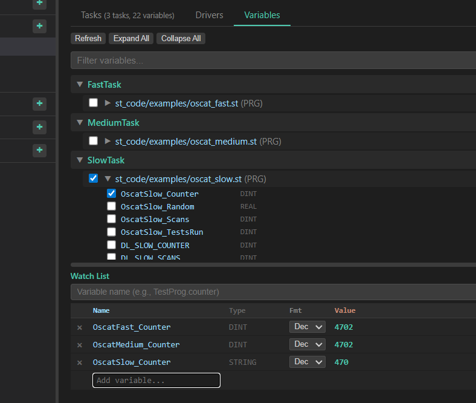<br><b>Watch List</b><br>Real-time variable monitoring</td>
</tr>
<tr>
<td align="center">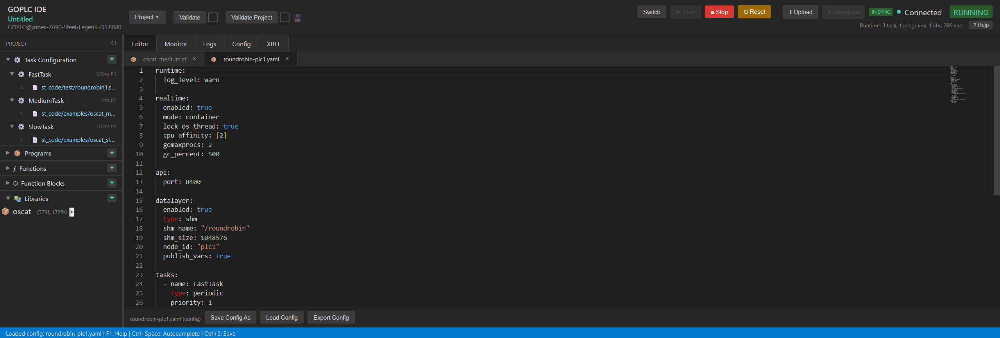<br><b>Config Editor</b><br>YAML configuration with syntax highlighting</td>
<td align="center">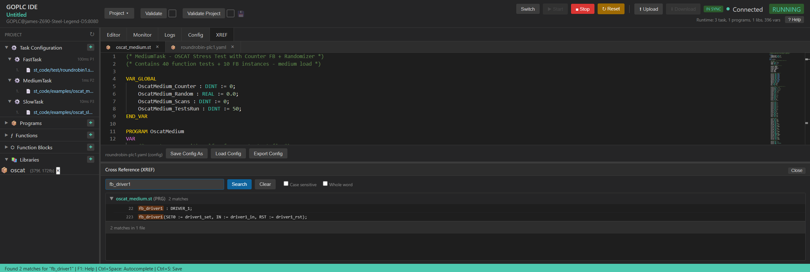<br><b>Cross Reference</b><br>Search across all programs</td>
</tr>
<tr>
<td align="center">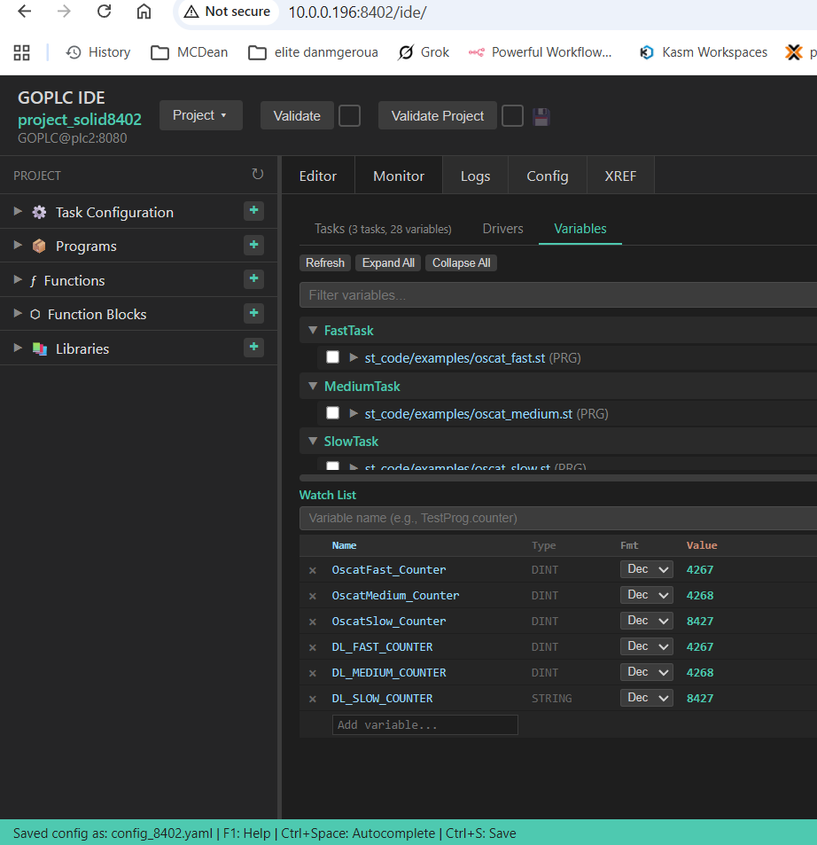<br><b>DataLayer Sync</b><br>Multi-PLC variable synchronization</td>
<td align="center">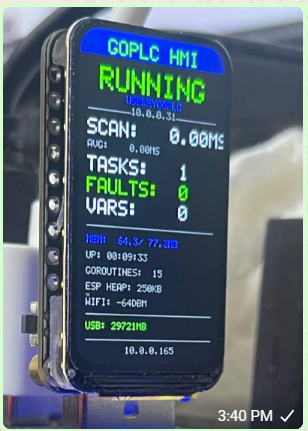<br><b>ESP32 HMI</b><br>Hardware status display</td>
</tr>
</table>

---

## Debugger

Full statement-level step debugger comparable to CoDeSys and commercial PLC IDEs. Zero runtime overhead when disabled — a single atomic boolean check on the fast path.

### Debug Controls

| Action | Shortcut | Description |
|--------|----------|-------------|
| **Continue** | F5 | Resume execution until the next breakpoint |
| **Step Over** | F10 | Execute the current line, skip over function/FB calls |
| **Step Into** | F11 | Step into function and function block calls |
| **Step Out** | Shift+F11 | Run until the current function/FB returns |

### Debug Features

- **Line Breakpoints** - Click the editor gutter to set/clear breakpoints on any ST line
- **Breakpoint Enable/Disable** - Toggle breakpoints without removing them
- **Call Stack** - View the full function block / function call chain at each stop
- **Variable Inspection** - Examine all variables and their current values at each step
- **Multi-Task Broadcast** - When any task hits a breakpoint, ALL tasks pause for a consistent system snapshot
- **Watchdog Auto-Suspend** - Watchdog timers automatically suspend while stopped in the debugger
- **Hit Counter** - Track how many times each breakpoint has been triggered

### Debug API

```bash
# Enable the debugger
curl -X POST http://localhost:8082/api/debug/step/enable

# Set a breakpoint at line 15 of MainProgram
curl -X POST http://localhost:8082/api/debug/step/breakpoints \
  -d '{"program": "MainProgram", "line": 15}'

# Continue execution
curl -X POST http://localhost:8082/api/debug/step/continue

# Step into the next statement
curl -X POST http://localhost:8082/api/debug/step/into

# Step over the current statement
curl -X POST http://localhost:8082/api/debug/step/over

# Step out of the current function/FB
curl -X POST http://localhost:8082/api/debug/step/out

# Get current debug state (position, stopped status, call stack)
curl http://localhost:8082/api/debug/step/state
```

<p align="center">
  <a href="https://www.youtube.com/watch?v=vO16D4oMQJY">
    
  </a>
  <br><em>Click to watch: Debugger Walkthrough</em>
</p>

---

## Node-RED Integration

GOPLC manages Node-RED as an integrated subprocess with full lifecycle management, a reverse proxy, and **7 custom PLC nodes** for building industrial HMI dashboards — all accessible through the same port as the Web IDE.

### How It Works

```
GOPLC (port 8082)
├── /ide/          → Web IDE
├── /nodered/      → Node-RED editor (reverse proxied)
├── /hmi/          → Built-in HMI pages
└── /api/          → REST API
```

- Node-RED auto-starts with GOPLC and auto-restarts on crash (exponential backoff)
- No separate port needed — reverse proxy serves Node-RED through GOPLC's API port
- GOPLC host/port injected into Node-RED's global context for zero-config node connections

### 7 Custom PLC Nodes

| Node | Description |
|------|-------------|
| **goplc-connection** | Config node — auto-detects host/port from global context |
| **goplc-read** | Read a single variable or all variables from the PLC |
| **goplc-write** | Write values to PLC variables |
| **goplc-subscribe** | Real-time WebSocket variable updates with on-change filtering |
| **goplc-runtime** | Start/stop/status control of the PLC runtime |
| **goplc-task** | Task management — reload, status, per-task control |
| **goplc-cluster** | Read/write variables on cluster minions via boss proxy |

### Dashboard Support

Auto-installs `@flowfuse/node-red-dashboard` (Dashboard 2.0) for building operator HMI screens. Includes demo flows:

- **Industrial HMI Demo** - Water treatment plant dashboard with live gauges, trends, and alarm panels
- **Dual Runtime** - Multi-PLC communication and monitoring
- **Quick Start Dashboard** - Simple template to get started

### AI Flow Generation

The AI assistant can generate complete Node-RED flows from natural language descriptions. Generated flows include custom PLC nodes pre-configured for the current runtime. Import directly from the AI chat with one click.

<p align="center">
  <a href="https://www.youtube.com/watch?v=dVYpVslmxfc">
    
  </a>
  <br><em>Click to watch: Node-RED Integration Walkthrough</em>
</p>

### Configuration

```yaml
nodered:
  enabled: true
  port: 1880                    # Node-RED internal port
  auto_start: true
  restart_on_crash: true
  max_restarts: 5
  restart_backoff_ms: 2000
  user_dir: "data/nodered"
  flow_file: "flows.json"
  credential_secret: ""         # Optional encryption key
  extra_modules:                # Auto-install on startup
    - "@flowfuse/node-red-dashboard"
```

### Node-RED API

```bash
# Check Node-RED status (uptime, PID, restart count)
curl http://localhost:8082/api/nodered/status

# Start/stop/restart Node-RED subprocess
curl -X POST http://localhost:8082/api/nodered/start
curl -X POST http://localhost:8082/api/nodered/stop
curl -X POST http://localhost:8082/api/nodered/restart
```

---

## AI Assistant

Built-in AI coding assistant that understands all 1,450+ ST functions and can generate Structured Text code, HMI pages, and Node-RED flows from natural language descriptions.

### Multi-Provider Support

| Provider | Models | Use Case |
|----------|--------|----------|
| **Claude** (Anthropic) | claude-sonnet-4-20250514 (default) | Best ST code quality |
| **OpenAI** | GPT-4o, GPT-4, etc. | Alternative cloud provider |
| **Ollama** | qwen2.5-coder, deepseek-r1, etc. | Fully local/offline |

### What It Can Generate

- **Structured Text Programs** - PID loops, state machines, alarm handlers, protocol integrations. Detected as `iec` code blocks with an "Insert as Program" button.
- **HMI Pages** - Custom web dashboards with live PLC data. Detected as HTML with "Preview" and "Save as HMI Page" buttons.
- **Node-RED Flows** - Complete flow JSON with custom PLC nodes. Detected automatically with an "Import to Node-RED" button.

### Context-Aware

The AI receives the full function registry (1,450+ signatures with return types), current runtime variables, active tasks, and loaded programs as context — so it generates code that works with your specific setup.

<p align="center">
  <a href="https://www.youtube.com/watch?v=N2t-iAHdrvc">
    
  </a>
  <br><em>Click to watch: AI Code Writing Demo</em>
</p>

### Configuration

```yaml
ai:
  enabled: true
  provider: "claude"            # claude | openai | ollama
  api_key_env: "ANTHROPIC_API_KEY"
  model: "claude-sonnet-4-20250514"
  endpoint: ""                  # Required for Ollama (e.g., http://localhost:11434/v1)
  max_tokens: 8192
  temperature: 0.3
```

---

## Agentic Control Loop

An autonomous AI control agent that operates the PLC directly — separate from the code-writing assistant. Instead of generating code for a human to review, it reads sensors, writes setpoints, deploys programs, and manages tasks via tool calls in a multi-turn loop.

### 12 Built-in Control Tools

| Tool | Category | Description |
|------|----------|-------------|
| `read_variable` | Read-only | Read current PLC variable value |
| `list_variables` | Read-only | List all variables with optional prefix filter |
| `get_task_status` | Read-only | All task states, scan times, faults |
| `get_diagnostics` | Read-only | Memory, uptime, scan stats |
| `get_faults` | Read-only | Active task fault messages |
| `write_variable` | Normal | Write setpoint or control variable |
| `reload_task` | Normal | Hot-reload task without stopping others |
| `start_task` | Normal | Start named task or all tasks |
| `create_manifest` | Normal | Register hardware descriptor |
| `create_hmi_page` | Normal | Generate Node-RED Dashboard 2.0 flow |
| `deploy_program` | Normal | AI-generate and deploy a control program |
| `stop_task` | Critical | Stop a running task |

```bash
curl -X POST http://localhost:8082/api/ai/control \
  -H "Content-Type: application/json" \
  -d '{
    "message": "Ramp the temperature setpoint to 50 degrees and start the pump",
    "max_turns": 6
  }'
```

The response includes `actions_executed` — a full log of every tool call and result — and `turns_used` showing how many AI iterations were needed. Multi-turn conversation history is supported for follow-up instructions.

---

## Hardware Manifests

Declarative YAML descriptors for physical hardware. GOPLC reads manifests and auto-generates a `SysInit_{id}` ST program that opens hardware channels on startup and maps sensor readings to named PLC variables.

```yaml
id: "greenhouse_1"
name: "Tomato Greenhouse"
hardware:
  - id: "temp_sensor"
    type: "phidgets"
    channel_type: "temperature"
    serial: -1          # -1 = any connected device
    hub_port: 0
    st_var: "temp_c"

  - id: "heater_relay"
    type: "phidgets"
    channel_type: "digital_output"
    hub_port: 2
    st_var: "heater_on"

  - id: "custom_sensor"
    type: "custom"
    open_call: "MY_DEVICE_OPEN('{name}')"
    read_call: "MY_DEVICE_READ('{name}')"
    write_call: "MY_DEVICE_WRITE('{name}', {var})"
```

GOPLC generates `VAR_GLOBAL` declarations for all `st_var` bindings and a startup sequence that initializes each hardware channel. Manifests can be created manually, via API, or through the agentic control loop.

**API:**

```bash
GET    /api/system/manifests              # List all manifests
POST   /api/system/manifests              # Create manifest
PUT    /api/system/manifests/:id          # Update manifest
DELETE /api/system/manifests/:id          # Delete manifest
```

---

## HMI Builder

Create and serve custom web-based operator displays directly from the IDE.

### Built-in Default Dashboard

GOPLC ships with a default HMI dashboard at `/hmi/default-dashboard` showing:

- Runtime state, uptime, scan count, and memory usage
- Live trend charts for task scan times
- System information and feature summary

### Custom Pages

- Create custom HTML pages via the AI assistant or manually
- Pages stored inside the `.goplc` project file (portable, single-file deployment)
- Helper library (`goplc-hmi.js`) provides variable read/write from HMI pages
- Served at `/hmi/:page-name` with no additional configuration

### HMI API

```bash
# List all HMI pages
curl http://localhost:8082/api/hmi/pages

# Create a new page
curl -X POST http://localhost:8082/api/hmi/pages \
  -d '{"name": "tank-overview", "content": "<html>...</html>"}'

# Get/update/delete pages
curl http://localhost:8082/api/hmi/pages/tank-overview
curl -X PUT http://localhost:8082/api/hmi/pages/tank-overview -d '{"content": "..."}'
curl -X DELETE http://localhost:8082/api/hmi/pages/tank-overview
```

---

## Config Wizard

Searchable topic browser with static forms and AI-assisted setup that generates ready-to-apply YAML configuration. Lowers the barrier for configuring protocols, clustering, and services.

### Available Topics

| Topic | Mode | Description |
|-------|------|-------------|
| **AI Setup** | Form | Configure AI provider, API key, model |
| **Modbus Server** | Form | TCP server with register mapping |
| **Modbus Client** | Form | TCP client with polling intervals |
| **OPC UA Server** | Form | Server configuration |
| **FINS** | Form | Omron FINS protocol setup |
| **EtherNet/IP** | Form | Adapter and scanner configuration |
| **DNP3** | Form | Master/outstation setup |
| **S7comm** | Form | Siemens S7 configuration |
| **Cluster Boss** | Form | Boss with member list (add/remove rows) |
| **Cluster Minion** | Form | Minion with unix socket |
| **I/O Mapping** | Form | Map ST variables to protocol addresses |
| **Modbus Bridge** | AI | Custom gateway configurations |
| **Performance** | AI | Tuning and optimization guidance |
| **Real-time** | AI | RT container mode setup |
| **DataLayer** | AI | Multi-PLC sync configuration |

Each form generates a YAML snippet that can be applied via hot-reload — no restart needed.

---

## Protocols

GOPLC includes **55,000+ lines** of industrial protocol code for seamless integration with existing automation systems.

### Industrial Protocols (12 Total)

| Protocol | Role | Transport | Lines | Target Systems |
|----------|------|-----------|-------|----------------|
| **Modbus TCP/RTU** | Server + Client | TCP, UDP, Serial | 7,241 | Universal - PLCs, VFDs, meters, sensors |
| **DNP3** | Master + Outstation | TCP, UDP, Serial | 13,354 | SCADA - Electric, water, gas utilities |
| **BACnet/IP & MSTP** | Server + Client | UDP, RS-485 | 7,883 | Building automation - HVAC, fire, access |
| **EtherNet/IP** | Adapter + Scanner | TCP, UDP | 5,388 | Allen-Bradley - CompactLogix, ControlLogix |
| **OPC UA** | Server + Client | TCP | 4,496 | Modern - Cloud integration, MES, SCADA |
| **FINS** | Server + Client | TCP, UDP | 3,565 | Omron - NX, NY, CP, CJ series PLCs |
| **S7comm** | Server + Client | TCP (TPKT/COTP) | 2,441 | Siemens - S7-300, S7-400, S7-1200, S7-1500 |
| **IEC 60870-5-104** | Client + Server | TCP | 2,100 | Utilities - Power grid SCADA, substation automation |
| **PROFINET** | Server + Client | TCP, UDP | 1,997 | Siemens - Real-time industrial Ethernet |
| **SEL** | Server + Client | Serial | 1,758 | Protective relays - Power system monitoring |
| **SNMP v1/v2c/v3** | Client + Trap | UDP | 3,597 | Network devices - Switches, UPS, sensors |
| **DF1** | Client | Serial | 1,417 | Allen-Bradley legacy - SLC 500, MicroLogix, PLC-5 |

### Protocol Features

<details>
<summary><strong>Modbus TCP/RTU</strong> - Click to expand</summary>

- Full function code support (FC01-06, FC15-16)
- Coils, discrete inputs, holding registers, input registers
- RTU framing with CRC-16
- RS-485 half-duplex with RTS control
- Connection pooling and retry logic
- Diagnostics counters (FC08)
- Gateway mode (TCP to RTU bridge)

</details>

<details>
<summary><strong>DNP3</strong> - Click to expand</summary>

- Complete Master and Outstation implementation
- Binary/Analog inputs and outputs
- Counters with freeze support
- Event buffering with classes (1, 2, 3)
- Unsolicited responses
- Select-Before-Operate (SBO) control
- Time synchronization
- Serial transport (RS-232/RS-485)
- Data link layer with FCB/FCV
- Store-and-forward with SQLite buffering, GZIP compression, AES-256-GCM encryption

</details>

<details>
<summary><strong>BACnet/IP & MSTP</strong> - Click to expand</summary>

- BACnet/IP over UDP (port 47808)
- BACnet/MSTP over RS-485 (token passing)
- All standard object types (AI, AO, AV, BI, BO, BV, MI, MO, MV)
- COV (Change of Value) subscriptions
- ReadPropertyMultiple for efficient polling
- Priority arrays (1-16) for commandable objects
- Schedule and Calendar objects
- TrendLog objects
- Alarm and Event services
- Segmentation for large responses
- Device discovery (Who-Is/I-Am)

</details>

<details>
<summary><strong>EtherNet/IP</strong> - Click to expand</summary>

- CIP (Common Industrial Protocol) messaging
- Adapter mode (expose tags to scanners)
- Scanner mode (read/write remote tags)
- Explicit messaging (TCP port 44818)
- Implicit I/O (UDP port 2222)
- ForwardOpen/ForwardClose connections
- Unconnected messaging (UCMM)
- Assembly objects for I/O data

</details>

<details>
<summary><strong>OPC UA</strong> - Click to expand</summary>

- Server and Client implementation
- Secure channel management
- Session authentication
- Node browsing
- Read/Write attributes
- Subscriptions with monitored items
- Method calls
- Security policies (None, Basic256Sha256)

</details>

<details>
<summary><strong>SNMP v1/v2c/v3</strong> - Click to expand</summary>

- SNMP v1, v2c, and v3 support
- GET, SET, GETNEXT, GETBULK operations
- WALK for MIB traversal
- Trap receiver
- SNMPv3 authentication (MD5, SHA)
- SNMPv3 privacy (DES, AES)
- ASN.1 BER encoding

</details>

<details>
<summary><strong>IEC 60870-5-104</strong> - Click to expand</summary>

- Full Client and Server implementation
- APCI frame handling (I, S, U formats)
- ASDU types: single/double-point, measured values, step position, normalized/scaled/short floating point
- Interrogation commands (station and group)
- Command types: single, double, regulating step, set-point
- Time-tagged variants for all information types
- 26 ST functions for IEC 104 operations
- Connection state machine with T1/T2/T3 timers

</details>

### Communication Layer

| Module | Purpose | Transport | Features |
|--------|---------|-----------|----------|
| **DataLayer** | Multi-PLC sync | TCP, Shared Memory | Real-time variable sharing, <1ms latency, prefix filtering |
| **MQTT** | IoT/Cloud | TCP, TLS | Publish variables, subscribe to commands, QoS 0/1/2 |
| **HTTP/REST** | Integration | TCP | 60+ API endpoints, WebSocket streaming, SSE watch |
| **Store-and-Forward** | Reliability | SQLite | Offline buffering, GZIP compression, AES-256 encryption |
| **Serial** | Legacy | RS-232/485 | Configurable baud, parity, RTS/CTS flow control |

### Hardware Abstraction Layer (HAL)

**Tested & Production Ready:**

| Device | Interface | I/O Type | Use Case |
|--------|-----------|----------|----------|
| **Nextion HMI** | Serial/UART | Touch Display | Local operator interface |
| **USB Camera** | rpicam-still | Vision | Barcode, QC inspection |
| **ESP32 Remote I/O** | Modbus TCP | WiFi I/O Module | Wireless sensors/actuators |
| **Raspberry Pi GPIO** | Direct | Digital I/O | Edge computing, local control |
| **PCF8574** | I2C | 8-bit I/O Expander | Expand GPIO count |
| **Grove ADC** | I2C | Analog Input | Seeed Studio sensors |
| **Phidgets** | USB/VINT | Multi-sensor | Temperature, humidity, voltage, current, relays, motors, encoders (simulation mode; real hardware via CGO extension) |

**Implemented - Testing Soon:**

| Device | Interface | I/O Type | Use Case |
|--------|-----------|----------|----------|
| **Orange Pi GPIO** | Direct | Digital I/O | Cost-effective edge nodes |
| **ADXL345** | I2C | Accelerometer | Vibration monitoring |
| **DHT11/22** | 1-Wire | Temp/Humidity | Environmental sensing |
| **TFT Display** | SPI | Graphics Display | Custom HMI screens |
| **Propeller 2** | Serial | 8-core MCU | High-speed I/O, motor control |

**Planned:**

| Device | Interface | I/O Type | Use Case |
|--------|-----------|----------|----------|
| **MCP3008** | SPI | 8-ch 10-bit ADC | Analog sensor input |
| **ADS1115** | I2C | 4-ch 16-bit ADC | Precision measurement |
| **MAX31855** | SPI | Thermocouple | High-temp sensing |
| **MCP23017** | I2C | 16-bit I/O Expander | More GPIO |
| **W5500** | SPI | Ethernet | Wired network on MCU |

### Protocol Analyzer

Built-in packet capture and analysis with support for all protocols:

```bash
# Start capture with filters
curl -X POST http://localhost:8082/api/analyzer/start \
  -d '{"protocols": ["modbus-tcp", "dnp3", "bacnet"]}'

# View captured transactions
curl http://localhost:8082/api/analyzer/transactions?limit=100

# Export to Wireshark
curl http://localhost:8082/api/analyzer/export/pcap -o capture.pcap

# Decode raw packet
curl -X POST http://localhost:8082/api/analyzer/decode \
  -d '{"protocol":"modbus-tcp","raw_hex":"00 01 00 00 00 06 01 03 00 00 00 0A"}'
```

**Supported decoders:** Modbus TCP/RTU, DNP3, BACnet/IP, EtherNet/IP, OPC UA, S7, FINS, IEC 104, SEL

### Protocol Coverage by Industry

| Industry | Protocols |
|----------|-----------|
| **Manufacturing** | Modbus, EtherNet/IP, PROFINET, S7, FINS, OPC UA |
| **Building Automation** | BACnet/IP, BACnet/MSTP, Modbus, SNMP, OPC UA |
| **Utilities/SCADA** | DNP3, IEC 104, Modbus, SEL, OPC UA |
| **Oil & Gas** | Modbus, DNP3, OPC UA, EtherNet/IP |
| **Water/Wastewater** | DNP3, Modbus, OPC UA |
| **Power Generation** | DNP3, IEC 104, Modbus, SEL, IEC 61850 (planned) |
| **Food & Beverage** | EtherNet/IP, Modbus, OPC UA, S7 |
| **Pharmaceutical** | OPC UA, Modbus, S7, EtherNet/IP |
| **Data Centers** | SNMP, Modbus, BACnet |

---

## Clustering

GOPLC supports distributed PLC architecture using a Boss/Minion pattern that scales to 10,000+ instances on a single machine.

### Boss/Minion Architecture

```
Boss PLC (coordinator, port 8082)
├── Unix Socket → Minion: CRAC controller
├── Unix Socket → Minion: Fire suppression
├── Unix Socket → Minion: Power distribution
└── TCP fallback → Minion: Remote site
```

- **Boss** aggregates and proxies API calls to all minions
- **Minions** are fully isolated PLC instances (own scheduler, protocols, data)
- Communication via **Unix sockets** (same host) or **TCP** (networked)
- All minion access goes through the Boss API — minions never exposed directly
- **Nested proxy** supports multi-tier topologies: Supervisor → Edge Boss → Minions

### Per-Task Hot Reload

Deploy updates to individual tasks without stopping the runtime:

```bash
# Reload only the MQTTTask — MainTask keeps running
curl -X POST http://localhost:8082/api/tasks/MQTTTask/reload
```

### Cluster API

```bash
# Read variables from a specific minion
curl http://localhost:8082/api/cluster/crac/api/variables

# Write to a minion's variable
curl -X PUT http://localhost:8082/api/cluster/fire/api/variables/AlarmActive \
  -d '{"value": true}'

# Reload a task on a specific minion
curl -X POST http://localhost:8082/api/cluster/pdu/api/tasks/MainTask/reload

# Nested: supervisor → edge boss → minion
curl http://localhost:8082/api/cluster/edge-boss/api/cluster/crac/api/variables
```

### DataLayer Mesh

Minions publish `DL_*` prefixed variables to the Boss via DataLayer. The Boss aggregates variables from all minions and rebroadcasts, creating a real-time variable mesh across the cluster.

### Configuration

```yaml
# Boss config
api:
  port: 8082
  cluster:
    members:
      - name: crac
        socket: /run/goplc/crac.sock
      - name: fire
        socket: /run/goplc/fire.sock
      - name: remote-plc
        url: http://10.0.0.50:8500

# Minion config
api:
  socket: /run/goplc/crac.sock   # No port needed
```

<p align="center">
  <a href="https://www.youtube.com/watch?v=VKavnWHM4H8">
    
  </a>
  <br><em>Click to watch: Boss/Minion Cluster Demo — single-port IDE controlling boss and minions with separate tasks, scan times, and live variable windows</em>
</p>

### Distributed Performance (Whitepaper Results)

Measured on a 24-core / 32-thread AMD system running PID loop workloads:

| Metric | Result |
|--------|--------|
| **Monolithic vs. Distributed** | **10.4x throughput** improvement (same 1,000-line workload, 10 minions) |
| **Linear Scaling** | 97.7% efficiency at 400 minions, 94.9% at 500 |
| **Peak Throughput** | 620,949 aggregate scans/s at 50μs scan (31 minions, 100.1% efficiency) |
| **DataLayer Latency** | 1.7μs avg, 5.5μs p95, 8.2μs p99 |
| **RT Mode Jitter** | 5.5x reduction at p95 (890μs → 163μs) |
| **Container Overhead** | ~2% scan time, 0% scaling efficiency |
| **Projected (768 threads)** | ~13M aggregate scans/s, ~12,000 simultaneous PID loops |

**Industry Comparison:**

| Platform | Min Cycle | Max Cores | Aggregate Scans/s | Architecture |
|----------|-----------|-----------|-------------------|--------------|
| Beckhoff TwinCAT 3 | 50μs | 4-8 (1 per task) | ~20,000 | Windows CE/RTOS |
| Siemens S7-1500 | 250μs | 1 (ASIC) | ~4,000 | Proprietary |
| Allen-Bradley ControlLogix | 500μs | 1 (per chassis) | ~2,000 | Single-threaded |
| **GOPLC** | **50μs** | **All available** | **620,949** | **Distributed goroutines** |

See the full [Clustering Whitepaper (PDF)](docs/whitepaper-clustering.pdf) for architecture details, methodology, and complete benchmark data. See also the [DC Simulation Hardware Whitepaper](docs/WHITEPAPER_DC_SIMULATION_HARDWARE.md) for hyperscale deployment estimates (50 MW–1 GW).

---

## Redundancy & Failover

GOPLC supports hot-standby redundancy with automatic failover for high-availability deployments. A **Supervisor** monitors identical primary and backup clusters — if the primary fails, the supervisor switches to the backup with zero data loss.

<p align="center">
  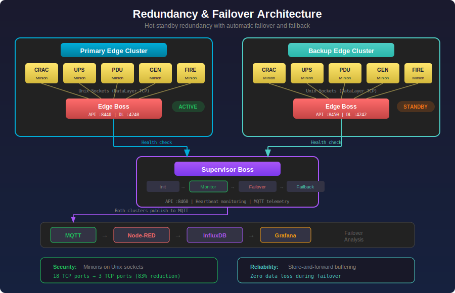
</p>

### Failover Performance & Strategies

Three redundancy strategies with sub-second failover, automatic failback, and zero data loss via store-and-forward buffering:

<p align="center">
  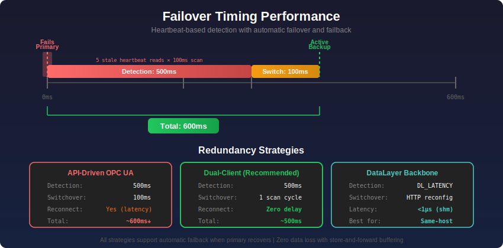
</p>

### Data Pipeline

Both clusters independently publish telemetry for failover timing analysis and data continuity verification:

<p align="center">
  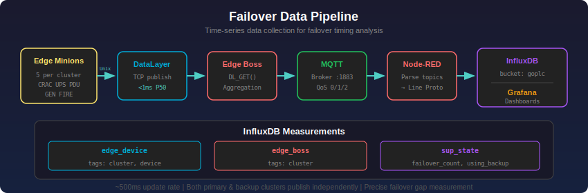
</p>

---

## Authentication

Optional JWT-based authentication that protects engineering endpoints while leaving operator paths open.

### Access Control

| Path Type | Examples | Authentication |
|-----------|----------|----------------|
| **Public** | `/hmi/*`, `/api/variables`, `/api/tags`, `/ws` | None required |
| **Protected** | `/ide/*`, `/api/programs`, `/api/runtime`, `/api/tasks`, `/api/cluster`, `/api/config`, `/api/debug` | Bearer token required |

### Features

- **Disabled by default** — zero friction for development and standalone use
- **HMAC-SHA256 tokens** with configurable expiry (no external dependencies)
- **Bcrypt password verification** for secure credential storage
- **Login page** with token refresh and logout
- **Operator-friendly** — HMI dashboards and variable read/write work without credentials

### Configuration

```yaml
api:
  auth:
    enabled: true
    jwt_secret: "your-jwt-secret"     # auto-generated if empty (won't survive restart)
    token_expiry_hours: 24
    users:
      - username: admin
        password_hash: "$2a$10$..."   # bcrypt hash
```

```bash
# Generate a bcrypt hash for the config
goplc auth hash-password mypassword

# Generate a random JWT secret
goplc auth generate-secret
```

---

## Licensing

Offline HMAC-signed unlock codes — no server, no internet, no phone-home. Runs in a 2-hour restartable demo mode until activated.

### Activation Flow

1. Get your installation ID: `GET /api/license/info`
2. Email the hardware ID to the developer
3. Receive an unlock code (`GOPLC-XXXXXX`)
4. Activate: `POST /api/license/activate` with `{"unlock_code": "GOPLC-..."}`

| Status | Meaning |
|--------|---------|
| `demo` | 2-hour trial, restartable via API |
| `active` | Valid unlock code installed |
| `expired` | Demo expired, activation required |

```bash
# Check license status and get installation ID
curl http://localhost:8082/api/license/info

# Activate with an unlock code
curl -X POST http://localhost:8082/api/license/activate \
  -H "Content-Type: application/json" \
  -d '{"unlock_code": "GOPLC-XXXXXXXXXXXXXXXX"}'

# Restart the 2-hour demo timer
curl -X POST http://localhost:8082/api/license/restart-demo
```

License cache is Fernet-encrypted and stored outside the bind-mounted data directory. Unlock codes are HMAC-signed — the binary verifies only; generation uses a separate developer-side tool. The `PURGE_LICENSE=true` environment variable wipes license data on startup for clean reinstalls.

---

## Snap / ctrlX CORE

Package GOPLC as an Ubuntu Core snap for the [Bosch ctrlX CORE](https://www.boschrexroth.com/ctrlx-core) ecosystem (ARM64, strict confinement).

```bash
make snap-stage            # ARM64 target (ctrlX CORE)
make snap-stage-amd64      # amd64 (local testing)
./build-snap.sh            # Full build + snapcraft pack
```

Post-install configuration via `snap set`:

```bash
sudo snap set goplc-runtime api-port=8082
sudo snap set goplc-runtime cluster=true minions=4
sudo snap restart goplc-runtime
```

### ctrlX Data Layer Bridge

Bidirectional variable sync between GOPLC and the ctrlX Data Layer via REST (no CGO required):

```yaml
ctrlx_datalayer:
  enabled: true
  base_url: "https://localhost"
  username: "ctrlx-user"
  password: "ctrlx-password"
  publish_prefix: "goplc-runtime"        # ctrlX node path prefix
  publish_vars: ["temp_c", "pump_on"]    # PLC → ctrlX Data Layer
  subscribe_vars: ["ctrlx/setpoint"]     # ctrlX Data Layer → PLC
  sync_interval_ms: 100
  insecure_tls: true
```

- PLC variables published as ctrlX Data Layer nodes under `publish_prefix/`
- ctrlX nodes read back into PLC variables on each sync interval
- Authenticates via ctrlX identity manager JWT
- Pure HTTP/REST — no libcomm_datalayer bindings required

---

## Datacenter Gateway

GOPLC as a universal protocol gateway for data center infrastructure management — bridging CRAC units, PDUs, UPS systems, fire suppression, and building automation into a unified SCADA layer.

### Three-Tier Architecture

```
Corporate Layer (Grafana, SCADA, cloud)
         │
    Site Supervisor (GOPLC Boss)
    ├── OPC UA clients to each edge
    ├── MQTT subscriber (primary path)
    └── DNP3 master (failover path)
         │
    Edge Modules (GOPLC Clusters)
    Boss → per-protocol minions
    ├── Modbus TCP/RTU (CRAC, UPS, VFD)
    ├── BACnet/IP (AHU, dampers, lighting)
    ├── EtherNet/IP (power meters)
    └── SNMP v3 (smart PDUs, switches)
```

### Dual-Path Communication

- **Primary:** MQTT publish/subscribe (sub-second latency)
- **Failover:** DNP3 outstation with store-and-forward (SQLite buffer, GZIP + AES-256-GCM encryption)
- Automatic switchover when MQTT path goes stale

See the full [Datacenter Gateway Whitepaper](docs/whitepaper-datacenter-gateway.md) for architecture details and deployment examples. For scale analysis and cost modeling see the [Hardware Gateway Whitepaper](docs/WHITEPAPER_DC_SIMULATION_HARDWARE.md) and [Virtualized Gateway Whitepaper](docs/WHITEPAPER_DC_SIMULATION_VIRTUAL.md).

---

## Quick Start

### Run with Docker

```bash
docker run -d --name goplc \
  -p 8082:8082 \
  -p 502:502 \
  -v $(pwd)/configs:/app/configs \
  -v $(pwd)/projects:/app/projects \
  goplc:latest --config /app/configs/default.yaml
```

### Run with Node-RED

```bash
docker run -d --name goplc \
  -p 8082:8082 \
  -p 502:502 \
  -v $(pwd)/data:/app/data \
  -e ANTHROPIC_API_KEY=sk-... \
  goplc:latest --config /app/configs/nodered.yaml
```

Node-RED is available at `http://localhost:8082/nodered/` — no separate port needed.

### Access the Web IDE

Open `http://localhost:8082/ide/` in your browser.

### Configuration Example

```yaml
# config.yaml
runtime:
  log_level: info

tasks:
  - name: FastTask
    type: periodic
    scan_time_us: 100      # 100 microsecond scan
    priority: 1
    watchdog_ms: 10
    programs:
      - fast_control.st

  - name: SlowTask
    type: periodic
    scan_time_ms: 100      # 100ms scan
    priority: 10
    programs:
      - monitoring.st

protocols:
  modbus:
    enabled: true
    port: 502
  opcua:
    enabled: true
    port: 4840

nodered:
  enabled: true
  auto_start: true

ai:
  provider: "claude"
  api_key_env: "ANTHROPIC_API_KEY"

api:
  port: 8082
```

---

## Examples

### Structured Text Programs

See the [`examples/st/`](examples/st/) directory for sample programs:

| Example | Description |
|---------|-------------|
| [`modbus_gateway.st`](examples/st/modbus_gateway.st) | Bridge between Modbus devices |
| [`data_sync.st`](examples/st/data_sync.st) | Multi-PLC data synchronization |
| [`esp32_io.st`](examples/st/esp32_io.st) | ESP32 remote I/O control |
| [`pid_control.st`](examples/st/pid_control.st) | PID loop with anti-windup |
| [`alarm_handler.st`](examples/st/alarm_handler.st) | Alarm management system |

### Configuration Examples

See the [`examples/configs/`](examples/configs/) directory:

| Config | Description |
|--------|-------------|
| [`modbus_server.yaml`](examples/configs/modbus_server.yaml) | Modbus TCP server with I/O mapping |
| [`multi_plc.yaml`](examples/configs/multi_plc.yaml) | DataLayer sync between PLCs |
| [`realtime.yaml`](examples/configs/realtime.yaml) | Real-time container mode |
| [`full_stack.yaml`](examples/configs/full_stack.yaml) | All protocols enabled |

---

## Architecture

<p align="center">
  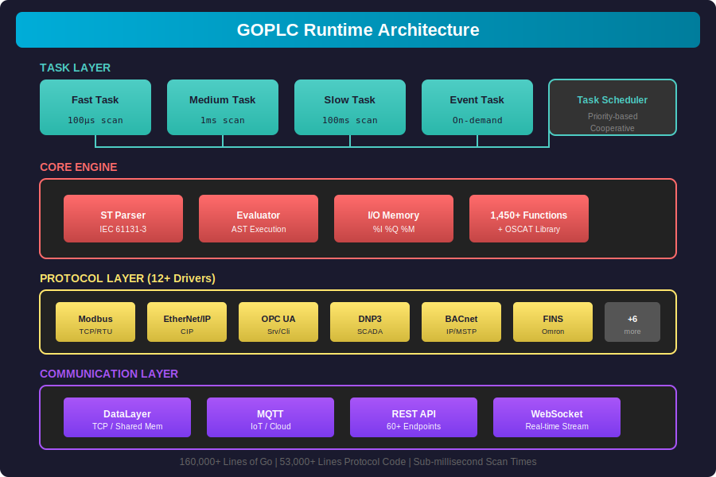
</p>

### Multi-PLC Clustering

<p align="center">
  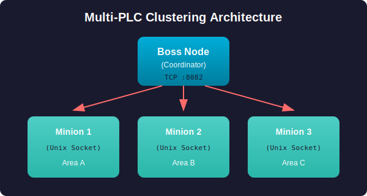
</p>

---

## Performance

<p align="center">
  <a href="https://www.youtube.com/watch?v=eV3Kc8fKmNk">
    
  </a>
  <br><em>Click to watch: Stress Test Walkthrough</em>
</p>

### Live Multi-PLC Benchmark (January 2026)

3 GOPLC instances running simultaneously with DataLayer synchronization:

<p align="center">
  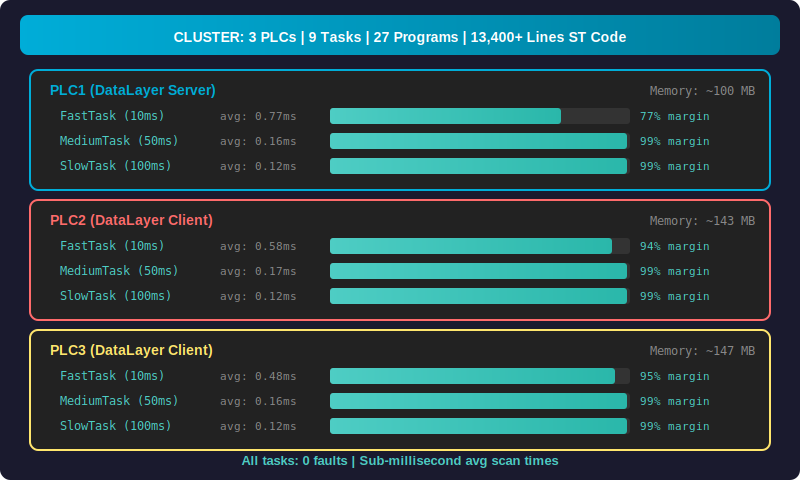
</p>

**Test Configuration:**
- 3 PLCs with DataLayer TCP sync (server + 2 clients)
- 9 programs per PLC: math, arrays, strings, JSON, datetime, regex, crypto, datastructures
- Each PLC running ~4,500 lines of Structured Text
- Modbus TCP servers on each PLC (ports 5601-5603)
- Real-time variable synchronization across all nodes

### Modbus Stress Test (January 2026)

<p align="center">
  
</p>

### Modbus Scalability Test - 500 Servers (January 2026)

<p align="center">
  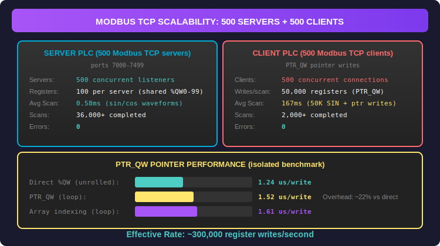
</p>

**PTR_QW Feature:** New system constants for pointer arithmetic with I/O memory:
- `PTR_QW` - Base pointer for output words (%QW)
- `PTR_IW` - Base pointer for input words (%IW)
- `PTR_MW` - Base pointer for marker words (%MW)

Enables efficient bulk I/O operations: `(PTR_QW + offset)^ := value`

### Modbus Scalability Test - 5000 Servers (January 2026)

<p align="center">
  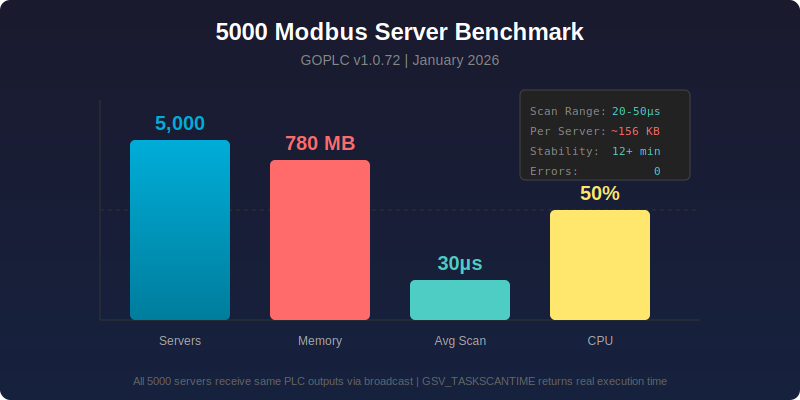
</p>

**Configuration:**
- 5000 concurrent Modbus TCP servers on ports 7000-11999
- ST program: Counter + GSV_TASKSCANTIME() writing to %QW0-1
- All servers receive same PLC outputs via driver broadcast

**Results:**
| Metric | Value |
|--------|-------|
| Scan Execution Time | 20-50µs (avg 30µs) |
| Memory Usage | 780 MB (~156 KB/server) |
| CPU Usage | 50% |
| Stability | 12+ minutes, 0 errors |

<p align="center">
  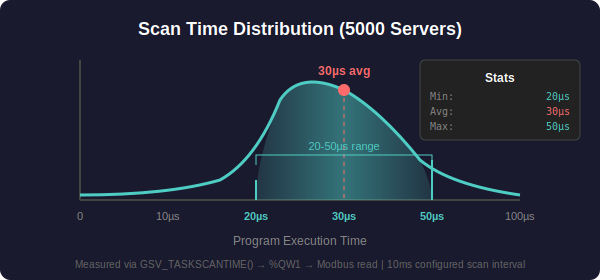
</p>

**Driver Broadcast Architecture:**

<p align="center">
  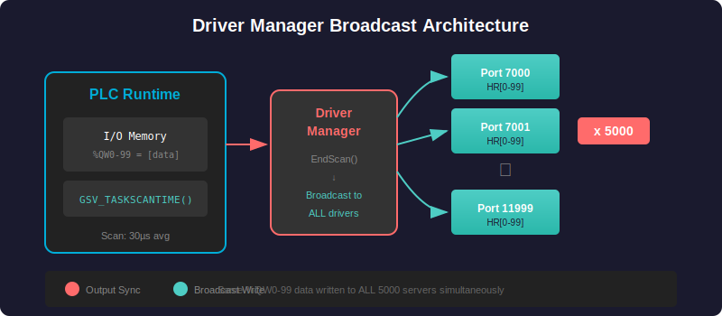
</p>

### Cluster Mode - Idle vs Running Programs (January 2026)

<p align="center">
  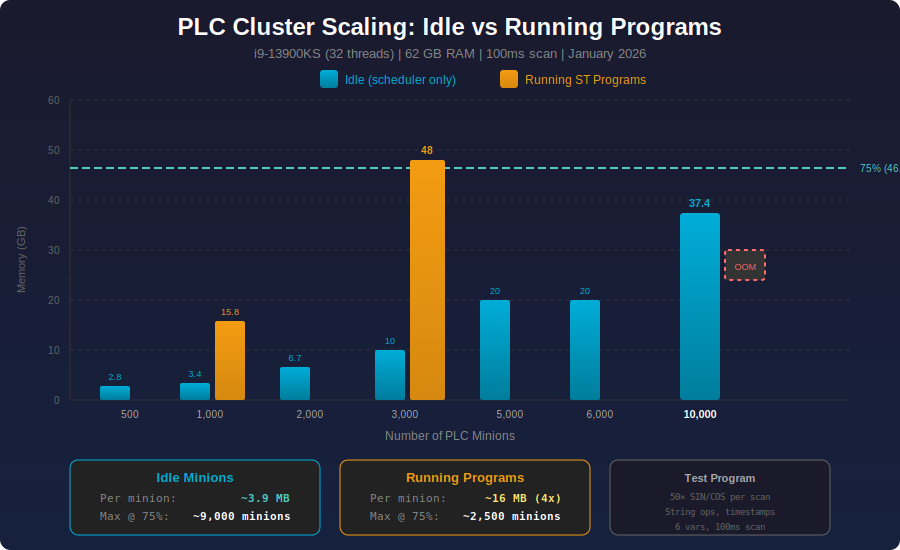
</p>

**Test Configuration:**
- Intel i9-13900KS (32 threads), 62 GB RAM
- Single-process architecture with goroutine-based minions
- Each minion has fully isolated PLCContext (protocols, connections, data)
- Boss API proxies to minions via Unix sockets

**Idle Minions (scheduler only):**
| Minions | RAM | Per Minion | CPU |
|---------|-----|------------|-----|
| 1,000 | 3.4 GB | 3.4 MB | 24% |
| 5,000 | 20 GB | 4.0 MB | 67% |
| **10,000** | **37.4 GB** | **3.9 MB** | **108%** |

**Running ST Programs (50x SIN/COS, string ops, 100ms scan):**
| Minions | RAM | Per Minion | CPU | Load |
|---------|-----|------------|-----|------|
| 1,000 | 15.8 GB | 15.8 MB | 63% | 2.96 |
| **3,000** | **48 GB** | **16 MB** | **188%** | **7.38** |

**Key Findings:**
- **Idle:** ~3.9 MB/minion → **~9,000 minions** at 75% resources
- **Running:** ~16 MB/minion (4x overhead) → **~2,500 minions** at 75% resources
- Memory is the limiter, not CPU

### Benchmarks

| Metric | Result |
|--------|--------|
| **Scan execution time** | 20-50μs (5000 servers) |
| **Minimum scan interval** | 100μs sustained |
| **Modbus throughput** | 89,769 req/sec (100 connections) |
| **Modbus scalability** | 5000 servers (780 MB), 500 clients (0 errors) |
| **PTR_QW writes** | ~300,000 registers/sec |
| **DataLayer latency** | <1ms P50, <3ms P99 |
| **Memory footprint** | ~65MB typical, ~150MB with DataLayer |
| **Distributed speedup** | 10.4x throughput (same workload, 10 minions) |
| **Aggregate throughput** | 620,949 scans/sec (31 minions at 50μs) |
| **ST functions** | 1,450+ available |
| **Lines of code** | 180,000+ Go |

### Latency Distribution (2ms scan, DataLayer TCP)

<p align="center">
  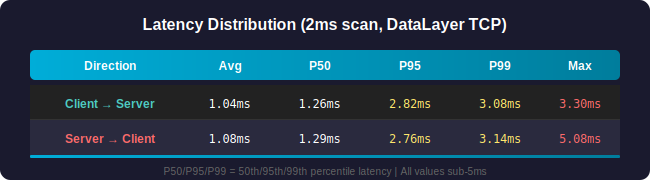
</p>

---

## REST API

Full REST API for integration with SCADA, MES, and custom applications.

### Key Endpoints

| Endpoint | Description |
|----------|-------------|
| `GET /api/tags` | List all tags with values |
| `GET/PUT /api/variables/:name` | Read/write variables |
| `POST /api/runtime/start` | Start PLC runtime |
| `POST /api/runtime/stop` | Stop PLC runtime |
| `POST /api/tasks/:name/reload` | Hot-reload a single task |
| `GET /api/diagnostics` | Full runtime diagnostics |
| `GET /api/capabilities` | List supported protocols, functions, clustering |
| `GET /api/docs/functions` | All 1,450+ function signatures |
| `GET /api/analyzer/transactions` | Protocol capture data |
| `GET /api/cluster/:name/*path` | Proxy to cluster minion |
| `GET /api/nodered/status` | Node-RED subprocess status |
| `GET /api/debug/step/state` | Debugger state and position |
| `GET /ws` | WebSocket for real-time updates |

See [`docs/API.md`](docs/API.md) for complete API reference.

---

## Diagnostics

### Per-Module Debug System

Runtime-toggleable logging with per-module granularity. 15+ modules including `webui`, `nextion`, `modbus`, `fins`, `enip`, `opcua`, `datalayer`, `hal`, and more.

```bash
# Get debug status for all modules
curl http://localhost:8082/api/debug/status

# Set module-specific log level
curl -X PUT http://localhost:8082/api/debug/runtime/modules/modbus \
  -d '{"level": "trace"}'

# View debug ring buffer (optionally filter by module)
curl http://localhost:8082/api/debug/log?module=modbus

# Enable/disable entire debug system
curl -X POST http://localhost:8082/api/debug/runtime -d '{"enabled": true}'
```

---

## Use Cases

GOPLC is designed for:

- **Industrial Automation** - Replace or supplement traditional PLCs
- **Protocol Gateway** - Bridge between different protocols (data center, building, utility)
- **Edge Computing** - Run on Raspberry Pi, industrial PCs
- **Distributed Control** - Boss/Minion clustering for large installations
- **HMI/SCADA Backend** - Node-RED dashboards + high-performance data collection
- **Simulation** - Test automation logic without hardware
- **Education** - Learn PLC programming with modern tools

---

## Whitepapers

| Whitepaper | Description |
|------------|-------------|
| [Clustering: Distributed Real-Time PLC Performance](docs/whitepaper-clustering.md) ([PDF](docs/whitepaper-clustering.pdf)) | Architecture, benchmark methodology, and measured results: 10.4x throughput improvement, 620,949 aggregate scans/sec, linear scaling to 500+ minions, water treatment plant validation |
| [Datacenter Gateway: Universal Protocol Gateway](docs/whitepaper-datacenter-gateway.md) ([PDF](docs/whitepaper-datacenter-gateway.pdf)) | Three-tier DC hierarchy, 12 protocol drivers, dual-path MQTT + DNP3 store-and-forward, redundancy strategies, AI-assisted commissioning, ctrlX CORE deployment |
| [DC Simulation: Hardware Gateway Architecture](docs/WHITEPAPER_DC_SIMULATION_HARDWARE.md) ([PDF](docs/WHITEPAPER_DC_SIMULATION_HARDWARE.pdf)) | 11 device simulators, 6 gateway blueprints, scale estimates 50 MW–1 GW, ctrlX CORE edge SBC deployment, standalone vs cluster decision matrix, full cost model |
| [DC Simulation: Virtualized Gateway Architecture](docs/WHITEPAPER_DC_SIMULATION_VIRTUAL.md) ([PDF](docs/WHITEPAPER_DC_SIMULATION_VIRTUAL.pdf)) | Server VM gateways via Cisco SVI routing, 51–66% total cost reduction vs hardware, migration path, IEC 62443 security considerations |

---

## License

GOPLC is proprietary software. Contact jbelcher@jmbtechnical.com for licensing inquiries.

---

<p align="center">
  <strong>Built with Go</strong><br>
  <em>Industrial-grade automation for the modern world</em>
</p>
