<p align="center">
  
</p>

<h1 align="center">GOPLC</h1>

<p align="center">
  <strong>Industrial-Grade PLC Runtime in Go</strong><br>
  IEC 61131-3 Structured Text | 15 Protocol Drivers | Web IDE | 280,000+ Lines of Code
</p>

<p align="center">
  
  
  
  
</p>

<!-- docs-gen:begin facts (auto-updated from /api/capabilities — do not edit between these markers) -->
> **Live build facts** — auto-updated from `/api/capabilities`. _GOPLC 1.0.959, 2026-05-28._
>
> **2248** built-in functions · **12** standard function blocks.
<!-- docs-gen:end -->

<p align="center">
  <a href="#features">Features</a> •
  <a href="#web-ide">Web IDE</a> •
  <a href="#node-red-integration">Node-RED</a> •
  <a href="#debugger">Debugger</a> •
  <a href="#ai-assistant">AI</a> •
  <a href="#agentic-control-loop">Agentic</a> •
  <a href="#hardware-manifests">Manifests</a> •
  <a href="#protocols">Protocols</a> •
  <a href="#industrial-control--enhanced-pid--autotune">PID+Autotune</a> •
  <a href="#video-historian--vision-pipeline">Video&Vision</a> •
  <a href="#l5x--rockwell-import">L5X</a> •
  <a href="#foundation-registry-architectural-metadata-for-ai-agents">Foundation</a> •
  <a href="#events-event-spine--webhooks">Events</a> •
  <a href="#alarms">Alarms</a> •
  <a href="#audit--compliance">Audit</a> •
  <a href="#snapshots-edit-history--revert">Snapshots</a> •
  <a href="#embedded-messaging-brokers">Brokers</a> •
  <a href="#trend-component">Trends</a> •
  <a href="#clustering">Clustering</a> •
  <a href="#redundancy--failover">Redundancy</a> •
  <a href="#authentication">Auth</a> •
  <a href="#licensing">Licensing</a> •
  <a href="#snap--ctrlx-core">Snap</a> •
  <a href="#download">Download</a> •
  <a href="#quick-start">Quick Start</a> •
  <a href="#architecture">Architecture</a> •
  <a href="#whitepapers">Whitepapers</a>
</p>

---

## What is GOPLC?

GOPLC is a **full-featured PLC runtime** written entirely in Go. It executes IEC 61131-3 Structured Text programs with industrial-grade features:

- **Multi-task scheduler** with priorities, watchdogs, and microsecond-precision scan times
- **25+ protocol drivers** including Modbus, EtherNet/IP, DNP3, BACnet, OPC UA, FINS, S7, IEC 104, Sparkplug B, KNX, M-Bus, SNMP, ZMQ, NATS, MQTT, and ctrlX EtherCAT
- **ctrlX CORE EtherCAT I/O** — native Data Layer IPC via Bosch SDK: 500 Hz polling, 0.69ms scan, 10x faster than REST
- **Built-in Web IDE** with Monaco editor, statement-level debugger, project management, and a built-in trend component with auto-scaling and event-marker overlays
- **Integrated Node-RED** with 7 custom PLC nodes for building HMI dashboards
- **AI Assistant** supporting Claude, OpenAI, and Ollama for code generation
- **AI architecture registry** — every foundational package ships a `.foundation.yaml`, queryable via REST + MCP so agents can answer "where does X live" and "what breaks if I change Y" without grep
- **2,200+ built-in functions** covering math, strings, crypto, HTTP, databases, motion control, vision, video capture, and more
- **Enhanced PID + autotune** — Rockwell-style PIDE function block with relay-feedback (Åström-Hägglund) automatic tuning
- **Video historian + vision pipeline** — camera burst capture indexed in SQLite, plus a pluggable CV backend (ONNX inference, gauge reader, ZXing barcode/QR)
- **L5X / Rockwell import** — Studio 5000 / RSLogix exports translate to GOPLC ST with visible warnings for anything unsupported
- **Real-time capable** with memory locking, CPU affinity, and GC tuning
- **Boss/Minion clustering** scaling to 10,000+ PLC instances

<p align="center">
  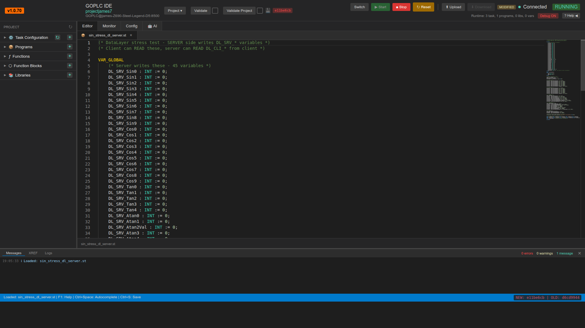
</p>

---

## Features

### Core Runtime

| Feature | Description |
|---------|-------------|
| **ST Parser** | Full IEC 61131-3 Structured Text with extensions |
| **Multi-task Scheduler** | Cooperative scheduling with priorities (1-255) |
| **Scan Times** | From 100μs to hours, configurable per task |
| **Watchdog Protection** | Per-task watchdogs with fault/halt options |
| **Hot Reload** | Update individual tasks without stopping the runtime |
| **Function Blocks** | TON, TOF, TP, RTO, CTU, CTD, CTUD, R_TRIG, F_TRIG, SR, RS, SEMA, AVERAGE, PID, **PIDE** (Rockwell-style with relay-feedback autotune) |
| **RETAIN Variables** | Persistent variables across warm/cold restarts |
| **Project Files** | Single `.goplc` file contains programs, tasks, configs, HMI pages |

### 2,200+ Built-in Functions

| Category | Count | Highlights |
|----------|-------|------------|
| **Conversion** | 157 | INT_TO_REAL, DWORD_TO_TIME, HEX_TO_INT |
| **Data Structures** | 130 | LIST_*, MAP_*, QUEUE_*, STACK_*, SET_*, HEAP_*, DEQUE_* |
| **Crypto & Encoding** | 55 | AES_*, SHA*, RSA_*, JWT_*, HMAC_*, BASE64_*, GZIP_* |
| **MQTT & Sparkplug B** | 56 | MQTT_PUBLISH, MQTT_SUBSCRIBE, SPARKPLUG_NODE_*, SPARKPLUG_METRIC_* |
| **SNMP** | 47 | SNMP_GET, SNMP_WALK, SNMP_AGENT_*, SNMP_TRAP_* (v1/v2c/v3) |
| **Resilience** | 40 | CIRCUIT_BREAKER_*, RATE_LIMIT_*, RETRY_*, CACHE_*, BULKHEAD_* |
| **Array (Functional)** | 50 | ARRAY_SORT, ARRAY_FILTER, ARRAY_MAP, ARRAY_REDUCE, ARRAY_ZIP_WITH |
| **Debug** | 35 | DEBUG_TO_FILE, DEBUG_TO_SQLITE, DEBUG_TO_INFLUX, DEBUG_TO_SYSLOG |
| **String & Regex** | 43 | CONCAT, SPLIT, REGEX_*, FORMAT, JSON_* |
| **JSON** | 25 | JSON_PARSE, JSON_GET, JSON_SET, JSON_MERGE, JSON_PATH |
| **Motion Control** | 23 | MC_POWER, MC_MOVE_ABSOLUTE, MC_HOME, MC_JOG, GSV/SSV |
| **HTTP & URL** | 22 | HTTP_GET, HTTP_POST, URL_ENCODE, URL_PARSE, QUERY_STRING_* |
| **Serial I/O** | 20 | SER_OPEN, SER_READ, SER_WRITE, SERIAL_PORTS, SERIAL_FIND |
| **Database** | 21 | DB_CONNECT, DB_QUERY, DB_EXEC, DB_COMMIT, DB_LIST_TABLES |
| **DateTime** | 23 | NOW, DATE_*, TIME_*, ADD_TIME, DAY_OF_WEEK, TICK_MS |
| **InfluxDB** | 16 | INFLUX_CONNECT, INFLUX_WRITE, INFLUX_BATCH_ADD, INFLUX_BATCH_FLUSH |
| **NMEA & GPS** | 26 | NMEA_PARSE, NMEA_GET_LAT, GPS_DISTANCE, GPS_BEARING, GPS_IN_RADIUS |
| **File & Config** | 35 | FILE_READ, FILE_WRITE, CSV_PARSE, INI_READ, ZPL_BARCODE_128 |
| **Specialty Protocols** | 76 | KNX_SEND, MBUS_PARSE, ARTNET_SEND, SACN_SEND, MIDI_NOTE_ON, OSC_SEND, AT_CMD |
| **Math & Statistics** | 40 | SIN, COS, SQRT, POW, MEDIAN, STDDEV, CORRELATION, PERCENTILE |
| **Barcode & Scale** | 17 | BARCODE_PARSE, BARCODE_GS1_GET, SCALE_PARSE, SCALE_GET_WEIGHT |
| **+ OSCAT Library** | 557 | Complete OSCAT Basic library (384 functions + 173 FBs) |

### Real-time Capabilities

```yaml
realtime:
  enabled: true
  mode: container          # container | host | off
  lock_os_thread: true     # Pin goroutines to OS threads
  cpu_affinity: [2, 3]     # Pin to specific CPU cores
  memory_lock: true        # mlockall() to prevent page faults
  gc_percent: 500          # Reduce GC frequency
  rt_priority: 50          # SCHED_FIFO priority (requires privileges)
```

---

## Web IDE

GOPLC includes a full-featured browser-based IDE built on 18 modular JavaScript components:

<p align="center">
  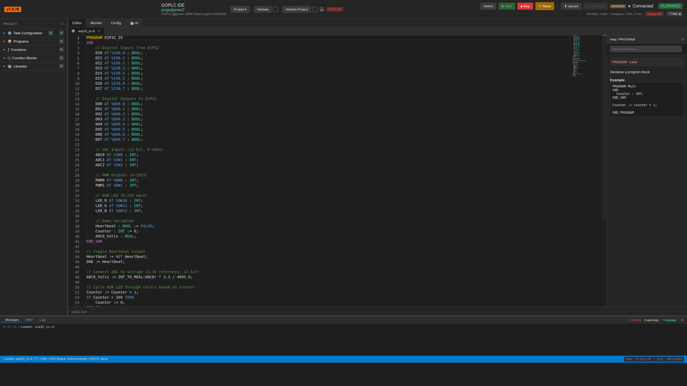
</p>

### IDE Features

- **Monaco Editor** with full IEC 61131-3 syntax highlighting
- **Project Tree** showing tasks, programs, functions, libraries
- **Live Variable Watch** with real-time updates via WebSocket
- **Runtime Control** - Start/Stop/Reset/Upload/Download
- **Project Management** - New/Open/Save/Export/Import (`.goplc` format)
- **Task Configuration** - Priorities, scan times, watchdogs
- **Per-Task Hot Reload** - Update one task without stopping others
- **Multi-Runtime Switch** - Connect to different PLC instances
- **Hash-Based Sync Indicator** - Shows if IDE matches runtime code
- **Config Editor** - YAML configuration with syntax highlighting
- **Cross-Reference Search** - Find variable/function usage across all programs
- **Tags Browser** - Browse all tags with sorting and filtering

### Online Mode

CoDeSys-style live variable debugging — monitor and modify PLC variables in real-time while the program executes:

- **Split-Panel Layout** - Variable list panel alongside the editor with no layout shift
- **Click-to-Edit Values** - Click any variable value to write a new value to the running PLC
- **250ms Live Updates** - Continuous polling with change highlighting
- **Boolean Coloring** - TRUE values in green, FALSE in red
- **Type-Based Formatting** - Specialized display for BOOL, INT, REAL, TIME, STRING
- **FB Instance Support** - View function block member variables
- **Pause/Step/Resume** - Per-scan stepping for system-level debugging

<p align="center">
  <a href="https://www.youtube.com/watch?v=Sdb1rMul7Mg">
    
  </a>
  <br><em>Click to watch: Online Live View Demo</em>
</p>

### IDE Screenshots

<table>
<tr>
<td align="center">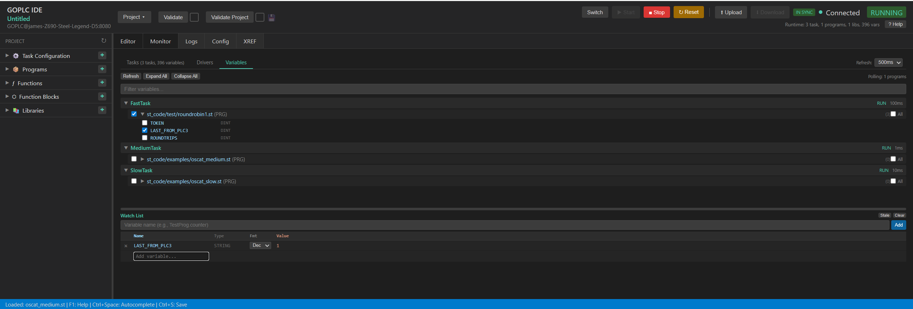<br><b>Monitor - Variables</b><br>Live task/variable view with Watch List</td>
<td align="center">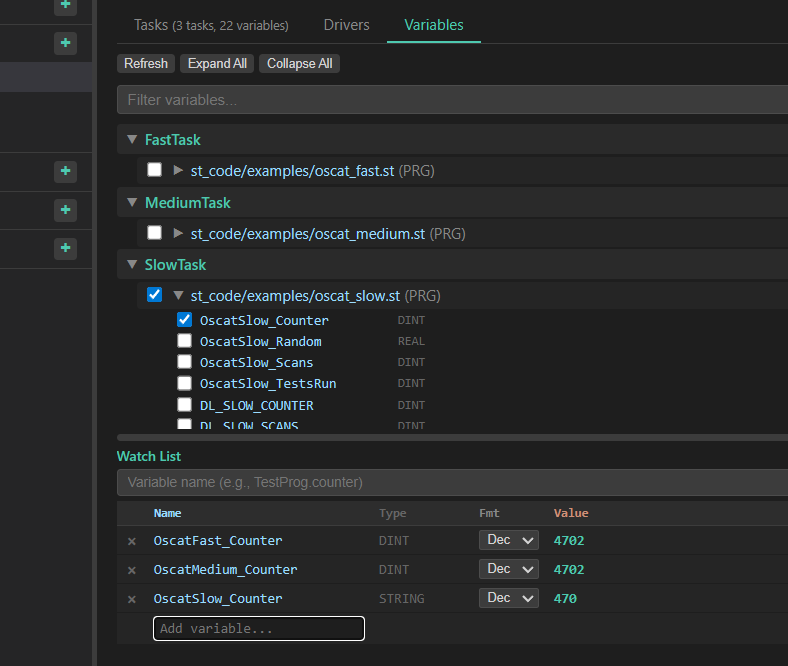<br><b>Watch List</b><br>Real-time variable monitoring</td>
</tr>
<tr>
<td align="center">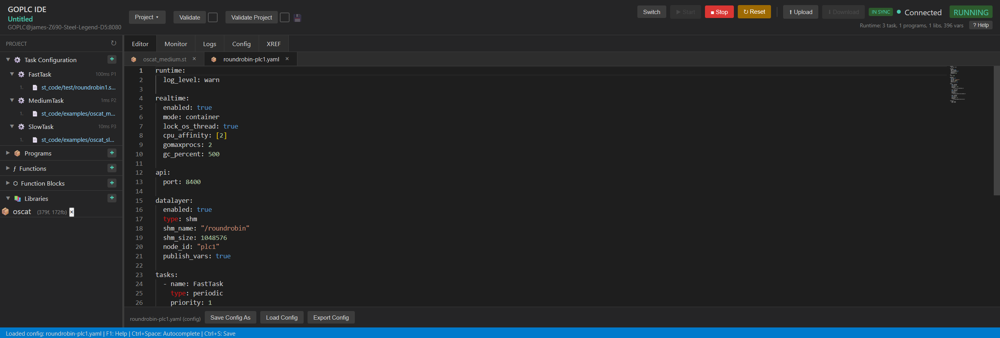<br><b>Config Editor</b><br>YAML configuration with syntax highlighting</td>
<td align="center">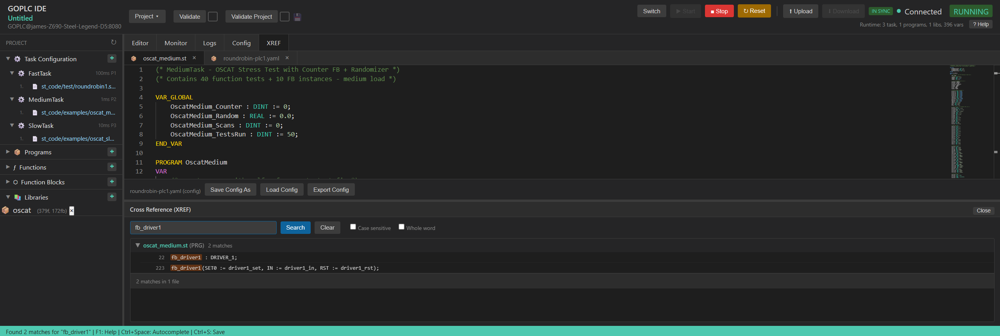<br><b>Cross Reference</b><br>Search across all programs</td>
</tr>
<tr>
<td align="center">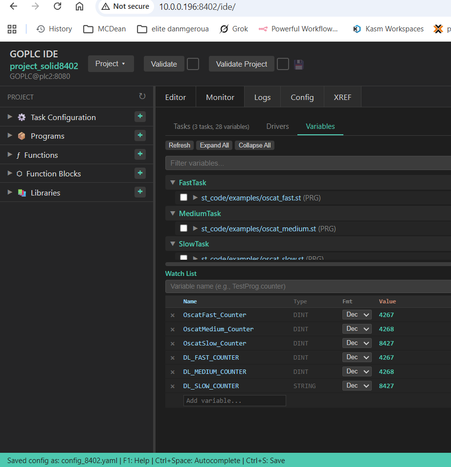<br><b>DataLayer Sync</b><br>Multi-PLC variable synchronization</td>
<td align="center">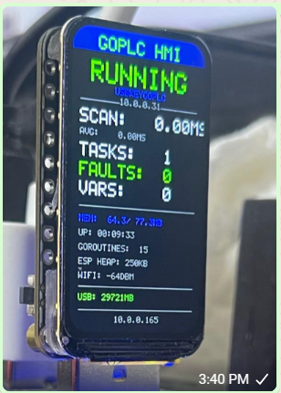<br><b>ESP32 HMI</b><br>Hardware status display</td>
</tr>
</table>

---

## Trend Component

`<goplc-trend>` is GOPLC's reusable web component for live and historical data visualization. One renderer drives every trend surface — the dedicated `/hmi/trend-fullscreen.html`, the per-page mini-trends, and any user-authored HMI panel. No charting library; direct canvas rendering for full control over BOOL data, multi-axis layout, and event overlays.

### Declarative usage

```html
<goplc-trend
  tags="pou.eye_x,pou.blinking,pou.motor_rpm"
  zoom="1m"
  retention="1800"
  height="360"
  title="Process trend"
  scales='{"pou.motor_rpm":{"min":0,"max":3000,"unit":"RPM"}}'
  events-kinds="alarm.*,operator.action"
  events-severity-min="warning"
  persist="my-trend-prefs">
</goplc-trend>
```

### Features

| Feature | Description |
|---------|-------------|
| **Auto-scale per pen** | Each pen gets its own Y-axis range so tags with wildly different magnitudes (0..100 and -50,000..70,000) both fill the chart |
| **BOOL pulse ticks** | Boolean tags rendered as discrete pulse markers, not line segments — readable digital signals |
| **Hydrate on connect** | One-shot `GET /api/history` backfills the in-memory ring buffer so a fresh trend isn't empty for the first `retention` seconds |
| **Live / pause anchor** | One-click toggle between live (chart follows now) and paused (chart anchored at a fixed timestamp) |
| **Scrollbar** | Draggable scrollbar scrubs through the full retention buffer when paused |
| **Wheel zoom** | Mouse wheel zooms the time window in/out around the cursor position |
| **Hover cursor + click-to-pin** | Hover shows per-pen values at the cursor; click pins them with a cyan dashed line for stable inspection |
| **Event-marker band** | Alarms and operator events overlay as colored ticks in a 12px top band; color encodes severity (info/warning/error). Adjacent events collapse into "+N" clusters when zoomed out |
| **Drag-to-resize** | A 4px handle on the bottom edge lets the user grow/shrink the canvas height interactively |
| **Variable picker** | `+` button opens a search-filterable list sourced from `/api/variables/meta` — type to filter, checkboxes toggle pens |
| **Legend pen actions** | Click toggles visibility; `×` removes the pen entirely. Pen color cycles through 12 colorblind-distinguishable values |
| **CSV export** | `Export` button serializes the visible window across all current pens as wide-format CSV (ISO8601 UTC timestamps, one column per tag) |
| **Engineering range pragmas** | When a tag declaration carries a documented range hint, the trend auto-scales to those engineering limits |
| **localStorage persistence** | `persist="<key>"` makes user customizations (pens, hidden tags, height, scales) survive a page reload |
| **Fullscreen page** | `web/hmi/trend-fullscreen.html` mounts the same component edge-to-edge, deep-linkable with attributes encoded in the URL |

### Data sources

- **Live samples** — `/api/variables/bulk` polled every `poll` ms (default 500ms); appends to a per-tag ring buffer sized by `retention`
- **Hydrate** — one-shot `GET /api/history?tag=...` to backfill from the edge historian when the trend first mounts
- **Events overlay** — `/api/events` polled (or WebSocket stream when `events-stream="true"`) when `events-kinds` is non-empty
- **Variable metadata** — `/api/variables/meta` cached once, drives BOOL vs analog rendering and the picker's search index

### Why this design

- **One component, every surface.** Before consolidation each page rendered its own trend; that produced inconsistent UX and quietly lost features when pages got rewritten. Now there is one renderer; features land once and show up everywhere.
- **No charting library.** Direct `CanvasRenderingContext2D`. Cuts ~80kB of dependency, gives exact control over BOOL rendering, event bands, frame-stable label formatting, and the multi-axis layout.
- **Polling + hydrate, not push.** Variable updates flow via cheap polling against `/api/variables/bulk`. The pub/sub hub is reserved for individual variable subscriptions in editor tabs; a busy trend page would otherwise dominate hub fanout.

---

## Debugger

Full statement-level step debugger comparable to CoDeSys and commercial PLC IDEs. Zero runtime overhead when disabled — a single atomic boolean check on the fast path.

### Debug Controls

| Action | Shortcut | Description |
|--------|----------|-------------|
| **Continue** | F5 | Resume execution until the next breakpoint |
| **Step Over** | F10 | Execute the current line, skip over function/FB calls |
| **Step Into** | F11 | Step into function and function block calls |
| **Step Out** | Shift+F11 | Run until the current function/FB returns |

### Debug Features

- **Line Breakpoints** - Click the editor gutter to set/clear breakpoints on any ST line
- **Breakpoint Enable/Disable** - Toggle breakpoints without removing them
- **Call Stack** - View the full function block / function call chain at each stop
- **Variable Inspection** - Examine all variables and their current values at each step
- **Multi-Task Broadcast** - When any task hits a breakpoint, ALL tasks pause for a consistent system snapshot
- **Watchdog Auto-Suspend** - Watchdog timers automatically suspend while stopped in the debugger
- **Hit Counter** - Track how many times each breakpoint has been triggered

### Debug API

```bash
# Enable the debugger
curl -X POST http://localhost:8082/api/debug/step/enable

# Set a breakpoint at line 15 of MainProgram
curl -X POST http://localhost:8082/api/debug/step/breakpoints \
  -d '{"program": "MainProgram", "line": 15}'

# Continue execution
curl -X POST http://localhost:8082/api/debug/step/continue

# Step into the next statement
curl -X POST http://localhost:8082/api/debug/step/into

# Step over the current statement
curl -X POST http://localhost:8082/api/debug/step/over

# Step out of the current function/FB
curl -X POST http://localhost:8082/api/debug/step/out

# Get current debug state (position, stopped status, call stack)
curl http://localhost:8082/api/debug/step/state
```

<p align="center">
  <a href="https://www.youtube.com/watch?v=vO16D4oMQJY">
    
  </a>
  <br><em>Click to watch: Debugger Walkthrough</em>
</p>

---

## Node-RED Integration

GOPLC manages Node-RED as an integrated subprocess with full lifecycle management, a reverse proxy, and **7 custom PLC nodes** for building industrial HMI dashboards — all accessible through the same port as the Web IDE.

### How It Works

```
GOPLC (port 8082)
├── /ide/          → Web IDE
├── /nodered/      → Node-RED editor (reverse proxied)
├── /hmi/          → Built-in HMI pages
└── /api/          → REST API
```

- Node-RED auto-starts with GOPLC and auto-restarts on crash (exponential backoff)
- No separate port needed — reverse proxy serves Node-RED through GOPLC's API port
- GOPLC host/port injected into Node-RED's global context for zero-config node connections

### 7 Custom PLC Nodes

| Node | Description |
|------|-------------|
| **goplc-connection** | Config node — auto-detects host/port from global context |
| **goplc-read** | Read a single variable or all variables from the PLC |
| **goplc-write** | Write values to PLC variables |
| **goplc-subscribe** | Real-time WebSocket variable updates with on-change filtering |
| **goplc-runtime** | Start/stop/status control of the PLC runtime |
| **goplc-task** | Task management — reload, status, per-task control |
| **goplc-cluster** | Read/write variables on cluster minions via boss proxy |

### Dashboard Support

Auto-installs `@flowfuse/node-red-dashboard` (Dashboard 2.0) for building operator HMI screens. Includes demo flows:

- **Industrial HMI Demo** - Water treatment plant dashboard with live gauges, trends, and alarm panels
- **Dual Runtime** - Multi-PLC communication and monitoring
- **Quick Start Dashboard** - Simple template to get started

### AI Flow Generation

The AI assistant can generate complete Node-RED flows from natural language descriptions. Generated flows include custom PLC nodes pre-configured for the current runtime. Import directly from the AI chat with one click.

<p align="center">
  <a href="https://www.youtube.com/watch?v=dVYpVslmxfc">
    
  </a>
  <br><em>Click to watch: Node-RED Integration Walkthrough</em>
</p>

### Configuration

```yaml
nodered:
  enabled: true
  port: 1880                    # Node-RED internal port
  auto_start: true
  restart_on_crash: true
  max_restarts: 5
  restart_backoff_ms: 2000
  user_dir: "data/nodered"
  flow_file: "flows.json"
  credential_secret: ""         # Optional encryption key
  extra_modules:                # Auto-install on startup
    - "@flowfuse/node-red-dashboard"
```

### Node-RED API

```bash
# Check Node-RED status (uptime, PID, restart count)
curl http://localhost:8082/api/nodered/status

# Start/stop/restart Node-RED subprocess
curl -X POST http://localhost:8082/api/nodered/start
curl -X POST http://localhost:8082/api/nodered/stop
curl -X POST http://localhost:8082/api/nodered/restart
```

---

## AI Assistant

Built-in AI coding assistant that understands all 1,900+ ST functions and can generate Structured Text code, HMI pages, and Node-RED flows from natural language descriptions.

### Multi-Provider Support

| Provider | Models | Use Case |
|----------|--------|----------|
| **Claude** (Anthropic) | claude-sonnet-4-20250514 (default) | Best ST code quality |
| **OpenAI** | GPT-4o, GPT-4, etc. | Alternative cloud provider |
| **Ollama** | qwen2.5-coder, deepseek-r1, etc. | Fully local/offline |

### What It Can Generate

- **Structured Text Programs** - PID loops, state machines, alarm handlers, protocol integrations. Detected as `iec` code blocks with an "Insert as Program" button.
- **HMI Pages** - Custom web dashboards with live PLC data. Detected as HTML with "Preview" and "Save as HMI Page" buttons.
- **Node-RED Flows** - Complete flow JSON with custom PLC nodes. Detected automatically with an "Import to Node-RED" button.

### Context-Aware

The AI receives the full function registry (1,900+ signatures with return types), current runtime variables, active tasks, and loaded programs as context — so it generates code that works with your specific setup.

<p align="center">
  <a href="https://www.youtube.com/watch?v=N2t-iAHdrvc">
    
  </a>
  <br><em>Click to watch: AI Code Writing Demo</em>
</p>

### Configuration

```yaml
ai:
  enabled: true
  provider: "claude"            # claude | openai | ollama
  api_key_env: "ANTHROPIC_API_KEY"
  model: "claude-sonnet-4-20250514"
  endpoint: ""                  # Required for Ollama (e.g., http://localhost:11434/v1)
  max_tokens: 8192
  temperature: 0.3
```

---

## Agentic Control Loop

An autonomous AI control agent that operates the PLC directly — separate from the code-writing assistant. Instead of generating code for a human to review, it reads sensors, writes setpoints, deploys programs, and manages tasks via tool calls in a multi-turn loop.

### 12 Built-in Control Tools

| Tool | Category | Description |
|------|----------|-------------|
| `read_variable` | Read-only | Read current PLC variable value |
| `list_variables` | Read-only | List all variables with optional prefix filter |
| `get_task_status` | Read-only | All task states, scan times, faults |
| `get_diagnostics` | Read-only | Memory, uptime, scan stats |
| `get_faults` | Read-only | Active task fault messages |
| `write_variable` | Normal | Write setpoint or control variable |
| `reload_task` | Normal | Hot-reload task without stopping others |
| `start_task` | Normal | Start named task or all tasks |
| `create_manifest` | Normal | Register hardware descriptor |
| `create_hmi_page` | Normal | Generate Node-RED Dashboard 2.0 flow |
| `deploy_program` | Normal | AI-generate and deploy a control program |
| `stop_task` | Critical | Stop a running task |

```bash
curl -X POST http://localhost:8082/api/ai/control \
  -H "Content-Type: application/json" \
  -d '{
    "message": "Ramp the temperature setpoint to 50 degrees and start the pump",
    "max_turns": 6
  }'
```

The response includes `actions_executed` — a full log of every tool call and result — and `turns_used` showing how many AI iterations were needed. Multi-turn conversation history is supported for follow-up instructions.

---

## Hardware Manifests

Declarative YAML descriptors for physical hardware. GOPLC reads manifests and auto-generates a `SysInit_{id}` ST program that opens hardware channels on startup and maps sensor readings to named PLC variables.

```yaml
id: "greenhouse_1"
name: "Tomato Greenhouse"
hardware:
  - id: "temp_sensor"
    type: "phidgets"
    channel_type: "temperature"
    serial: -1          # -1 = any connected device
    hub_port: 0
    st_var: "temp_c"

  - id: "heater_relay"
    type: "phidgets"
    channel_type: "digital_output"
    hub_port: 2
    st_var: "heater_on"

  - id: "custom_sensor"
    type: "custom"
    open_call: "MY_DEVICE_OPEN('{name}')"
    read_call: "MY_DEVICE_READ('{name}')"
    write_call: "MY_DEVICE_WRITE('{name}', {var})"
```

GOPLC generates `VAR_GLOBAL` declarations for all `st_var` bindings and a startup sequence that initializes each hardware channel. Manifests can be created manually, via API, or through the agentic control loop.

**API:**

```bash
GET    /api/system/manifests              # List all manifests
POST   /api/system/manifests              # Create manifest
PUT    /api/system/manifests/:id          # Update manifest
DELETE /api/system/manifests/:id          # Delete manifest
```

---

## HMI Builder

Create and serve custom web-based operator displays directly from the IDE.

### Built-in Default Dashboard

GOPLC ships with a default HMI dashboard at `/hmi/default-dashboard` showing:

- Runtime state, uptime, scan count, and memory usage
- Live trend charts for task scan times
- System information and feature summary

### Custom Pages

- Create custom HTML pages via the AI assistant or manually
- Pages stored inside the `.goplc` project file (portable, single-file deployment)
- Helper library (`goplc-hmi.js`) provides variable read/write from HMI pages
- Served at `/hmi/:page-name` with no additional configuration

### HMI API

```bash
# List all HMI pages
curl http://localhost:8082/api/hmi/pages

# Create a new page
curl -X POST http://localhost:8082/api/hmi/pages \
  -d '{"name": "tank-overview", "content": "<html>...</html>"}'

# Get/update/delete pages
curl http://localhost:8082/api/hmi/pages/tank-overview
curl -X PUT http://localhost:8082/api/hmi/pages/tank-overview -d '{"content": "..."}'
curl -X DELETE http://localhost:8082/api/hmi/pages/tank-overview
```

---

## Config Wizard

Searchable topic browser with static forms and AI-assisted setup that generates ready-to-apply YAML configuration. Lowers the barrier for configuring protocols, clustering, and services.

### Available Topics

| Topic | Mode | Description |
|-------|------|-------------|
| **AI Setup** | Form | Configure AI provider, API key, model |
| **Modbus Server** | Form | TCP server with register mapping |
| **Modbus Client** | Form | TCP client with polling intervals |
| **OPC UA Server** | Form | Server configuration |
| **FINS** | Form | Omron FINS protocol setup |
| **EtherNet/IP** | Form | Adapter and scanner configuration |
| **DNP3** | Form | Master/outstation setup |
| **S7comm** | Form | Siemens S7 configuration |
| **Cluster Boss** | Form | Boss with member list (add/remove rows) |
| **Cluster Minion** | Form | Minion with unix socket |
| **I/O Mapping** | Form | Map ST variables to protocol addresses |
| **Modbus Bridge** | AI | Custom gateway configurations |
| **Performance** | AI | Tuning and optimization guidance |
| **Real-time** | AI | RT container mode setup |
| **DataLayer** | AI | Multi-PLC sync configuration |

Each form generates a YAML snippet that can be applied via hot-reload — no restart needed.

---

## Protocols

GOPLC includes **60,000+ lines** of protocol code for seamless integration with existing automation systems.

### Industrial & Specialty Protocols

| Protocol | Role | Transport | Lines | Target Systems |
|----------|------|-----------|-------|----------------|
| **Modbus TCP/RTU** | Server + Client | TCP, UDP, Serial | 7,241 | Universal - PLCs, VFDs, meters, sensors |
| **DNP3** | Master + Outstation | TCP, UDP, Serial | 13,354 | SCADA - Electric, water, gas utilities |
| **BACnet/IP & MSTP** | Server + Client | UDP, RS-485 | 7,883 | Building automation - HVAC, fire, access |
| **EtherNet/IP** | Adapter + Scanner | TCP, UDP | 5,388 | Allen-Bradley - CompactLogix, ControlLogix |
| **OPC UA** | Server + Client | TCP | 4,496 | Modern - Cloud integration, MES, SCADA |
| **FINS** | Server + Client | TCP, UDP | 3,565 | Omron - NX, NY, CP, CJ series PLCs |
| **S7comm** | Server + Client | TCP (TPKT/COTP) | 2,441 | Siemens - S7-300, S7-400, S7-1200, S7-1500 |
| **IEC 60870-5-104** | Client + Server | TCP | 2,100 | Utilities - Power grid SCADA, substation automation |
| **Sparkplug B** | Node + Host | MQTT + Protobuf | 1,800 | IIoT - Unified Namespace, SCADA/MES integration |
| **PROFINET** | Server + Client | TCP, UDP | 1,997 | Siemens - Real-time industrial Ethernet |
| **SEL** | Server + Client | Serial | 1,758 | Protective relays - Power system monitoring |
| **SNMP v1/v2c/v3** | Client + Agent + Trap | UDP | 3,597 | Network devices - Switches, UPS, sensors |
| **DF1** | Client | Serial | 1,417 | Allen-Bradley legacy - SLC 500, MicroLogix, PLC-5 |
| **KNX** | Client | UDP/Multicast | 600 | Building automation - Lighting, blinds, HVAC |
| **M-Bus** | Master | TCP, Serial | 700 | Utility metering - Water, gas, heat, electric |
| **ctrlX EtherCAT** | DI + DO | REST or Native IPC | 1,200 | Bosch ctrlX CORE - EtherCAT I/O modules |
| **Phidgets** | Sensors + Actuators | USB/VINT | 800 | Phidgets USB/VINT sensor and actuator modules |
| **ZMQ PUB/SUB** | Publisher + Subscriber | TCP, IPC, in-process | 1,500 | High-throughput messaging - pure-Go (forked `zmq4` in-tree, no libzmq) |
| **NATS** | Embedded Broker + Client | TCP | 2,400 | Cloud-native messaging - server bundled in the binary, JetStream streams, KV buckets |

### Specialty Communication

| Protocol | Functions | Transport | Use Case |
|----------|-----------|-----------|----------|
| **Art-Net / DMX512** | 7 | UDP | Stage lighting, architectural lighting control |
| **sACN / E1.31** | 7 | UDP Multicast | Entertainment lighting with priority control |
| **MIDI** | 16 | Serial/USB | Music production, audio equipment control |
| **OSC** | 12 | UDP | Audio/visual software, show control |
| **AT Commands** | 13 | Serial | Cellular modems, GSM/GPS modules |
| **NMEA 0183** | 17 | Serial | GPS receivers, marine electronics |

### Protocol Features

<details>
<summary><strong>Modbus TCP/RTU</strong> - Click to expand</summary>

- Full function code support (FC01-06, FC15-16)
- Coils, discrete inputs, holding registers, input registers
- RTU framing with CRC-16
- RS-485 half-duplex with RTS control
- Connection pooling and retry logic
- Diagnostics counters (FC08)
- Gateway mode (TCP to RTU bridge)

</details>

<details>
<summary><strong>DNP3</strong> - Click to expand</summary>

- Complete Master and Outstation implementation
- Binary/Analog inputs and outputs
- Counters with freeze support
- Event buffering with classes (1, 2, 3)
- Unsolicited responses
- Select-Before-Operate (SBO) control
- Time synchronization
- Serial transport (RS-232/RS-485)
- Data link layer with FCB/FCV
- Store-and-forward with SQLite buffering, GZIP compression, AES-256-GCM encryption

</details>

<details>
<summary><strong>BACnet/IP & MSTP</strong> - Click to expand</summary>

- BACnet/IP over UDP (port 47808)
- BACnet/MSTP over RS-485 (token passing)
- All standard object types (AI, AO, AV, BI, BO, BV, MI, MO, MV)
- COV (Change of Value) subscriptions
- ReadPropertyMultiple for efficient polling
- Priority arrays (1-16) for commandable objects
- Schedule and Calendar objects
- TrendLog objects
- Alarm and Event services
- Segmentation for large responses
- Device discovery (Who-Is/I-Am)

</details>

<details>
<summary><strong>EtherNet/IP</strong> - Click to expand</summary>

- CIP (Common Industrial Protocol) messaging
- Adapter mode (expose tags to scanners)
- Scanner mode (read/write remote tags)
- Explicit messaging (TCP port 44818)
- Implicit I/O (UDP port 2222)
- ForwardOpen/ForwardClose connections
- Unconnected messaging (UCMM)
- Assembly objects for I/O data

</details>

<details>
<summary><strong>OPC UA</strong> - Click to expand</summary>

- Server and Client implementation
- Secure channel management
- Session authentication
- Node browsing
- Read/Write attributes
- Subscriptions with monitored items
- Method calls
- Security policies (None, Basic256Sha256)

</details>

<details>
<summary><strong>SNMP v1/v2c/v3</strong> - Click to expand</summary>

- SNMP v1, v2c, and v3 support
- GET, SET, GETNEXT, GETBULK operations
- WALK for MIB traversal
- Trap receiver
- SNMPv3 authentication (MD5, SHA)
- SNMPv3 privacy (DES, AES)
- ASN.1 BER encoding

</details>

<details>
<summary><strong>Sparkplug B v3.0</strong> - Click to expand</summary>

- Eclipse Sparkplug B specification v3.0 over MQTT
- Node lifecycle: NBIRTH, NDEATH, NDATA, NCMD
- Protobuf-encoded payloads with sequence numbering
- Metric types: boolean, integer, float, string with timestamps
- Command subscription for remote control (NCMD)
- Birth certificate on connect, death certificate via MQTT will
- Multi-metric batch publishing per NDATA message
- 26 ST functions for full node lifecycle management

</details>

<details>
<summary><strong>IEC 60870-5-104</strong> - Click to expand</summary>

- Full Client and Server implementation
- APCI frame handling (I, S, U formats)
- ASDU types: single/double-point, measured values, step position, normalized/scaled/short floating point
- Interrogation commands (station and group)
- Command types: single, double, regulating step, set-point
- Time-tagged variants for all information types
- 26 ST functions for IEC 104 operations
- Connection state machine with T1/T2/T3 timers

</details>

<details>
<summary><strong>ctrlX EtherCAT I/O</strong> - Click to expand</summary>

- **Two transport modes** switchable from ST code — no recompilation needed
- **REST mode** (`'rest'`): HTTP/TLS to ctrlX Data Layer REST API. Works everywhere, 100ms default poll
- **Native IPC mode** (`'dl'`): Direct function calls via official Bosch `ctrlx-datalayer-golang/v2` SDK (CGo). 2ms poll, 500 Hz I/O, sub-millisecond latency
- 10 ST functions: `CTRLX_EC_CREATE`, `START`, `STOP`, `CONNECTED`, `READ_DI`, `WRITE_DO`, `READ_DO`, `STATS`, `BROWSE`, `DELETE`
- `CTRLX_EC_WRITE_DO` returns FALSE when disconnected — ST-level connection loss detection
- Verified on Bosch ctrlX CORE X3 (ARM64 Cortex-A53) with physical loopback DO→DI
- Snap bundles `libcomm_datalayer.so` + `libsystemd.so` for native IPC at runtime

**Performance (measured on X3 hardware):**

| Metric | REST Mode | Native IPC Mode |
|--------|-----------|-----------------|
| Poll interval | 100ms | **2ms** |
| Avg scan | 1.2ms | **0.69ms** |
| I/O update rate | 10 Hz | **500 Hz** |
| Determinism | Variable (HTTP stack) | **Consistent (IPC)** |

</details>

### Communication Layer

| Module | Purpose | Transport | Features |
|--------|---------|-----------|----------|
| **DataLayer** | Multi-PLC sync | TCP, Shared Memory | Real-time variable sharing, <1ms latency, prefix filtering |
| **MQTT** | IoT/Cloud | TCP, TLS | Publish variables, subscribe to commands, QoS 0/1/2 |
| **MQTT Broker** | Embedded broker | TCP, TLS | `mochi-mqtt` server bundled in the binary, no external broker needed |
| **NATS** | Cloud-native messaging | TCP | Embedded `nats-server` + client driver, JetStream streams, KV buckets |
| **ZMQ PUB/SUB** | High-throughput pub/sub | TCP, IPC, in-proc | Pure-Go (forked `zmq4` in-tree, no CGO/libzmq dependency) |
| **HTTP/REST** | Integration | TCP | 60+ API endpoints, WebSocket streaming, SSE watch |
| **Store-and-Forward** | Reliability | SQLite | Offline buffering, GZIP compression, AES-256 encryption |
| **Serial** | Legacy | RS-232/485 | Configurable baud, parity, RTS/CTS flow control |

### Hardware Abstraction Layer (HAL)

**Tested & Production Ready:**

| Device | Interface | I/O Type | Use Case |
|--------|-----------|----------|----------|
| **Nextion HMI** | Serial/UART | Touch Display | Local operator interface |
| **USB Camera** | rpicam-still | Vision | Barcode, QC inspection |
| **ESP32 Remote I/O** | Modbus TCP | WiFi I/O Module | Wireless sensors/actuators |
| **Raspberry Pi GPIO** | Direct | Digital I/O | Edge computing, local control |
| **PCF8574** | I2C | 8-bit I/O Expander | Expand GPIO count |
| **Grove ADC** | I2C | Analog Input | Seeed Studio sensors |
| **Phidgets** | USB/VINT | Multi-sensor | Temperature, humidity, voltage, current, relays, motors, encoders (simulation mode; real hardware via CGO extension) |
| **ctrlX EtherCAT I/O** | REST or Native IPC | 16 DI + 16 DO | Bosch ctrlX CORE — 500 Hz native IPC, 0.69ms scan, verified on X3 hardware |

**Hobbyist & Maker Integrations:**

GOPLC bridges the gap between industrial automation and hobbyist/maker hardware. All devices use USB serial with automatic port discovery, heartbeat monitoring, and auto-recovery on disconnect/reconnect.

| Device | Interface | Functions | Capabilities |
|--------|-----------|-----------|-------------|
| **Parallax Propeller 2** | Serial/USB | 56 ST functions | 8-core MCU — GPIO, Smart Pins, UART, I2C, SPI, ADC/DAC, PWM, encoder, frequency counter, OLED SSD1306, servo |
| **Teensy 4.x** | Serial/USB | 40+ ST functions | ARM Cortex-M7 — GPIO, ADC, PWM pairs, encoder, frequency counter, CAN bus, I2C, SPI, UART, PID, NeoPixel, OLED, RTC, TRNG |
| **RP2040 / Pico** | Serial/USB | 25+ ST functions | Dual-core ARM — GPIO, ADC, PWM, I2C, SPI, UART, NeoPixel, OLED, servo, ultrasonic, temperature |
| **Arduino R4 WiFi** | Serial/USB | 20 ST functions | Digital/analog I/O, servo, I2C, WiFi, BLE, LED matrix, temperature, ultrasonic |
| **Flipper Zero** | Serial/USB | 35 ST functions | GPIO, buttons, IR TX/RX, Sub-GHz TX/RX, NFC, RFID — custom binary FAP driver |

**Implemented - Testing Soon:**

| Device | Interface | I/O Type | Use Case |
|--------|-----------|----------|----------|
| **Orange Pi GPIO** | Direct | Digital I/O | Cost-effective edge nodes |
| **ADXL345** | I2C | Accelerometer | Vibration monitoring |
| **DHT11/22** | 1-Wire | Temp/Humidity | Environmental sensing |
| **TFT Display** | SPI | Graphics Display | Custom HMI screens |

**Planned:**

| Device | Interface | I/O Type | Use Case |
|--------|-----------|----------|----------|
| **MCP3008** | SPI | 8-ch 10-bit ADC | Analog sensor input |
| **ADS1115** | I2C | 4-ch 16-bit ADC | Precision measurement |
| **MAX31855** | SPI | Thermocouple | High-temp sensing |
| **MCP23017** | I2C | 16-bit I/O Expander | More GPIO |
| **W5500** | SPI | Ethernet | Wired network on MCU |

### Protocol Analyzer

Built-in packet capture and analysis with support for all protocols:

```bash
# Start capture with filters
curl -X POST http://localhost:8082/api/analyzer/start \
  -d '{"protocols": ["modbus-tcp", "dnp3", "bacnet"]}'

# View captured transactions
curl http://localhost:8082/api/analyzer/transactions?limit=100

# Export to Wireshark
curl http://localhost:8082/api/analyzer/export/pcap -o capture.pcap

# Decode raw packet
curl -X POST http://localhost:8082/api/analyzer/decode \
  -d '{"protocol":"modbus-tcp","raw_hex":"00 01 00 00 00 06 01 03 00 00 00 0A"}'
```

**Supported decoders:** Modbus TCP/RTU, DNP3, BACnet/IP, EtherNet/IP, OPC UA, S7, FINS, IEC 104, SEL

### Protocol Coverage by Industry

| Industry | Protocols |
|----------|-----------|
| **Manufacturing** | Modbus, EtherNet/IP, PROFINET, S7, FINS, OPC UA, Sparkplug B |
| **Building Automation** | BACnet/IP, BACnet/MSTP, KNX, Modbus, SNMP, OPC UA |
| **Utilities/SCADA** | DNP3, IEC 104, Modbus, SEL, M-Bus, OPC UA |
| **Oil & Gas** | Modbus, DNP3, OPC UA, EtherNet/IP, Sparkplug B |
| **Water/Wastewater** | DNP3, Modbus, OPC UA, Sparkplug B |
| **Power Generation** | DNP3, IEC 104, Modbus, SEL, IEC 61850 (planned) |
| **Food & Beverage** | EtherNet/IP, Modbus, OPC UA, S7 |
| **Pharmaceutical** | OPC UA, Modbus, S7, EtherNet/IP |
| **Data Centers** | SNMP, Modbus, BACnet, Sparkplug B |
| **Entertainment/AV** | Art-Net, sACN, MIDI, OSC |
| **Marine/Fleet** | NMEA 0183, GPS, Modbus, MQTT |

---

## Industrial Control — Enhanced PID + Autotune

GOPLC ships a Rockwell-style **PIDE** function block alongside the classic IEC `PID` — same scan-cycle execution, more pins, and built-in **relay-feedback autotuning** based on the Åström-Hägglund 1984 method.

### PIDE Function Block

```iec
VAR
    loop : PIDE;
END_VAR

// Standard run pins
loop(
    PV   := process_value,
    SP   := setpoint,
    KP   := 1.2,
    KI   := 0.05,
    KD   := 0.0,
    CV_HI := 100.0,
    CV_LO := 0.0
);
output_to_actuator := loop.CV;
```

**What PIDE adds over plain PID:**

- **Independent / dependent / parallel gain forms** — pick the tuning convention your team already uses
- **CV high/low limits** with anti-windup integrator clamping
- **Bumpless manual ↔ auto transition** — manual writes to CV; switching to auto picks up where the operator left off
- **Output rate limiting** — clamp `dCV/dt` so an aggressive tune can't slam an actuator
- **Configurable derivative source** — derivative on PV (process) or error
- **Deadband** — quiet small oscillations without losing setpoint tracking

### Relay-Feedback Autotuning (Åström-Hägglund)

```iec
// Set the autotune trigger pin and PIDE drives a square-wave step in CV,
// counts the half-cycles in PV, and recovers the ultimate gain (Ku) and
// ultimate period (Pu). Ziegler-Nichols rules then suggest KP/KI/KD.
loop(AT := autotune_request, PV := process_value, SP := setpoint, ...);
```

- Square-wave relay step in CV induces a controlled oscillation
- Algorithm measures `Ku` (ultimate gain) and `Pu` (ultimate period) from the PV swing
- Suggested gains land in `loop.KP_TUNE`, `loop.KI_TUNE`, `loop.KD_TUNE` for one-click commit
- Verified against FOPDT plant simulations: `TestRelayAutotune_FOPDT` recovers `Ku=11.766`, `Pu=5.8s` from 13 half-cycles
- Standard textbook method, no proprietary tuning algorithm needed — same physics that powers commercial autotune tools

See the [PIDE Autotune Guide](docs/guides/goplc_pide_autotune_guide.md) for a complete walkthrough.

---

## Video Historian & Vision Pipeline

Two cooperating subsystems that bring camera frames into the PLC scan-cycle worldview.

### Video Historian

Burst capture of camera frames, triggered by ST code or HTTP, indexed in SQLite for time-correlation with events and alarms.

```iec
// Trigger a 5-second pre/post burst from ST
VIDEO_CAMERA_BURST('cam_1', 'reject_event', 5000, 5000);
```

```bash
# Or via HTTP
curl -X POST http://localhost:8082/api/video/cameras/cam_1/burst \
  -d '{"reason":"reject_event","pre_ms":5000,"post_ms":5000}'
```

- **Pre/post buffering** — frames already in the rolling buffer are saved when a burst is requested, so you see the seconds *leading up to* the event, not just after
- **SQLite burst index** — metadata (timestamp, reason, camera, frame count, path on disk) queryable like any other history
- **One-way emission** — videohist publishes events; it never subscribes back. Burst URLs surface as hyperlinks on the matching event entry in the IDE
- **Retention** — auto-prune by age and by total disk size

### Vision Pipeline

Pluggable CV backend registry. Backends register at process init; the engine pulls frames from a `FrameSource` and publishes detections to the event bus.

| Backend | Capability |
|---------|------------|
| **ONNX inference** | Run ONNX classification/detection models (`onnxruntime_go`) — defect detection, object counting, presence/absence |
| **Gauge reader** | Read analog dial gauges from camera frames — needle angle → engineering value |
| **ZXing barcode/QR** | Decode 1D and 2D codes in-frame (`gozxing`) — pure-Go, no Python sidecar |
| **Video historian source** | Re-run inference against historical bursts — same backend, different frame source |

```iec
// ST-side: read the last detection from the bus
detect_result : STRING;
detect_result := VISION_LAST_DETECTION('cam_1', 'defect_detector');
IF VISION_CONFIDENCE() > 0.85 THEN
    reject_count := reject_count + 1;
    VIDEO_CAMERA_BURST('cam_1', 'reject_event', 3000, 3000);
END_IF
```

All vision audit records persist to a separate SQLite audit store for 21 CFR Part 11 / IEC 62443 traceability.

---

## L5X / Rockwell Import

Studio 5000 / RSLogix `.L5X` exports translate to GOPLC ST in one API call. Anything that doesn't have an exact equivalent surfaces as a **visible warning**, not a silent gap.

```bash
curl -X POST http://localhost:8082/api/l5x/import \
  -F file=@MyProject.L5X
```

**What gets imported automatically:**

- Routines → POU function blocks (one per Routine)
- Variable declarations with type-mapping (DINT → DINT, REAL → REAL, BOOL → BOOL, arrays, structures)
- RLL (Relay Ladder Logic) rungs translated to ST statements
- Tag aliases and program-scoped vs controller-scoped variable visibility

**Supported RLL instructions** (rung-by-rung translation):

| Category | Instructions |
|----------|-------------|
| **Bit** | `XIC`, `XIO`, `OTE`, `OTL`, `OTU`, `ONS` |
| **Timer/Counter** | `TON`, `TOF`, `RTO`, `CTU`, `CTD`, `CTUD`, `RES` |
| **Compare** | `EQU`, `NEQ`, `GTR`, `GEQ`, `LES`, `LEQ`, `LIM`, `MEQ` |
| **Math** | `ADD`, `SUB`, `MUL`, `DIV`, `MOD`, `SQR`, `ABS`, `NEG` |
| **Move/Logic** | `MOV`, `COP`, `MVM`, `AND`, `OR`, `XOR`, `NOT`, `BTD`, `SWPB` |
| **Program flow** | `JMP`, `LBL`, `JSR`, `RET`, `SBR` |
| **File ops** | `FAL`, `FSC`, `BSL`, `BSR`, `FFU`, `FFL`, `LFU`, `LFL` |

**Visible warnings** for anything the converter doesn't recognize — emitted as inline ST comments and tallied in the API response:

```st
(* UNSUPPORTED RLL: MSG(MyMessageBlock) - manual translation required *)
```

The import API returns a per-program and per-project warning count so QA can see at a glance how clean the conversion was. Verified on real customer L5X exports — balance-of-plant control programs and water-treatment routines have both round-tripped with single-digit warning counts.

---

## Foundation Registry (Architectural Metadata for AI Agents)

Every foundational package in GOPLC ships a `.foundation.yaml` colocated with its source, describing what the package owns, its entry points, its contracts, and which docs to read for deeper context. A central registry (`pkg/foundation`) loads them all, derives the internal dependency graph automatically from `go list`, and validates entry-point symbols/files actually exist at build time.

Four query surfaces — same data, different transports:

```bash
# CLI
goplc foundation list
goplc foundation impact <package>        # blast-radius if you change it
goplc foundation concerns <keyword>      # which package owns this concern
goplc foundation search <query>          # ranked cross-field search

# REST
GET  /api/foundation/packages
GET  /api/foundation/packages/:name
GET  /api/foundation/impact/:name
GET  /api/foundation/concerns/:concern
GET  /api/foundation/search?q=

# MCP (for AI agents)
goplc_foundation_packages
goplc_foundation_package(name="auth")
goplc_foundation_impact(name="sqlitebatch")
goplc_foundation_concerns(concern="RBAC")
goplc_foundation_search(q="WebSocket")

# Per-package deep-dive — colocated with the code
cat pkg/auth/FOUNDATION.md
cat pkg/runtime/FOUNDATION.md
```

Why: an AI agent (Claude, Cursor, anything speaking MCP) asking "where does authentication live?" or "what would break if I touch the SQLite primitive?" gets a structured answer in tokens, not a grep tour through 280,000+ lines of Go. The registry is the cheapest way to keep context minimal as the codebase grows.

A CI gate (`TestFoundationDocInSync`) regenerates the per-package docs and fails the build if any YAML drifts from its rendered Markdown — the catalog stays truthful by force.

---

## Events, Event Spine & Webhooks

GOPLC's event subsystem is the trunk every notification, alarm transition, audit entry, and trend marker hangs off of. State changes inside the runtime publish to one in-process bus; subscribers fan that out to SQLite, MQTT republishers, webhook delivery, audit logs, and the unified event spine.

### Event Bus

`pkg/events` is the in-process pub/sub bus that every subsystem publishes to:

- **Per-event schema** — `type`, `severity`, `source`, `message`, structured `data` payload, timestamp
- **Dedup window** — duplicate events within a configurable interval collapse into one (configurable per-source)
- **SQLite event store** — events persist via the shared `pkg/sqlitebatch` primitive, retention by age
- **MQTT republisher** — events fan out to an external MQTT broker with topic mapping
- **Webhook delivery manager** — HTTP webhooks with retry, exponential backoff, dead-letter queue
- **Threshold monitor** — system thresholds (CPU, memory, disk, scan-time overruns) become events automatically

```bash
# Subscribe to events live
curl -N http://localhost:8082/api/events/stream

# Post a custom event from anywhere
curl -X POST http://localhost:8082/api/events \
  -d '{"type":"operator.action","severity":"info","source":"hmi","message":"Reset pressed","data":{"user":"jbel"}}'

# Add a webhook delivery target
curl -X POST http://localhost:8082/api/webhooks \
  -d '{"url":"https://hooks.slack.com/...","filter":{"severity":"error"}}'
```

### Unified Event Spine

`pkg/eventspine` is the phase-2 successor to the legacy `/events` API — a normalized event surface with **correlation IDs**, **translation bridges**, **historian hooks**, and **retention policy** built in. Currently coexists with the legacy `/events` handlers at `/spine/events`; phase 3 of the design plan retires the legacy path and migrates everything under spine semantics.

| Capability | What it does |
|------------|--------------|
| **Normalized schema** | One event shape across every source; legacy events translate into it on the way in |
| **Correlation IDs** | A single user action (button press → command → response → alarm) carries one correlation ID end-to-end |
| **Debug bridge** | Selected `debug.Debug()` log lines surface as spine events for ops dashboards |
| **Historian hook** | Spine events tagged for history become trend markers automatically — `<goplc-trend>` picks them up via `events-kinds` |
| **Retention policy** | Per-kind retention rules; high-volume diagnostic events expire faster than safety-critical ones |

```bash
# Spine endpoints (coexist with /events)
GET  /api/spine/events            # paginated list with filters
GET  /api/spine/events/stream     # WebSocket stream
GET  /api/spine/events/:id        # single event by id
POST /api/spine/events            # publish a spine event
```

### Why two layers (for now)

The legacy `/events` API has shipping integrations (MQTT bridges, customer webhooks, Node-RED flows) that we don't break mid-deploy. The spine ships alongside, gathers usage, then phase 3 retires the legacy path with a clean migration path. See `docs/design/UNIFIED_EVENT_SPINE.md` for the design rationale and timeline.

---

## Alarms

`pkg/alarms` is GOPLC's industrial alarm engine — threshold rule evaluation, state machine transitions, SQLite history, and integration with the event bus so HMI panels and trend overlays see alarms uniformly.

### State Machine

```
NORMAL ───────► ACTIVE ─── operator ack ──► ACKNOWLEDGED
   ▲              │                              │
   │              └────── condition cleared ─────┘
   └──── return-to-normal (after clear + ack) ◄──┘
```

Every transition publishes an event on the bus AND persists to the alarm history database. Trend overlays surface active and recent transitions as colored markers.

### Features

- **Threshold rule engine** — hi/hihi/lo/lolo with deadbands, rate-of-change limits, deviation alarms
- **Severity tiers** — info, warning, error, critical — driving HMI color and notification priority
- **Area / priority metadata** — group by plant area, sort by priority, filter by tag
- **Active-alarm registry** — `/api/alarms/active` returns the live list; `/api/alarms/ack` acknowledges
- **History database** — full transition log via `pkg/sqlitebatch` with retention
- **Global helpers for ST builtins** — `ALARM_RAISE`, `ALARM_CLEAR`, `ALARM_ACK` available from ST code
- **Bus integration** — every transition emits an event so webhooks, MQTT, audit log, and trends all see it without per-subsystem wiring

---

## Audit & Compliance

`pkg/audit` subscribes to the event bus and persists state-changing actions into a separate, append-only SQLite audit log with compliance metadata.

### Compliance Targets

| Standard | Coverage |
|----------|----------|
| **21 CFR Part 11** | Electronic records / electronic signatures for pharma & life sciences |
| **IEC 62443** | Industrial cybersecurity audit trail |
| **NERC CIP** | Critical Infrastructure Protection logging for power utilities |

### What's Captured

- **Username + source IP** for every action
- **Action type** — `runtime.start`, `runtime.stop`, `program.upload`, `task.reload`, `variable.write`, `auth.login`, `auth.logout`, `license.activate`, `config.change`
- **Resource** — the program/task/variable/file affected
- **Result** — success/failure with error detail
- **Append-only** — rows are never modified or deleted, only inserted

The audit logger is intentionally a **bus subscriber only** — it observes events; it never publishes back. That asymmetry keeps the audit log free of self-referential noise and means the audit subsystem can't accidentally trigger or amplify the events it's supposed to record.

---

## Snapshots, Edit History & Revert

Two cooperating subsystems make GOPLC's "I broke something, undo" story work at both the project level and the task/scan level.

### Snapshot Store (`pkg/snapshots`)

Periodic and on-demand snapshots of the full runtime state — variable values, task states, configuration, retain data. Backs the "revert to N hours ago" feature and the post-mortem workflow when something goes sideways.

- **SQLite index** of every snapshot with timestamp, source (auto/manual/pre-deploy), and node ID
- **Per-node directory layout** so a boss aggregates snapshots from every minion
- **Atomic snapshot capture** taken from one coherent runtime moment
- **Configurable retention** — keep N most recent per node, archive older to disk
- **Restore API** — `POST /api/snapshots/:id/restore` rewinds the runtime to a captured state

### Edit Flow (`pkg/editflow`)

Tracks every POU edit as a staged-change log with diff, commit, and revert. Backs the IDE's "what changed since last download" view and the one-click revert button.

- **Staging area** for un-downloaded edits — see exactly what's pending before deploying
- **Per-POU diff** between staged and last-committed source
- **Commit** moves staged → history with timestamp and author
- **Revert** restores any POU from the history table to either staging or active
- **Retention** — configurable history depth, auto-prune oldest

### Recovery on Boot

If the runtime previously crashed, `cmd/goplc/recover.go` is a separate subcommand (`goplc recover <project> <panic-save>`) that replays the panic-save snapshot back into a healthy runtime. The "panic save" path is part of `pkg/shutdown` — even an abnormal exit attempts to write a recoverable snapshot before the process terminates.

---

## Watchdog & UPS-Driven Shutdown

Two independent supervision surfaces protect runtime liveness and safe shutdown.

### Hardware Watchdog (`pkg/watchdog`)

- Opens `/dev/watchdog` (Linux) and kicks it on a configurable schedule
- If kicks stop arriving, the kernel resets the box — protecting against any-cause hangs (deadlock, OOM, runaway goroutine)
- Build-tagged stub on non-Linux so the binary still compiles and runs (without RT guarantees)

### systemd Notifier

- Emits `READY=1`, `WATCHDOG=1`, and `STATUS=...` on the systemd notify socket
- `systemctl status goplc` shows live runtime status without polling
- `journalctl -u goplc` correlates systemd-level state with runtime-level state

### UPS-Driven Graceful Shutdown (`pkg/power`)

- Polls a configured UPS via Network UPS Tools (NUT) for line-loss and battery-low conditions
- Triggers graceful shutdown via `pkg/shutdown` when thresholds are hit — preserving RETAIN state
- Configurable battery threshold (default: 20%) prevents abrupt power-cut data loss

### Shutdown Orchestration (`pkg/shutdown`)

- **Persister registry** — every subsystem with mutable state registers a save-on-shutdown hook at init time
- **Ordered flush** — persisters run in registration order (never in parallel), so dependencies save before dependents
- **Panic save** — even an abnormal exit writes a recoverable snapshot before the process terminates
- **Signal coordination** — SIGINT, SIGTERM, and the API `/api/runtime/shutdown` endpoint all funnel through the same orderly sequence

---

## Embedded Messaging Brokers

GOPLC bundles three messaging transports inside the runtime binary — zero external broker process to deploy, monitor, secure, or fail independently of the PLC.

### MQTT Broker

- **`mochi-mqtt/server/v2`** embedded inline — full MQTT 3.1.1 / 5.0 broker
- Use cases: local MQTT bridge between GOPLC and devices (ESP32 remotes, Sparkplug B nodes, IoT sensors) that need MQTT but shouldn't depend on a separate broker for liveness
- Configurable TLS, auth, persistence, retained messages
- Coexists with the MQTT *client* used by the standard MQTT publisher — both speak the same wire format

### NATS

- **`nats-io/nats-server/v2`** embedded inline plus the **`nats.go`** client
- **JetStream** streams with at-least-once delivery and consumer groups
- **KV buckets** for distributed key-value semantics
- Use cases: inter-PLC messaging in cluster mode, microservice-style fanout, durable event streams
- ST-side `NATS_*` builtins expose pub/sub, JetStream, and KV directly from PLC code

### ZMQ PUB/SUB

- **Pure-Go ZMQ** via the in-tree forked `zmq4-fork/` — no libzmq, no CGO
- Transports: TCP, IPC (Unix domain sockets), in-process
- Use cases: high-throughput pub/sub patterns inside a single machine or between processes on the same host
- Forked in-tree so a vendor change in the upstream library can't break a shipping deployment

```yaml
# All three can run side-by-side in one config
mqtt_broker:
  enabled: true
  port: 1883
  tls:
    enabled: true
    cert: certs/broker.crt
    key: certs/broker.key

nats:
  enabled: true
  port: 4222
  jetstream:
    enabled: true
    store_dir: data/jetstream

zmq:
  enabled: true
  endpoints:
    - "tcp://*:5555"
    - "ipc:///tmp/goplc.ipc"
```

---

## Clustering

GOPLC supports distributed PLC architecture using a Boss/Minion pattern that scales to 10,000+ instances on a single machine.

### Boss/Minion Architecture

```
Boss PLC (coordinator, port 8082)
├── Unix Socket → Minion: CRAC controller
├── Unix Socket → Minion: Fire suppression
├── Unix Socket → Minion: Power distribution
└── TCP fallback → Minion: Remote site
```

- **Boss** aggregates and proxies API calls to all minions
- **Minions** are fully isolated PLC instances (own scheduler, protocols, data)
- Communication via **Unix sockets** (same host) or **TCP** (networked)
- All minion access goes through the Boss API — minions never exposed directly
- **Nested proxy** supports multi-tier topologies: Supervisor → Edge Boss → Minions

### Per-Task Hot Reload

Deploy updates to individual tasks without stopping the runtime:

```bash
# Reload only the MQTTTask — MainTask keeps running
curl -X POST http://localhost:8082/api/tasks/MQTTTask/reload
```

### Cluster API

```bash
# Read variables from a specific minion
curl http://localhost:8082/api/cluster/crac/api/variables

# Write to a minion's variable
curl -X PUT http://localhost:8082/api/cluster/fire/api/variables/AlarmActive \
  -d '{"value": true}'

# Reload a task on a specific minion
curl -X POST http://localhost:8082/api/cluster/pdu/api/tasks/MainTask/reload

# Nested: supervisor → edge boss → minion
curl http://localhost:8082/api/cluster/edge-boss/api/cluster/crac/api/variables
```

### Fleet Management

Remote management of distributed GOPLC instances from the Boss IDE:

- **mDNS Auto-Discovery** — automatically finds GOPLC nodes on the local network via DNS-SD
- **Persistent Node Registry** — fleet-registry.json survives restarts, manual node add/remove
- **Snapshot Store** — SQLite metadata + gzip files on disk, auto-save on download/import, auto-prune at 50 local snapshots
- **Remote Snapshot Management** — browse any node's history, push snapshots (single or bulk), drift detection across healthy nodes
- **Project Deploy** — atomic restore+validate+download+start in one API call (`POST /api/project/deploy`)
- **System Control** — graceful shutdown (`POST /api/system/shutdown`), process re-exec restart (`POST /api/system/restart`), runtime restart
- **Fleet UI** — per-node snapshot browser, deploy/multi/export/delete, collect/export/purge toolbar, drift banner, column sorting, auto-refresh 15s

### DataLayer Mesh

Minions publish `DL_*` prefixed variables to the Boss via DataLayer. The Boss aggregates variables from all minions and rebroadcasts, creating a real-time variable mesh across the cluster.

### Configuration

```yaml
# Boss config
api:
  port: 8082
  cluster:
    members:
      - name: crac
        socket: /run/goplc/crac.sock
      - name: fire
        socket: /run/goplc/fire.sock
      - name: remote-plc
        url: http://10.0.0.50:8500

# Minion config
api:
  socket: /run/goplc/crac.sock   # No port needed
```

<p align="center">
  <a href="https://www.youtube.com/watch?v=VKavnWHM4H8">
    
  </a>
  <br><em>Click to watch: Boss/Minion Cluster Demo — single-port IDE controlling boss and minions with separate tasks, scan times, and live variable windows</em>
</p>

### Distributed Performance (Whitepaper Results)

Measured on a 24-core / 32-thread AMD system running PID loop workloads:

| Metric | Result |
|--------|--------|
| **Monolithic vs. Distributed** | **10.4x throughput** improvement (same 1,000-line workload, 10 minions) |
| **Linear Scaling** | 97.7% efficiency at 400 minions, 94.9% at 500 |
| **Peak Throughput** | 620,949 aggregate scans/s at 50μs scan (31 minions, 100.1% efficiency) |
| **DataLayer Latency** | 1.7μs avg, 5.5μs p95, 8.2μs p99 |
| **RT Mode Jitter** | 5.5x reduction at p95 (890μs → 163μs) |
| **Container Overhead** | ~2% scan time, 0% scaling efficiency |
| **Projected (768 threads)** | ~13M aggregate scans/s, ~12,000 simultaneous PID loops |

**Industry Comparison:**

| Platform | Min Cycle | Max Cores | Aggregate Scans/s | Architecture |
|----------|-----------|-----------|-------------------|--------------|
| Beckhoff TwinCAT 3 | 50μs | 4-8 (1 per task) | ~20,000 | Windows CE/RTOS |
| Siemens S7-1500 | 250μs | 1 (ASIC) | ~4,000 | Proprietary |
| Allen-Bradley ControlLogix | 500μs | 1 (per chassis) | ~2,000 | Single-threaded |
| **GOPLC** | **50μs** | **All available** | **620,949** | **Distributed goroutines** |

See the full [Clustering Whitepaper (PDF)](docs/whitepaper-clustering.pdf) for architecture details, methodology, and complete benchmark data. See also the [DC Simulation Hardware Whitepaper](docs/WHITEPAPER_DC_SIMULATION_HARDWARE.md) for hyperscale deployment estimates (50 MW–1 GW).

---

## Redundancy & Failover

GOPLC supports hot-standby redundancy with automatic failover for high-availability deployments. A **Supervisor** monitors identical primary and backup clusters — if the primary fails, the supervisor switches to the backup with zero data loss.

<p align="center">
  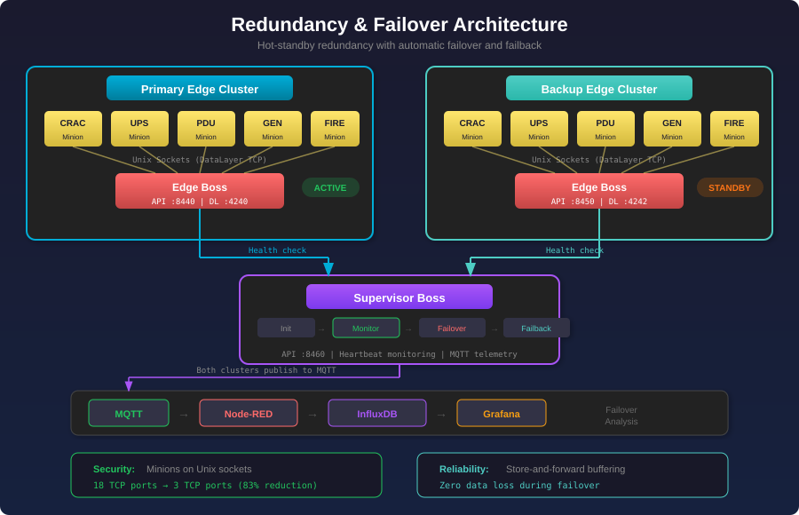
</p>

### Failover Performance & Strategies

Three redundancy strategies with sub-second failover, automatic failback, and zero data loss via store-and-forward buffering:

<p align="center">
  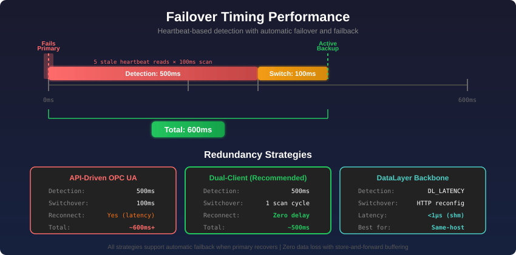
</p>

### Data Pipeline

Both clusters independently publish telemetry for failover timing analysis and data continuity verification:

<p align="center">
  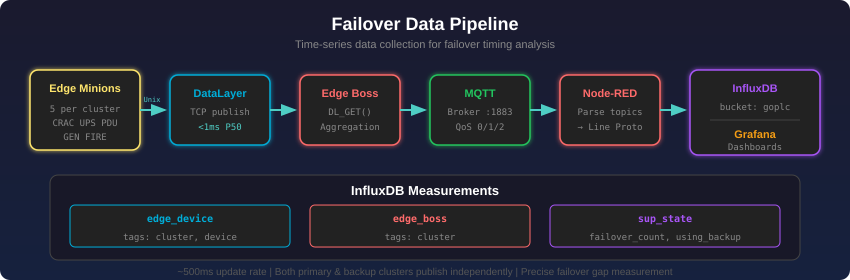
</p>

---

## Authentication

Optional JWT-based authentication that protects engineering endpoints while leaving operator paths open.

### Access Control

| Path Type | Examples | Authentication |
|-----------|----------|----------------|
| **Public** | `/hmi/*`, `/api/variables`, `/api/tags`, `/ws` | None required |
| **Protected** | `/ide/*`, `/api/programs`, `/api/runtime`, `/api/tasks`, `/api/cluster`, `/api/config`, `/api/debug` | Bearer token required |

### Features

- **Disabled by default** — zero friction for development and standalone use
- **HMAC-SHA256 tokens** with configurable expiry (no external dependencies)
- **Bcrypt password verification** for secure credential storage
- **Login page** with token refresh and logout
- **Operator-friendly** — HMI dashboards and variable read/write work without credentials

### Configuration

```yaml
api:
  auth:
    enabled: true
    jwt_secret: "your-jwt-secret"     # auto-generated if empty (won't survive restart)
    token_expiry_hours: 24
    users:
      - username: admin
        password_hash: "$2a$10$..."   # bcrypt hash
```

```bash
# Generate a bcrypt hash for the config
goplc auth hash-password mypassword

# Generate a random JWT secret
goplc auth generate-secret
```

---

## Licensing

HMAC-signed license keys with cloud activation. Runs in a 2-hour restartable demo mode until activated.

### Activation Flow

1. Get your installation ID: `GET /api/license/info`
2. Enter your license key in the IDE or via API
3. Automatic cloud activation validates the key and binds to your machine
4. Done — license persists across restarts and updates

| Status | Meaning |
|--------|---------|
| `demo` | 2-hour trial, restartable via API |
| `active` | Valid unlock code installed |
| `expired` | Demo expired, activation required |

```bash
# Check license status and get installation ID
curl http://localhost:8082/api/license/info

# Activate with an unlock code
curl -X POST http://localhost:8082/api/license/activate \
  -H "Content-Type: application/json" \
  -d '{"unlock_code": "GOPLC-XXXXXXXXXXXXXXXX"}'

# Restart the 2-hour demo timer
curl -X POST http://localhost:8082/api/license/restart-demo
```

License cache is Fernet-encrypted and stored outside the bind-mounted data directory. Unlock codes are HMAC-signed — the binary verifies only; generation uses a separate developer-side tool. The `PURGE_LICENSE=true` environment variable wipes license data on startup for clean reinstalls.

---

## Snap / ctrlX CORE

Package GOPLC as an Ubuntu Core snap for the [Bosch ctrlX CORE](https://www.boschrexroth.com/ctrlx-core) ecosystem (ARM64, strict confinement).

```bash
make snap-stage            # ARM64 target (ctrlX CORE)
make snap-stage-amd64      # amd64 (local testing)
./build-snap.sh            # Full build + snapcraft pack
```

Post-install configuration via `snap set`:

```bash
sudo snap set goplc-runtime api-port=8082
sudo snap set goplc-runtime cluster=true minions=4
sudo snap restart goplc-runtime
```

### ctrlX Data Layer Integration

Two approaches for integrating with the ctrlX ecosystem:

#### EtherCAT I/O (Real-Time Hardware I/O)

Direct read/write of EtherCAT digital I/O modules with dual transport:

```iec
// Native IPC mode — 500 Hz polling, sub-millisecond latency
CTRLX_EC_CREATE('ec1', '', '', '', 'XI110116', 'XI211116', 16, 16, 10, 'dl');
CTRLX_EC_START('ec1');

// Read inputs, write outputs
di_val := CTRLX_EC_READ_DI('ec1', 1);
write_ok := CTRLX_EC_WRITE_DO('ec1', 1, TRUE);  // Returns FALSE if disconnected

// Switch to REST mode (no recompile needed)
CTRLX_EC_CREATE('ec2', '', '', '', 'XI110116', 'XI211116', 16, 16, 100, 'rest');
```

| Transport | Polling | Avg Scan | I/O Rate | Determinism |
|-----------|---------|----------|----------|-------------|
| REST | 100ms | 1.2ms | 10 Hz | Variable (HTTP stack) |
| **Native IPC** | **2ms** | **0.69ms** | **500 Hz** | **Consistent (direct IPC)** |

- Uses official Bosch `ctrlx-datalayer-golang/v2` SDK (CGo) for native IPC
- Verified on ctrlX CORE X3 (ARM64) with physical loopback testing
- `CTRLX_EC_WRITE_DO` returns FALSE on disconnect — ST-level fault detection
- 10 ST functions for full I/O lifecycle management

#### Data Layer Bridge (Variable Synchronization)

Bidirectional variable sync between GOPLC and the ctrlX Data Layer:

```yaml
ctrlx_datalayer:
  enabled: true
  base_url: "https://localhost"
  username: "ctrlx-user"
  password: "ctrlx-password"
  publish_prefix: "goplc-runtime"        # ctrlX node path prefix
  publish_vars: ["temp_c", "pump_on"]    # PLC → ctrlX Data Layer
  subscribe_vars: ["ctrlx/setpoint"]     # ctrlX Data Layer → PLC
  sync_interval_ms: 100
  insecure_tls: true
```

- PLC variables published as ctrlX Data Layer nodes under `publish_prefix/`
- ctrlX nodes read back into PLC variables on each sync interval
- Authenticates via ctrlX identity manager JWT
- Pure HTTP/REST — no native libraries required

---

## Datacenter Gateway

GOPLC as a universal protocol gateway for data center infrastructure management — bridging CRAC units, PDUs, UPS systems, fire suppression, and building automation into a unified SCADA layer.

### Three-Tier Architecture

```
Corporate Layer (Grafana, SCADA, cloud)
         │
    Site Supervisor (GOPLC Boss)
    ├── OPC UA clients to each edge
    ├── MQTT subscriber (primary path)
    └── DNP3 master (failover path)
         │
    Edge Modules (GOPLC Clusters)
    Boss → per-protocol minions
    ├── Modbus TCP/RTU (CRAC, UPS, VFD)
    ├── BACnet/IP (AHU, dampers, lighting)
    ├── EtherNet/IP (power meters)
    └── SNMP v3 (smart PDUs, switches)
```

### Dual-Path Communication

- **Primary:** MQTT publish/subscribe (sub-second latency)
- **Failover:** DNP3 outstation with store-and-forward (SQLite buffer, GZIP + AES-256-GCM encryption)
- Automatic switchover when MQTT path goes stale

See the full [Datacenter Gateway Whitepaper](docs/whitepaper-datacenter-gateway.md) for architecture details and deployment examples. For scale analysis and cost modeling see the [Hardware Gateway Whitepaper](docs/WHITEPAPER_DC_SIMULATION_HARDWARE.md) and [Virtualized Gateway Whitepaper](docs/WHITEPAPER_DC_SIMULATION_VIRTUAL.md).

---

## Download

Pre-built binaries for Windows and Linux — single ~30 MB download, no installer needed.

| Platform | Architecture | Download |
|----------|-------------|----------|
| **Windows** | x86_64 | `goplc-windows.zip` |
| **Linux** | x86_64 (amd64) | `goplc-linux-amd64.tar.gz` |
| **Linux** | ARM64 (aarch64) | `goplc-linux-arm64.tar.gz` |

Visit [jmbtechnical.com/goplc/download](https://jmbtechnical.com/goplc/download) to download the latest release.

**What's included:** `goplc` binary, launcher script (app-mode browser), `config.yaml`, and a sample `counter.st` program. Extract, run, and open your browser — that's it.

**Licensing:** Runs in a 2-hour restartable demo mode out of the box. Activate with a license key for unlimited use. See [Licensing](#licensing) for details.

---

## Quick Start

### 1. Download & Extract

Visit [jmbtechnical.com/goplc/download](https://jmbtechnical.com/goplc/download) and grab the package for your platform.

```bash
# Linux
tar xzf goplc-linux-amd64.tar.gz
cd goplc

# Windows — unzip goplc-windows.zip
```

### 2. Run

```bash
# Linux — launches GOPLC and opens browser in app mode
./start-goplc.sh

# Windows — double-click start-goplc.bat
# Or run directly:
./goplc --config config.yaml
```

### 3. Open the Web IDE

Navigate to `http://localhost:8082/ide/` in your browser.

### Docker (Alternative)

Build a container from the downloaded binary:

```dockerfile
FROM alpine:3.19
COPY goplc /usr/local/bin/goplc
COPY config.yaml /app/config.yaml
EXPOSE 8082 502
WORKDIR /app
ENTRYPOINT ["goplc", "--config", "/app/config.yaml"]
```

```bash
# Extract the Linux binary, then build and run
docker build -t goplc:latest .
docker run -d --name goplc \
  -p 8082:8082 \
  -p 502:502 \
  -v $(pwd)/data:/app/data \
  goplc:latest
```

### Configuration Example

```yaml
# config.yaml
runtime:
  log_level: info

tasks:
  - name: FastTask
    type: periodic
    scan_time_us: 100      # 100 microsecond scan
    priority: 1
    watchdog_ms: 10
    programs:
      - fast_control.st

  - name: SlowTask
    type: periodic
    scan_time_ms: 100      # 100ms scan
    priority: 10
    programs:
      - monitoring.st

protocols:
  modbus:
    enabled: true
    port: 502
  opcua:
    enabled: true
    port: 4840

nodered:
  enabled: true
  auto_start: true

ai:
  provider: "claude"
  api_key_env: "ANTHROPIC_API_KEY"

api:
  port: 8082
```

---

## Examples

### Structured Text Programs

See the [`examples/st/`](examples/st/) directory for 14 ready-to-run programs:

| Example | Description |
|---------|-------------|
| [`pid_control.st`](examples/st/pid_control.st) | PID loop with anti-windup and bumpless transfer |
| [`modbus_gateway.st`](examples/st/modbus_gateway.st) | Bridge between Modbus TCP devices |
| [`modbus_client.st`](examples/st/modbus_client.st) | Modbus TCP client — registers, coils, read-verify |
| [`data_sync.st`](examples/st/data_sync.st) | Multi-PLC DataLayer synchronization |
| [`alarm_handler.st`](examples/st/alarm_handler.st) | Alarm management with shelving and history |
| [`bacnet_client.st`](examples/st/bacnet_client.st) | BACnet/IP client — read objects, track status |
| [`dnp3_master.st`](examples/st/dnp3_master.st) | DNP3 master — analog/binary inputs, pump control |
| [`enip_scanner.st`](examples/st/enip_scanner.st) | EtherNet/IP scanner — CIP tag read/write |
| [`esp32_io.st`](examples/st/esp32_io.st) | ESP32 remote I/O — 8 DI, 8 DO, 3 AI, 2 PWM, NeoPixel |
| [`fins_client.st`](examples/st/fins_client.st) | Omron FINS client — DM word read/write |
| [`iec104_client.st`](examples/st/iec104_client.st) | IEC 60870-5-104 client — SP, DP, floats, counters |
| [`mqtt_publish.st`](examples/st/mqtt_publish.st) | MQTT pub/sub — telemetry, commands, liveness |
| [`opcua_client.st`](examples/st/opcua_client.st) | OPC UA client — node read/write, method calls |
| [`datalayer_ethercat.st`](examples/st/datalayer_ethercat.st) | ctrlX EtherCAT I/O — native IPC, DI/DO toggle |

### Configuration Examples

See the [`examples/configs/`](examples/configs/) directory:

| Config | Description |
|--------|-------------|
| [`modbus_server.yaml`](examples/configs/modbus_server.yaml) | Modbus TCP server with I/O mapping |
| [`multi_plc.yaml`](examples/configs/multi_plc.yaml) | DataLayer sync between PLCs |
| [`realtime.yaml`](examples/configs/realtime.yaml) | Real-time container mode |
| [`full_stack.yaml`](examples/configs/full_stack.yaml) | All protocols enabled |

---

## Architecture

<p align="center">
  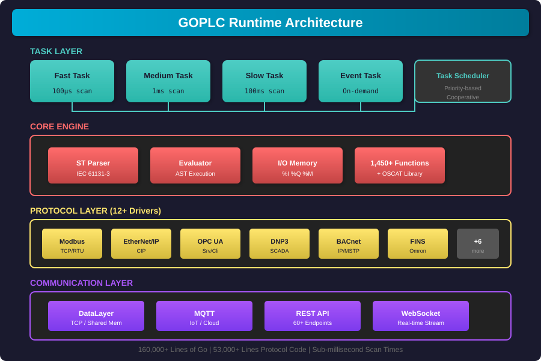
</p>

### Multi-PLC Clustering

<p align="center">
  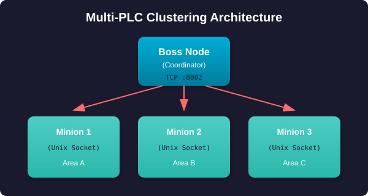
</p>

---

## Performance

<p align="center">
  <a href="https://www.youtube.com/watch?v=eV3Kc8fKmNk">
    
  </a>
  <br><em>Click to watch: Stress Test Walkthrough</em>
</p>

### Live Multi-PLC Benchmark (January 2026)

3 GOPLC instances running simultaneously with DataLayer synchronization:

<p align="center">
  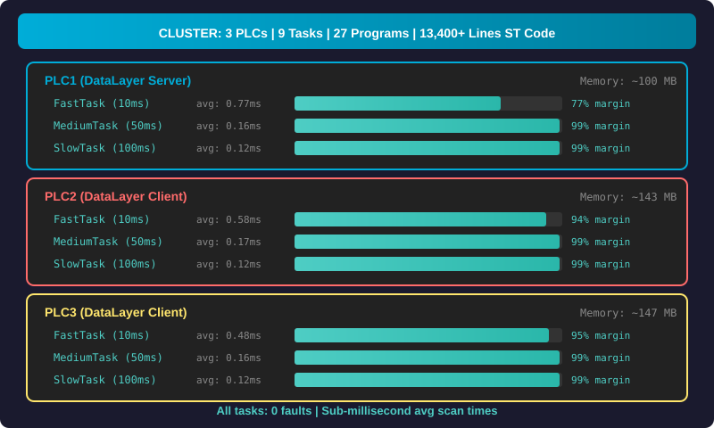
</p>

**Test Configuration:**
- 3 PLCs with DataLayer TCP sync (server + 2 clients)
- 9 programs per PLC: math, arrays, strings, JSON, datetime, regex, crypto, datastructures
- Each PLC running ~4,500 lines of Structured Text
- Modbus TCP servers on each PLC (ports 5601-5603)
- Real-time variable synchronization across all nodes

### Modbus Stress Test (January 2026)

<p align="center">
  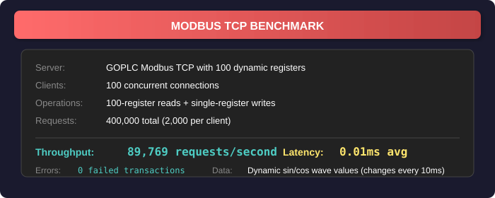
</p>

### Modbus Scalability Test - 500 Servers (January 2026)

<p align="center">
  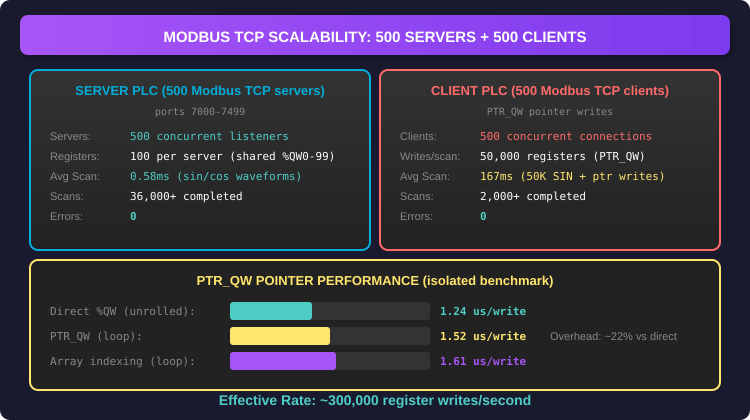
</p>

**PTR_QW Feature:** New system constants for pointer arithmetic with I/O memory:
- `PTR_QW` - Base pointer for output words (%QW)
- `PTR_IW` - Base pointer for input words (%IW)
- `PTR_MW` - Base pointer for marker words (%MW)

Enables efficient bulk I/O operations: `(PTR_QW + offset)^ := value`

### Modbus Scalability Test - 5000 Servers (January 2026)

<p align="center">
  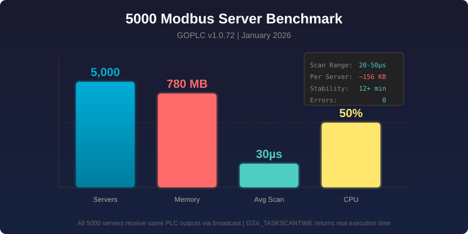
</p>

**Configuration:**
- 5000 concurrent Modbus TCP servers on ports 7000-11999
- ST program: Counter + GSV_TASKSCANTIME() writing to %QW0-1
- All servers receive same PLC outputs via driver broadcast

**Results:**
| Metric | Value |
|--------|-------|
| Scan Execution Time | 20-50µs (avg 30µs) |
| Memory Usage | 780 MB (~156 KB/server) |
| CPU Usage | 50% |
| Stability | 12+ minutes, 0 errors |

<p align="center">
  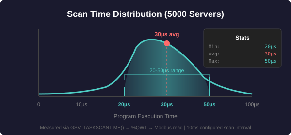
</p>

**Driver Broadcast Architecture:**

<p align="center">
  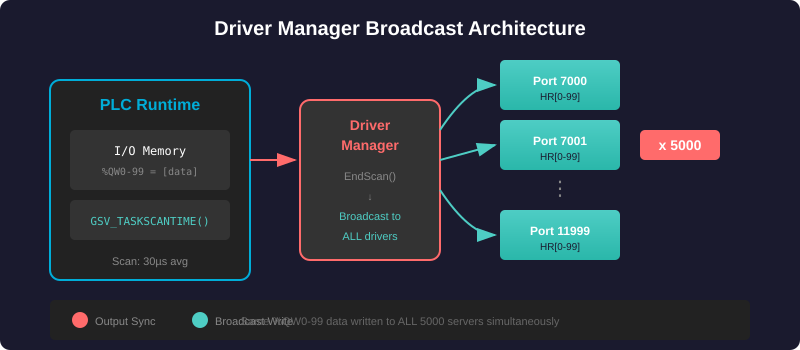
</p>

### Cluster Mode - Idle vs Running Programs (January 2026)

<p align="center">
  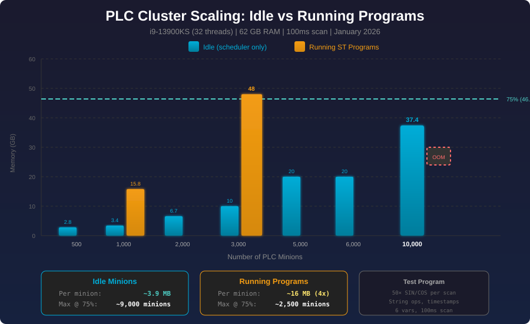
</p>

**Test Configuration:**
- Intel i9-13900KS (32 threads), 62 GB RAM
- Single-process architecture with goroutine-based minions
- Each minion has fully isolated PLCContext (protocols, connections, data)
- Boss API proxies to minions via Unix sockets

**Idle Minions (scheduler only):**
| Minions | RAM | Per Minion | CPU |
|---------|-----|------------|-----|
| 1,000 | 3.4 GB | 3.4 MB | 24% |
| 5,000 | 20 GB | 4.0 MB | 67% |
| **10,000** | **37.4 GB** | **3.9 MB** | **108%** |

**Running ST Programs (50x SIN/COS, string ops, 100ms scan):**
| Minions | RAM | Per Minion | CPU | Load |
|---------|-----|------------|-----|------|
| 1,000 | 15.8 GB | 15.8 MB | 63% | 2.96 |
| **3,000** | **48 GB** | **16 MB** | **188%** | **7.38** |

**Key Findings:**
- **Idle:** ~3.9 MB/minion → **~9,000 minions** at 75% resources
- **Running:** ~16 MB/minion (4x overhead) → **~2,500 minions** at 75% resources
- Memory is the limiter, not CPU

### Benchmarks

| Metric | Result |
|--------|--------|
| **Scan execution time** | 20-50μs (5000 servers) |
| **Minimum scan interval** | 100μs sustained |
| **Modbus throughput** | 89,769 req/sec (100 connections) |
| **Modbus scalability** | 5000 servers (780 MB), 500 clients (0 errors) |
| **PTR_QW writes** | ~300,000 registers/sec |
| **DataLayer latency** | <1ms P50, <3ms P99 |
| **Memory footprint** | ~65MB typical, ~150MB with DataLayer |
| **Distributed speedup** | 10.4x throughput (same workload, 10 minions) |
| **Aggregate throughput** | 620,949 scans/sec (31 minions at 50μs) |
| **ST functions** | 1,900+ available |
| **Lines of code** | 280,000+ Go |

### Latency Distribution (2ms scan, DataLayer TCP)

<p align="center">
  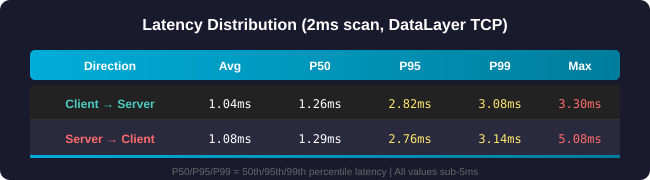
</p>

### ctrlX EtherCAT Native IPC (March 2026, X3 Hardware)

Measured on Bosch ctrlX CORE X3 (ARM64 Cortex-A53) with XI110116 (16 DI) + XI211116 (16 DO) physical loopback:

| Metric | REST Mode | Native IPC Mode |
|--------|-----------|-----------------|
| Poll interval | 100ms | **2ms** |
| Task scan time | 50ms | **5ms** |
| Avg scan duration | 1.2ms | **0.69ms** |
| Max scan duration | 30ms | **13ms** |
| I/O update rate | 10 Hz | **500 Hz** |
| Read errors | 0 | **0** |
| Watchdog trips | 0 | **0** |

The native IPC path uses the official Bosch `ctrlx-datalayer-golang/v2` SDK — direct function calls through `libcomm_datalayer.so` instead of HTTP/TLS/JSON. The EtherCAT bus itself cycles at 2ms (500 Hz), and native IPC matches that rate with zero errors.

---

## REST API

Full REST API for integration with SCADA, MES, and custom applications.

### Key Endpoints

| Endpoint | Description |
|----------|-------------|
| `GET /api/tags` | List all tags with values |
| `GET/PUT /api/variables/:name` | Read/write variables |
| `POST /api/runtime/start` | Start PLC runtime |
| `POST /api/runtime/stop` | Stop PLC runtime |
| `POST /api/tasks/:name/reload` | Hot-reload a single task |
| `GET /api/diagnostics` | Full runtime diagnostics |
| `GET /api/capabilities` | List supported protocols, functions, clustering |
| `GET /api/docs/functions` | All 1,900+ function signatures |
| `GET /api/analyzer/transactions` | Protocol capture data |
| `GET /api/cluster/:name/*path` | Proxy to cluster minion |
| `GET /api/nodered/status` | Node-RED subprocess status |
| `GET /api/debug/step/state` | Debugger state and position |
| `GET /ws` | WebSocket for real-time updates |

See [`docs/API.md`](docs/API.md) for complete API reference.

---

## Diagnostics

### Per-Module Debug System

Runtime-toggleable logging with per-module granularity. 15+ modules including `webui`, `nextion`, `modbus`, `fins`, `enip`, `opcua`, `datalayer`, `hal`, and more.

```bash
# Get debug status for all modules
curl http://localhost:8082/api/debug/status

# Set module-specific log level
curl -X PUT http://localhost:8082/api/debug/runtime/modules/modbus \
  -d '{"level": "trace"}'

# View debug ring buffer (optionally filter by module)
curl http://localhost:8082/api/debug/log?module=modbus

# Enable/disable entire debug system
curl -X POST http://localhost:8082/api/debug/runtime -d '{"enabled": true}'
```

---

## Use Cases

GOPLC is designed for:

- **Industrial Automation** - Replace or supplement traditional PLCs
- **Protocol Gateway** - Bridge between different protocols (data center, building, utility)
- **Edge Computing** - Run on Raspberry Pi, industrial PCs, Bosch ctrlX CORE
- **Distributed Control** - Boss/Minion clustering for large installations
- **HMI/SCADA Backend** - Node-RED dashboards + high-performance data collection
- **Fleet Management** - Centrally manage and deploy to hundreds of remote GOPLC nodes
- **Robotics & Motion** - MC_* motion control functions, servo coordination, sensor fusion
- **Simulation** - Test automation logic without hardware
- **Education** - Learn PLC programming with modern tools

---

## Whitepapers

| Whitepaper | Description |
|------------|-------------|
| [Clustering: Distributed Real-Time PLC Performance](docs/whitepaper-clustering.md) ([PDF](docs/whitepaper-clustering.pdf)) | Architecture, benchmark methodology, and measured results: 10.4x throughput improvement, 620,949 aggregate scans/sec, linear scaling to 500+ minions, water treatment plant validation |
| [Datacenter Gateway: Universal Protocol Gateway](docs/whitepaper-datacenter-gateway.md) ([PDF](docs/whitepaper-datacenter-gateway.pdf)) | Three-tier DC hierarchy, 12 protocol drivers, dual-path MQTT + DNP3 store-and-forward, redundancy strategies, AI-assisted commissioning, ctrlX CORE deployment |
| [DC Simulation: Hardware Gateway Architecture](docs/WHITEPAPER_DC_SIMULATION_HARDWARE.md) ([PDF](docs/WHITEPAPER_DC_SIMULATION_HARDWARE.pdf)) | 11 device simulators, 6 gateway blueprints, scale estimates 50 MW–1 GW, ctrlX CORE edge SBC deployment, standalone vs cluster decision matrix, full cost model |
| [DC Simulation: Virtualized Gateway Architecture](docs/WHITEPAPER_DC_SIMULATION_VIRTUAL.md) ([PDF](docs/WHITEPAPER_DC_SIMULATION_VIRTUAL.pdf)) | Server VM gateways via Cisco SVI routing, 51–66% total cost reduction vs hardware, migration path, IEC 62443 security considerations |
| [The Operator's Revenge: Industrial Control at Software Speed](docs/WHITEPAPER_OPERATORS_REVENGE.md) | Why industrial automation needs a software-native PLC runtime — 30 MB install vs multi-GB IDE installs, browser-based programming, zero proprietary cables |
| [Planetary Scale: From Edge to Orbit](docs/WHITEPAPER_PLANETARY_SCALE.md) | 10,000 full runtimes on one desktop, 250M+ projected deterministic runtimes at datacenter scale, memory-wall analysis, DataLayer at planetary scale |
| [Humanoid Robotics: Real-Time Control for Next-Gen Robots](docs/WHITEPAPER_HUMANOID_ROBOTICS.md) ([PDF](docs/GoPLC_Humanoid_Robotics_Whitepaper.pdf)) | GOPLC as a real-time control backbone for humanoid robotics — servo coordination, sensor fusion, safety interlocks, deterministic motion planning |

---

## License

GOPLC is proprietary software. Contact jbelcher@jmbtechnical.com for licensing inquiries.

---

<p align="center">
  <strong>Built with Go</strong><br>
  <em>Industrial-grade automation for the modern world</em>
</p>
