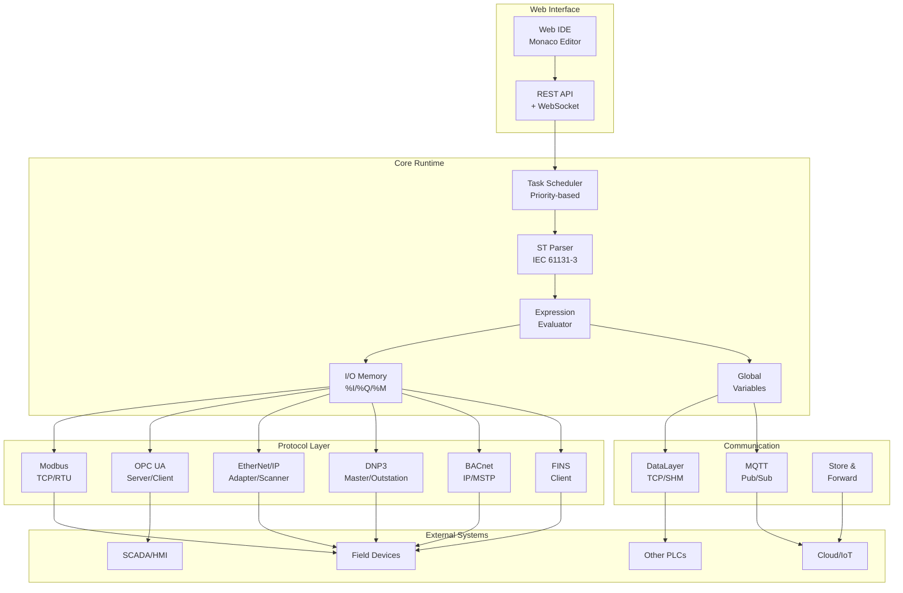
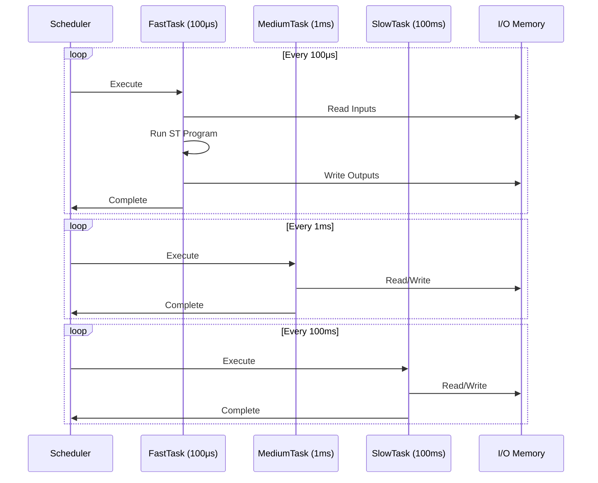
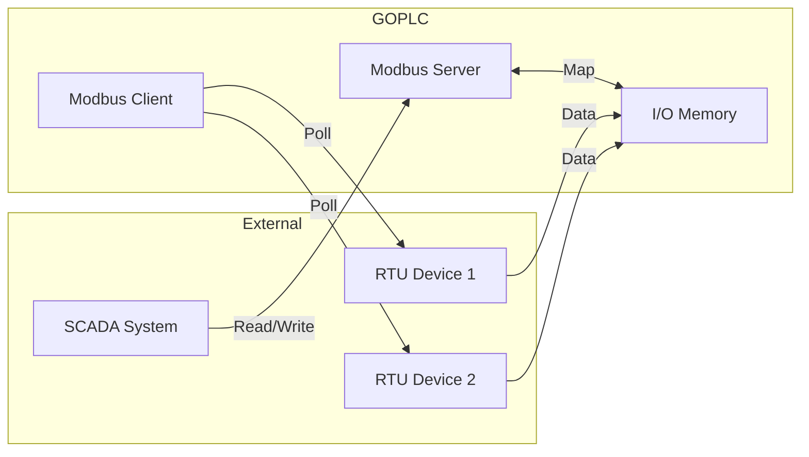
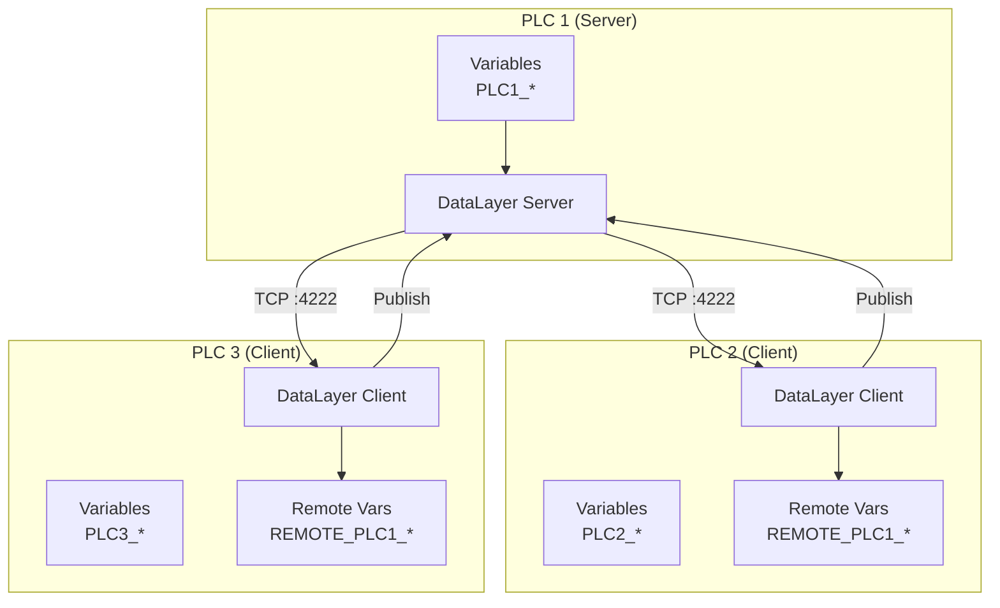
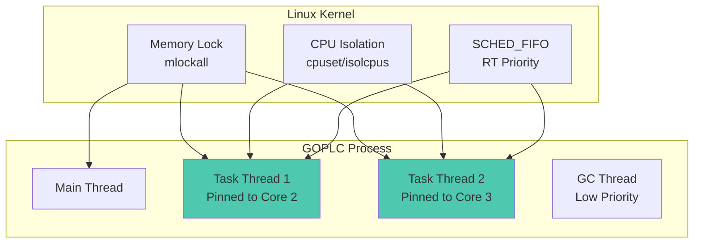
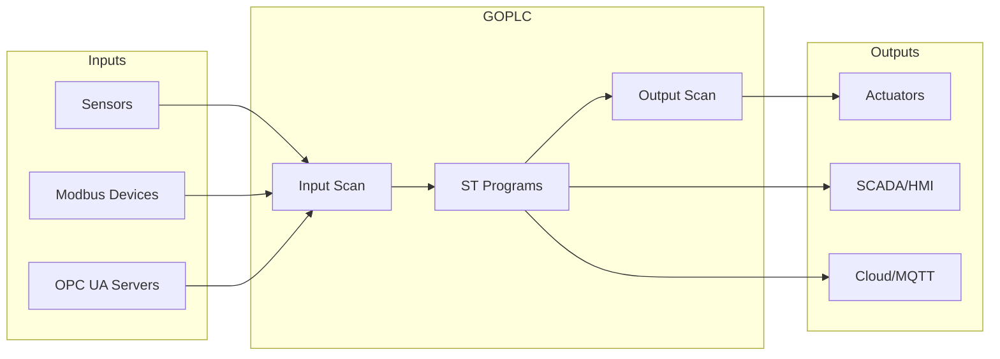

# GOPLC Architecture

## System Overview



## Task Scheduler

The task scheduler is the heart of GOPLC, providing deterministic execution of ST programs.



### Task Types

| Type | Description | Use Case |
|------|-------------|----------|
| **Periodic** | Executes at fixed intervals | Control loops, I/O scanning |
| **Event** | Triggered by condition | Alarms, interrupts |
| **Freerun** | Runs continuously | Background processing |

### Priority System

- Priorities range from 1 (highest) to 255 (lowest)
- Higher priority tasks preempt lower priority tasks
- Same-priority tasks execute round-robin

## Memory Model

```
┌─────────────────────────────────────────────────────────────────┐
│                         Memory Map                               │
├─────────────────────────────────────────────────────────────────┤
│                                                                  │
│  ┌─────────────┐  ┌─────────────┐  ┌─────────────┐              │
│  │  %I (Input) │  │ %Q (Output) │  │ %M (Memory) │              │
│  │             │  │             │  │             │              │
│  │ %IX0.0-7    │  │ %QX0.0-7    │  │ %MX0.0-7    │  Bits        │
│  │ %IB0-n      │  │ %QB0-n      │  │ %MB0-n      │  Bytes       │
│  │ %IW0-n      │  │ %QW0-n      │  │ %MW0-n      │  Words       │
│  │ %ID0-n      │  │ %QD0-n      │  │ %MD0-n      │  DWords      │
│  │ %IL0-n      │  │ %QL0-n      │  │ %ML0-n      │  LWords      │
│  └─────────────┘  └─────────────┘  └─────────────┘              │
│                                                                  │
│  ┌─────────────────────────────────────────────────┐            │
│  │              Global Variables (VAR_GLOBAL)       │            │
│  │  - Named variables accessible from all programs  │            │
│  │  - Published via DataLayer/MQTT                  │            │
│  │  - Mapped to protocol registers                  │            │
│  └─────────────────────────────────────────────────┘            │
│                                                                  │
│  ┌─────────────────────────────────────────────────┐            │
│  │              Program Variables (VAR)             │            │
│  │  - Local to each program instance               │            │
│  │  - Persistent across scan cycles                 │            │
│  │  - Supports AT binding to I/O                   │            │
│  └─────────────────────────────────────────────────┘            │
│                                                                  │
└─────────────────────────────────────────────────────────────────┘
```

## Protocol Integration

### Modbus TCP/RTU



### DataLayer (Multi-PLC Sync)



## Cluster Architecture

GOPLC supports multi-PLC clustering with a boss/minion architecture:

```
                         ┌─────────────────────┐
                         │     Boss Node       │
                         │   (Coordinator)     │
                         │                     │
                         │  - TCP API :8082    │
                         │  - Cluster Proxy    │
                         │  - Load Balancing   │
                         └──────────┬──────────┘
                                    │
               ┌────────────────────┼────────────────────┐
               │                    │                    │
        ┌──────▼──────┐      ┌──────▼──────┐      ┌──────▼──────┐
        │  Minion 0   │      │  Minion 1   │      │  Minion 2   │
        │             │      │             │      │             │
        │ Unix Socket │      │ Unix Socket │      │ Unix Socket │
        │ /var/run/   │      │ /var/run/   │      │ /var/run/   │
        │ goplc/      │      │ goplc/      │      │ goplc/      │
        │ minion-0    │      │ minion-1    │      │ minion-2    │
        │             │      │             │      │             │
        │ Area A      │      │ Area B      │      │ Area C      │
        │ Control     │      │ Control     │      │ Control     │
        └─────────────┘      └─────────────┘      └─────────────┘
```

### Cluster Benefits

- **Isolation**: Each minion has its own protocol registries
- **Scalability**: Add minions for more I/O capacity
- **Fault Containment**: Minion failure doesn't affect others
- **Unified API**: Access all minions through boss proxy

## Real-Time Architecture



### Real-Time Configuration

| Setting | Purpose | Typical Value |
|---------|---------|---------------|
| `lock_os_thread` | Pin goroutines to OS threads | `true` |
| `cpu_affinity` | Bind to specific CPU cores | `[2, 3]` |
| `memory_lock` | Prevent page faults | `true` |
| `gc_percent` | Reduce GC frequency | `500-1000` |
| `rt_priority` | SCHED_FIFO priority | `50` |

## Data Flow



## Security Architecture

```
┌─────────────────────────────────────────────────────────────────┐
│                      Security Layers                             │
├─────────────────────────────────────────────────────────────────┤
│                                                                  │
│  ┌─────────────────────────────────────────────────────────┐    │
│  │                    Network Layer                         │    │
│  │  - CORS configuration for Web IDE                       │    │
│  │  - Connection limits per protocol                       │    │
│  │  - Idle timeout for unused connections                  │    │
│  └─────────────────────────────────────────────────────────┘    │
│                                                                  │
│  ┌─────────────────────────────────────────────────────────┐    │
│  │                   Protocol Layer                         │    │
│  │  - OPC UA: Security policies (None, Sign, Encrypt)      │    │
│  │  - MQTT: TLS, username/password                         │    │
│  │  - Modbus: IP-based access control                      │    │
│  └─────────────────────────────────────────────────────────┘    │
│                                                                  │
│  ┌─────────────────────────────────────────────────────────┐    │
│  │                  Application Layer                       │    │
│  │  - Store-and-Forward: AES-256-GCM encryption            │    │
│  │  - JWT support in ST (JWT_ENCODE, JWT_DECODE)           │    │
│  │  - Crypto functions (AES, RSA, SHA, HMAC)               │    │
│  └─────────────────────────────────────────────────────────┘    │
│                                                                  │
└─────────────────────────────────────────────────────────────────┘
```
