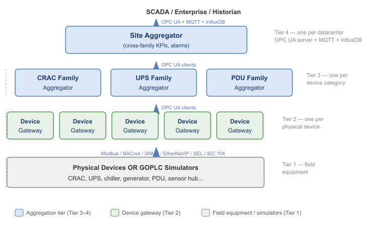
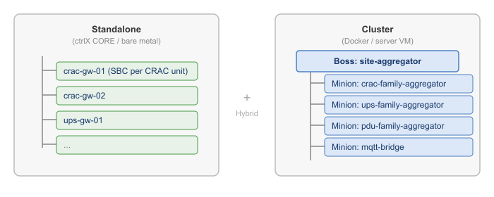

---
header-includes:
  - \usepackage{booktabs}
  - \usepackage{longtable}
  - \usepackage{array}
  - \usepackage{etoolbox}
  - \usepackage{xcolor}
  - \renewcommand{\arraystretch}{1.15}
  - \AtBeginEnvironment{longtable}{\footnotesize}
  - \AtBeginEnvironment{tabular}{\footnotesize}
geometry: "left=0.55in,right=0.55in,top=0.65in,bottom=0.65in"
fontsize: 9pt
---

# GOPLC Datacenter Infrastructure Simulation
# Hardware Gateway Architecture

**A Full-Stack, Protocol-Native Digital Twin for Hyperscale Datacenter Operations**

**Author:** James Belcher
**Date:** February 2026
**Version:** 1.0

*February 2026*

---

## Executive Summary

GOPLC is an IEC 61131-3 soft PLC runtime written in Go that has been extended into
a complete datacenter infrastructure simulation and automation platform. A single
compiled binary — deployed on edge controllers, in Docker containers, or as bare-metal
services — can act as a device simulator, a protocol gateway, a family aggregator,
a site-level SCADA concentrator, or all of the above simultaneously.

This white paper describes the hardware gateway architecture: dedicated edge single-board
computers (SBCs) such as the Bosch Rexroth ctrlX CORE running one GOPLC instance per
physical device. It covers the simulation matrix, the tiered gateway hierarchy, scale
estimates for 50 MW through 1 GW facilities, deployment models (ctrlX snap, Docker,
bare-metal binary), and the trade-offs between standalone and cluster-based runtime
configurations.

---

## 1. The Problem

Modern hyperscale datacenters contain thousands of independently-addressable devices —
CRAC units, UPS modules, chillers, generators, rack PDUs, environmental sensors, transfer
switches, fire alarm panels, power meters, and cooling towers. These devices speak different
protocols (Modbus TCP, BACnet/IP, SNMP, EtherNet/IP, SEL ASCII, IEC 60870-5-104) and come
from competing vendors with incompatible register maps.

Existing SCADA and BMS platforms handle this through monolithic integration servers with
per-vendor driver licenses. This model breaks at hyperscale:

- **Vendor lock-in**: Each SCADA platform charges per-driver, per-point licenses
- **Single point of failure**: One integration server handles hundreds of devices
- **Protocol silos**: Modbus, BACnet, and SNMP live in separate software stacks
- **No simulation**: Testing control logic requires physical hardware or expensive vendor simulators
- **Rigid architecture**: Adding a new device type requires vendor professional services

GOPLC solves this with a uniform runtime that speaks every field protocol natively,
normalizes all data into a common OPC UA namespace, and provides drop-in simulators
for every device type.

---

## 2. Architecture Overview

### 2.1 Tiered Hierarchy

The system is organized into four tiers. Every tier runs the same GOPLC binary with
different configuration and ST (Structured Text) programs:



### 2.2 The Normalization Contract

The core value of the gateway layer is **vendor normalization**. A Liebert CRAC and a
Stulz CRAC have different Modbus register maps, but both present identical OPC UA
namespaces northbound:

```
ns=1;s=crac_gw.supply_temp        REAL   °C
ns=1;s=crac_gw.return_temp        REAL   °C
ns=1;s=crac_gw.setpoint           REAL   °C (writable)
ns=1;s=crac_gw.gw_connected       BOOL
ns=1;s=crac_gw.gw_alarm_any       BOOL
```

Everything above the device gateway tier — family aggregators, site aggregators, SCADA
clients, dashboards, historians — sees one namespace per device category. Vendor
differences are an implementation detail confined to the gateway's ST poll program.

### 2.3 Data Flow Protocols

| Direction                        | Protocol                                                   | Purpose                                          |
| :------------------------------- | :--------------------------------------------------------- | :----------------------------------------------- |
| Southbound (to devices)          | Modbus TCP, BACnet/IP, SNMP v2c, EtherNet/IP, SEL ASCII   | Field device polling and control                 |
| Northbound (to aggregators)      | OPC UA                                                     | Normalized variable exposure                     |
| Side channel (to historians)     | MQTT, InfluxDB Line Protocol, Sparkplug B                  | Telemetry streaming                              |
| Management                       | REST API + mDNS                                            | Fleet discovery, config push, health monitoring  |

---

## 3. Simulation Matrix

Each simulator is a GOPLC instance running ST programs that generate physics-based
drifting values, expose them over the real field protocol, and support fault injection
via the REST API. Simulators are drop-in replacements for physical devices — a device
gateway cannot distinguish a simulator from real hardware.

### 3.1 Implemented Simulators

| ID     | Device Type        | Protocol       | Vendor Models                                      | Key Simulated Values                                                              |
| :----- | :----------------- | :------------- | :------------------------------------------------- | :-------------------------------------------------------------------------------- |
| SIM-1  | CRAC unit          | Modbus TCP     | Liebert DS, Vertiv, Stulz                          | Supply/return temp, humidity, fan speed, cooling capacity, power, dew point       |
| SIM-2  | UPS                | Modbus TCP     | APC, Eaton, Vertiv                                 | Battery charge, load%, input/output voltage/frequency, runtime remaining          |
| SIM-3  | Chiller            | BACnet/IP      | York, Carrier, Trane                               | Evap/condenser temps, COP, compressor amps, chilled water flow                    |
| SIM-4  | Env sensor hub     | SNMP v2c       | AKCP, Geist                                        | Temperature, humidity, water leak, contact closure                                |
| SIM-5  | Power meter        | SEL ASCII      | SEL-735, SEL-710, SEL-651R                         | kW, kVAR, PF, voltage, current, harmonics, frequency                             |
| SIM-6  | Fire alarm panel   | Modbus TCP     | Notifier NFS2-3030                                 | 24 zones, 4 SLC loops, zone/device alarms, supervisory signals                    |
| SIM-7  | Rack PDU           | SNMP v2c       | Raritan PX3-5400, Vertiv Geist                     | Per-outlet current/voltage/state, inlet power, phase balance                      |
| SIM-8  | Generator          | Modbus TCP     | Cummins PC3100, CAT EMCP 4.3                       | RPM, coolant temp, oil pressure, fuel level, voltage, frequency, load kW          |
| SIM-9  | Transfer switch    | EtherNet/IP    | Eaton ATVS, GE STS                                 | Source A/B status, active source, transfer events, overload                       |
| SIM-10 | CRAH unit          | BACnet/IP      | Liebert DME, Vertiv CRV                            | Chilled water flow/temps, delta-T, fan VFD, valve position                        |
| SIM-11 | Cooling tower      | Modbus TCP     | Baltimore Aircoil, Marley                          | Basin temp, fan VFD speed, approach temp, blowdown, water treatment               |

### 3.2 Physics-Based Simulation

Simulators do not return static values. Each implements a realistic process model:

- **Thermal drift**: Sinusoidal oscillation on configurable periods (15s–300s) with
  random noise overlay, simulating real HVAC process dynamics
- **First-order lag filters**: Fan speed, temperature, and pressure slew toward targets
  with configurable time constants (α = 0.1–0.4), preventing unrealistic step changes
- **State machines**: Generators implement a full Off → Pre-start → Cranking → Warmup →
  Running → Cooldown → Fault lifecycle with realistic timing (5s fuel prime, 10s crank,
  30s warmup, 60s cooldown)
- **Coupled variables**: Power consumption derives from fan speed and cooling capacity;
  generator current derives from kW, voltage, and power factor using `I = P / (√3 × V × PF)`
- **Fault injection**: Each simulator supports 4–6 fault modes writable via REST API:
  `POST /api/variables/crac_sim.sim_faultmode {"value": 1}` triggers a high-temperature
  ramp at 0.05°C per 100ms scan cycle

### 3.3 Multi-Vendor by Design

At hyperscale (36–72 MW per campus), operators cannot single-source equipment.
A single campus runs Cummins **and** CAT generators, Vertiv **and** Eaton UPS, Raritan
**and** Vertiv Geist PDUs, Liebert **and** Stulz CRAC units. Each vendor has a different
register map, different scaling factors, sometimes different protocols entirely.

The simulator matrix reflects this reality: multiple vendors per category, different
southbound protocols, **identical GVL namespace and OPC UA exposure northbound**. The
gateway layer absorbs vendor complexity; everything above it is vendor-agnostic.

---

## 4. Device Gateway Blueprints

### 4.1 Blueprint Structure

Each device gateway is defined by four files:

| File                                                        | Purpose                                                                                              |
| :---------------------------------------------------------- | :--------------------------------------------------------------------------------------------------- |
| `configs/gateways/<name>-device-gateway.yaml`               | Runtime config: API port, OPC UA port, protocol client settings, task definitions                    |
| `st_code/gateways/<name>_gateway_poll.st`                   | Named GVL + PollTask: reads device registers, maps raw values to engineering units                   |
| `st_code/gateways/<name>_gateway_alarms.st`                 | AlarmTask: evaluates limits, computes `gw_alarm_*` flags                                             |
| `scripts/deploy-<name>-gateway.sh`                          | Deploy script: spawns runtime, uploads programs, verifies connectivity                               |

### 4.2 Implemented Blueprints

| ID   | Protocol                              | Target Devices                          | Paired Simulator |
| :--- | :------------------------------------ | :-------------------------------------- | :--------------- |
| GW-1 | Modbus TCP client → OPC UA server     | CRAC units (Liebert, Vertiv, Stulz)     | SIM-1            |
| GW-2 | BACnet/IP client → OPC UA server      | Chillers (York, Carrier, Trane)         | SIM-3            |
| GW-3 | SNMP v2c client → OPC UA server       | Env sensor hubs, rack PDUs              | SIM-4, SIM-7     |
| GW-4 | SEL ASCII client → OPC UA server      | Power meters (SEL-735, SEL-710)         | SIM-5            |
| GW-5 | EtherNet/IP scanner → OPC UA server   | Transfer switches (Eaton, GE)           | SIM-9            |
| GW-6 | Modbus TCP client → OPC UA server     | Generators, cooling towers              | SIM-8, SIM-11    |

### 4.3 Gateway Runtime Behavior

A device gateway performs three operations every scan cycle:

1. **Poll** (PollTask, 100ms): Read all registers/objects from the field device, apply
   scaling factors, write engineering-unit values to the named GVL
2. **Alarm** (AlarmTask, 500ms): Evaluate limit checks against the GVL values, compute
   gateway-generated alarm flags (`gw_alarm_supply_hi`, `gw_alarm_comms_fail`, etc.)
3. **Expose** (automatic): The OPC UA server continuously exposes all GVL variables as
   OPC UA nodes with proper data types and access levels

Write-back is supported: an OPC UA client (or REST API call) can change a setpoint in
the GVL, and the PollTask writes it down to the device on the next scan.

### 4.4 CSV Import for New Device Types

Vendors ship register maps as CSV or Excel. The `POST /api/devices/import-map` endpoint
accepts a vendor CSV and generates:

- **Config YAML block** — Modbus/BACnet register mappings with scaling and units
- **ST GVL file** — `VAR_GLOBAL` declarations with correct types and documentation comments
- **OPC UA node list** — One node per variable with correct access level

This eliminates hand-configuration when onboarding a new device model. Upload a CSV,
review the generated scaffold, and deploy.

---

## 5. Aggregation Tiers

### 5.1 Family Aggregator

One instance per device category (e.g., all CRACs in a datacenter row). Connects to
N device gateways via OPC UA clients and computes family-level KPIs:

- **Online count** — how many devices in this family are reachable
- **Alarm count** — how many devices have active alarms
- **Average/max temperatures** — thermal health of the family
- **Total power** — aggregate power consumption
- **Family alarms** — `fam_alarm_hot` (avg supply > 25°C), `fam_alarm_critical`
  (max supply > 28°C), `fam_alarm_all_offline` (cooling lost)

Family aggregators publish telemetry via MQTT and expose northbound via OPC UA.

### 5.2 Site Aggregator

One instance per datacenter site. Connects to all family aggregators and computes
site-level cross-system KPIs:

- **Cooling health** — derived from CRAC family status
- **Power chain health** — derived from UPS, generator, transfer switch families
- **Environmental health** — derived from sensor hub family
- **Site alarms** — `site_alarm_cooling_lost`, `site_alarm_cooling_crit`

### 5.3 InfluxDB Telemetry

Each aggregator tier can write metrics to InfluxDB v2 via native Line Protocol. The
InfluxDB ST functions (`INFLUX_CONNECT`, `INFLUX_BATCH_ADD`, `INFLUX_BATCH_FLUSH`)
run in a dedicated InfluxTask on a 10-second scan interval, batching all fields into
a single write per cycle. Pre-built Grafana dashboards (7 dashboards covering site
overview, CRAC, chiller, environmental, generator, cooling tower, and transfer switch
telemetry) are generated automatically via the `setup-grafana-dashboards.py` script.

### 5.4 Sparkplug B IIoT

For Sparkplug B-compliant MQTT infrastructure, 24 ST functions provide native Eclipse
Sparkplug B v3.0 integration: `SPARKPLUG_NODE_CREATE`, `NODE_BIRTH`, `NODE_DATA`,
`NODE_DEATH`, metric management, and command reception — enabling direct integration
with Ignition, HiveMQ, and other Sparkplug-aware platforms.

---

## 6. Scale Estimates — Hardware Gateway Model

In the hardware gateway architecture, each device gateway runs on a dedicated edge SBC
(e.g., Bosch Rexroth ctrlX CORE) mounted near the physical device. The estimates below
use industry-standard equipment density ratios for hyperscale facilities.

### 6.1 Equipment Density Assumptions

| Equipment Category              | Density per MW IT Load                               | Protocol                   | Gateway Blueprint |
| :------------------------------ | :--------------------------------------------------- | :------------------------- | :---------------- |
| CRAC / CRAH units               | 4–6                                                  | Modbus TCP / BACnet        | GW-1 / GW-2       |
| UPS modules                     | 2–3 (500kW–1MW modules, 2N)                          | Modbus TCP                 | GW-1              |
| Rack PDUs                       | 40–50 (2 per rack, 20–25 racks/MW)                   | SNMP v2c                   | GW-3              |
| Generators                      | 0.5 (2MW class, N+1 for total facility load)         | Modbus TCP                 | GW-6              |
| Transfer switches (ATS/STS)     | 0.5 (1 per generator)                                | EtherNet/IP                | GW-5              |
| Chillers                        | 0.25–0.5 (2–4 MW capacity each)                      | BACnet/IP                  | GW-2              |
| Environmental sensor hubs       | 4–5 (1 per 5 racks)                                  | SNMP v2c                   | GW-3              |
| Power meters                    | 2–4 (switchgear + distribution)                      | SEL ASCII                  | GW-4              |
| Fire alarm panels               | 0.1–0.2 (1 per fire zone)                            | Modbus TCP                 | GW-1              |
| Cooling towers                  | 0.25–0.5 (matched to chillers)                       | Modbus TCP                 | GW-6              |

### 6.2 Gateway Instance Counts

**Device gateways** — one GOPLC instance per physical device (1:1 model):

| Category                  | 50 MW  | 100 MW  | 500 MW  |   1 GW  |
| :------------------------ | -----: | ------: | ------: | ------: |
| CRAC/CRAH                 |    250 |     500 |   2,500 |   5,000 |
| UPS modules               |    125 |     250 |   1,250 |   2,500 |
| Rack PDUs                 |  2,250 |   4,500 |  22,500 |  45,000 |
| Generators                |     35 |      65 |     325 |     650 |
| Transfer switches         |     35 |      65 |     325 |     650 |
| Chillers                  |     20 |      38 |     188 |     375 |
| Env sensor hubs           |    225 |     450 |   2,250 |   4,500 |
| Power meters              |    150 |     300 |   1,500 |   3,000 |
| Fire alarm panels         |      8 |      15 |      75 |     150 |
| Cooling towers            |     20 |      38 |     188 |     375 |
| **Device Gateways Total** | **3,118** | **6,221** | **31,101** | **62,200** |

**Aggregation tier** — family aggregators, site aggregators, fleet management:

| Role                   | 50 MW | 100 MW | 500 MW |  1 GW |
| :--------------------- | ----: | -----: | -----: | ----: |
| Family aggregators     |    10 |     10 |     10 |    10 |
| Site aggregator        |     1 |      1 |      1 |     1 |
| Fleet manager          |     1 |      1 |      1 |     1 |
| MQTT brokers           |     1 |      3 |      5 |    10 |
| **Aggregation Total**  |  **13** |   **15** |   **17** |  **22** |

**Grand total GOPLC instances (1:1 model):**

| Facility Size | Device Gateways | Aggregation | Total Instances |
| :------------ | --------------: | ----------: | --------------: |
| **50 MW**     |           3,118 |          13 |       **~3,130** |
| **100 MW**    |           6,221 |          15 |       **~6,240** |
| **500 MW**    |          31,101 |          17 |      **~31,120** |
| **1 GW**      |          62,200 |          22 |      **~62,220** |

### 6.3 Practical Grouping

At scale, certain high-density, low-complexity device types (rack PDUs, environmental
sensors) can be grouped under a single gateway instance that polls multiple devices
of the same type via SNMP. This reduces instance count significantly:

| Category         | 1:1 Ratio      | Practical Ratio        | Devices per GW      |
| :--------------- | -------------: | :--------------------- | :-----------------: |
| Rack PDUs        | 2,250/MW×50    | 113–225 gateways       | 10–20 PDUs/GW       |
| Env sensor hubs  | 225/MW×50      | 12–23 gateways         | 10–20 hubs/GW       |
| Power meters     | 150/50MW       | 15–30 gateways         | 5–10 meters/GW      |
| All others       | 1:1            | 1:1                    | 1 device/GW         |

**Practical totals (with grouping):**

| Facility Size | 1:1 Model | Practical Model | Reduction |
| :------------ | --------: | --------------: | --------: |
| **50 MW**     |     3,130 |         **~750** |       76% |
| **100 MW**    |     6,240 |       **~1,400** |       78% |
| **500 MW**    |    31,120 |       **~6,600** |       79% |
| **1 GW**      |    62,220 |      **~13,000** |       79% |

### 6.4 Hardware Cost Implications

At 1:1 mapping with dedicated edge SBCs:

| Item                      | Unit Cost (est.)    |          50 MW |          100 MW |            500 MW |              1 GW |
| :------------------------ | ------------------: | -------------: | --------------: | ----------------: | ----------------: |
| ctrlX CORE SBC            |        $600–700*    | $1.87M–$2.18M  | $3.73M–$4.35M   | $18.66M–$21.77M   | $37.32M–$43.54M   |
| Edge network switches     |      $200–500/port  | $0.6M–1.6M     | $1.2M–3.1M      | $6.2M–15.6M       | $12.4M–31.1M      |
| Installation labor        |       $150–300/unit | $0.5M–0.9M     | $0.9M–1.9M      | $4.7M–9.3M        | $9.3M–18.7M       |
| **Infrastructure subtotal** |                   | **$2.97M–$4.68M** | **$5.83M–$9.35M** | **$29.56M–$46.67M** | **$59.02M–$93.34M** |
| GOPLC runtime (standalone) | $400/instance      | $1.25M         | $2.49M          | $12.44M           | $24.88M           |
| **Grand total (infra + software)** |             | **$4.22M–$5.93M** | **$8.32M–$11.84M** | **$42.00M–$59.11M** | **$83.90M–$118.22M** |

*ctrlX CORE SBC pricing at volume (50+ units). GOPLC standalone runtime licensed at $400 per instance.

These costs motivate the virtualized gateway architecture described in the companion
white paper (WHITEPAPER_DC_SIMULATION_VIRTUAL.md).

---

## 7. Deployment Models

### 7.1 Bosch Rexroth ctrlX CORE (Snap Package)

The ctrlX CORE is an ARM64 industrial SBC running Ubuntu Core with the Bosch ctrlX OS
application ecosystem. GOPLC packages as a snap (`goplc-runtime`) with:

- **Daemon mode**: Runs as a systemd service, auto-restarts on failure
- **Snap configuration**: `sudo snap set goplc-runtime api-port=8082 cluster=true minions=4`
- **ctrlX Data Layer bridge**: A Python sidecar process publishes PLC variables to the
  ctrlX Data Layer via REST, enabling integration with other ctrlX apps (motion, vision, etc.)
- **Node-RED palette**: Pre-packaged `.tgz` for the ctrlX Node-RED app — GOPLC dashboard
  nodes available immediately after snap install
- **Strict confinement**: Network and network-bind plugs only; no filesystem escape

**Strengths:**
- Industrial-grade hardware with DIN rail mounting, 24V DC power, -25°C to +60°C operating range
- Integration with Bosch Rexroth motion control, drive, and hydraulics ecosystem
- Managed updates via ctrlX App Store
- Deterministic scan times (real-time kernel support)

**Weaknesses:**
- $600–700 per unit at volume
- One instance per SBC (no multi-tenancy)
- ARM64 only — limited to ctrlX hardware

**Best fit:** Device gateways mounted near field equipment where industrial-grade hardware
is required (harsh environments, DIN rail enclosures, 24V DC power distribution).

### 7.2 Docker Container

GOPLC provides two Dockerfiles:

- `Dockerfile` — Minimal runtime image for device gateways, simulators, and minion nodes
- `Dockerfile.nodered` — Runtime + Node-RED with Dashboard 2.0 for aggregator tiers
  that need HMI dashboards

Docker Compose orchestrates multi-tier deployments. The CRAC demo
(`docker-compose.crac-demo.yml`) deploys 11 containers representing a complete 4-tier
stack: 4 simulators, 4 device gateways, 1 family aggregator, 1 site aggregator,
and 1 MQTT broker.

**Strengths:**
- Runs on any Linux host with Docker (x86_64 or ARM64)
- Dense packing: dozens of gateway instances per host
- Compose orchestration with health checks, dependency ordering, automatic restart
- Easy horizontal scaling: `docker compose up --scale crac-sim=20` for 20 CRAC simulators
- Image reuse: all instances share the same base image

**Weaknesses:**
- Container networking adds 50–200us latency per hop (irrelevant for 100ms+ scan times)
- Requires Docker runtime on the host
- Not industrial-certified (no IEC 62443, no SIL rating)

**Best fit:** Lab/test environments, simulation farms, aggregator tiers, fleet-scale
deployments on commodity server hardware.

### 7.3 Bare-Metal Binary

A single `go build -o goplc ./cmd/goplc` produces a statically-linked binary with
zero runtime dependencies. Deploy via:

- `systemd` unit file on any Linux distribution
- Direct execution with `--config` and `--api-port` flags
- Ansible/Puppet/Chef for fleet provisioning

**Strengths:**
- Zero dependencies — no Docker, no snap, no package manager
- Lowest latency — no container or snap overhead
- Real-time capable: `mlockall()`, CPU affinity, `SCHED_FIFO` support
- Cross-compilation for any GOOS/GOARCH target

**Weaknesses:**
- No built-in orchestration (bring your own systemd/supervisord)
- Manual update management
- No isolation between instances on the same host

**Best fit:** Production gateway deployments on industrial PCs, embedded Linux systems,
or any environment where Docker is not available.

---

## 8. Standalone vs. Cluster Configuration

GOPLC supports two runtime topologies that serve fundamentally different operational
needs. The choice between them affects how instances are managed, how they communicate,
and how faults propagate.

### 8.1 Standalone Runtime

Each GOPLC instance operates independently with its own configuration file, API port,
and lifecycle:

```yaml
# standalone-gateway.yaml
runtime:
  log_level: info
api:
  port: 8510
tasks:
  - name: PollTask
    type: periodic
    priority: 1
    scan_time_ms: 100
  - name: AlarmTask
    type: periodic
    priority: 2
    scan_time_ms: 500
opcua:
  server:
    enabled: true
    port: 4860
modbus:
  client:
    host: "10.0.1.50"
    port: 502
    unit_id: 1
```

**Characteristics:**

| Aspect             | Standalone                                                              |
| :----------------- | :---------------------------------------------------------------------- |
| Configuration      | One YAML file per instance                                              |
| API access         | Direct HTTP to each instance's API port                                 |
| Lifecycle          | Independent start/stop per instance                                     |
| Fault isolation    | Complete — one instance crash affects nothing else                      |
| Network            | Each instance binds its own ports                                       |
| Discovery          | mDNS advertisement (`_goplc._tcp`) for fleet discovery                  |
| Coordination       | None — instances are unaware of each other                              |
| Scaling            | Deploy N independent instances                                          |

**Advantages:**
- **Maximum fault isolation**: A crashed gateway affects only its one device
- **Simple mental model**: One config file, one process, one device
- **Independent upgrades**: Roll out binary updates one instance at a time
- **No single point of failure**: No coordinator or boss process to lose

**Disadvantages:**
- **Management overhead**: N instances = N config files, N API endpoints, N log streams
- **No unified view**: Must query each instance individually or use fleet management
- **No variable sharing**: Instances cannot directly read each other's variables
- **Port management**: Each instance needs unique API and protocol server ports

### 8.2 Cluster Configuration (Boss/Minion)

A single boss process manages multiple minion runtimes. Minions communicate via Unix
sockets and are accessed exclusively through the boss's cluster proxy API:

```yaml
# boss-config.yaml
api:
  port: 8440
  cluster:
    members:
      - name: crac-gw-01
        socket: /var/run/goplc/crac-gw-01.sock
      - name: crac-gw-02
        socket: /var/run/goplc/crac-gw-02.sock
      - name: ups-gw-01
        socket: /var/run/goplc/ups-gw-01.sock
```

All minion access goes through the boss proxy:

```
GET  /api/cluster/crac-gw-01/api/variables    # Read CRAC gateway variables
POST /api/cluster/ups-gw-01/api/runtime/start  # Start UPS gateway runtime
GET  /api/cluster/crac-gw-02/api/info          # Check minion health
```

In-process cluster mode (`--cluster --cluster-dir ./data`) runs boss and all minions
as goroutines in a single process — no Docker or separate binaries needed.

**Characteristics:**

| Aspect             | Cluster                                                                                         |
| :----------------- | :---------------------------------------------------------------------------------------------- |
| Configuration      | Boss YAML + per-minion configs in subdirectories                                                |
| API access         | Single boss API port — all minion access via `/api/cluster/:name/` proxy                        |
| Lifecycle          | Boss manages minion lifecycles; per-task reload supported                                       |
| Fault isolation    | Minion crash contained; boss restart restarts all minions                                       |
| Network            | Minions use Unix sockets (no TCP ports); boss exposes one API port                              |
| Discovery          | Boss advertises itself; minions are internal                                                    |
| Coordination       | Boss coordinates config push, reload, health polling                                            |
| Scaling            | Add members to boss config; in-process mode spawns goroutines                                   |

**Advantages:**
- **Single management endpoint**: One API port for all minions
- **Unified monitoring**: Boss aggregates health, variables, logs from all minions
- **Simplified networking**: Minions need no TCP ports — Unix sockets only
- **In-process mode**: Run entire fleet as one binary for testing/development
- **DataLayer variable sharing**: Minions can share variables via the boss's DataLayer

**Disadvantages:**
- **Boss is a single point of failure**: If the boss process dies, all minion access is lost
- **Coupled lifecycle**: Boss restart restarts all minions (can be mitigated with per-task reload)
- **Complexity**: More moving parts — Unix sockets, proxy routing, member configuration
- **Scale limits**: A single boss process has finite capacity for proxied connections

### 8.3 Decision Matrix

| Criterion                | Standalone          | Cluster             | Recommendation                                     |
| :----------------------- | :-----------------: | :-----------------: | :------------------------------------------------- |
| Fault isolation          | ★★★★★               | ★★★                 | Standalone for safety-critical                     |
| Management simplicity    | ★★                  | ★★★★★               | Cluster for 10+ instances                          |
| Fleet visibility         | ★★ (needs fleet mgr)| ★★★★                | Cluster for unified dashboards                     |
| Resource efficiency      | ★★★                 | ★★★★                | Cluster — shared memory, no port waste             |
| Development/testing      | ★★                  | ★★★★★               | Cluster in-process mode                            |
| Production edge deploy   | ★★★★★               | ★★★                 | Standalone on ctrlX CORE                           |
| Aggregator tier          | ★★★                 | ★★★★★               | Cluster — aggregators need coordination            |

### 8.4 Hybrid Approach (Recommended for Production)

The optimal production topology uses standalone mode at the device gateway tier
and cluster mode at the aggregation tier:



This gives maximum fault isolation where it matters most (field device connectivity)
while providing unified management where it adds the most value (aggregation and
dashboards).

---

## 9. Fleet Management

At datacenter scale (hundreds to thousands of instances), individual management is not
viable. The fleet management system (DT-2) provides:

### 9.1 mDNS Discovery

Every GOPLC instance advertises itself on the local network via mDNS (`_goplc._tcp`).
Service records include node ID, role, version, tier, and family tag. The fleet manager
discovers all instances without manual IP entry.

### 9.2 Fleet Inventory API

`GET /api/fleet/nodes` returns all known instances with health status, version, task
count, and last-checked timestamp. Nodes are grouped by tier, family, and location.

### 9.3 Config Template System

Define a device gateway template once, then deploy to N instances with variable
substitution (device IP, unit ID, node name). Bulk push via
`POST /api/fleet/nodes/:id/config`.

### 9.4 Health Monitoring

Background polling queries all registered nodes periodically (30s default). Node
status: `healthy`, `degraded`, `offline`. The Web IDE fleet panel provides a unified
dashboard with health badges and bulk action buttons.

---

## 10. Runtime Performance

Each GOPLC gateway instance is lightweight and deterministic. Measured performance
on Intel i9-13900KS (January 2026):

| Metric | Result |
|:-------|:-------|
| Memory per gateway instance (running ST) | 16–50 MB |
| Modbus TCP throughput | 89,769 requests/sec |
| DataLayer latency (shared memory) | 1.7 us avg, 8.2 us p99 |
| DataLayer latency (TCP LAN) | <1 ms P50, <3 ms P99 |
| Scan execution (5,000 Modbus servers) | 20–50 us avg |
| 24-hour soak test | 0 missed scans, 0 memory leaks |

Gateway instances use ticker-mode scheduling (sleep between scans, zero idle CPU).
A 100ms scan cycle consumes less than 1% of one CPU core per instance, enabling
hundreds of gateway instances per server core in the virtualized deployment model.

The binary is statically linked with zero runtime dependencies. Docker image size
is approximately 20 MB. Container overhead versus bare metal is zero — benchmarks
show identical scan times and DataLayer latency inside Docker as on bare metal.

---

## 11. Reliability and Store-and-Forward

### 11.1 Dual-Path Communication

Every gateway tier can publish data through two independent paths simultaneously:

- **MQTT** (primary): Sub-second telemetry to the broker, QoS 0/1/2 with TLS
- **DNP3 outstation** (backup): Store-and-forward event buffering with original
  timestamps preserved in a local SQLite database encrypted with AES-256-GCM

When the MQTT path fails (network disruption, broker restart), the DNP3 outstation
continues buffering all events with precise timestamps. On reconnection, the
supervisor's DNP3 master retrieves the full ordered event history — zero data loss,
timestamp integrity intact.

### 11.2 39 Built-In Resilience Functions

Beyond protocol-level redundancy, 39 built-in ST functions implement standard
resilience patterns callable directly from gateway programs:

| Pattern | Function | Purpose |
|:--------|:---------|:--------|
| Circuit breaker | `CIRCUIT_BREAKER()` | Stop polling a device that keeps failing |
| Retry with backoff | `RETRY_BACKOFF()` | Exponential retry for transient failures |
| Last-known-good cache | `LKG_CACHE()` | Return last valid value on read failure |
| Rate limiter | `RATE_LIMIT()` | Throttle write-back to protect device |
| Bulkhead | `BULKHEAD()` | Isolate one failing device from others |

These patterns eliminate the need for custom exception handling in every gateway
ST program. A CRAC gateway that loses Modbus connectivity automatically returns
cached values northbound and stops hammering the device with retries.

### 11.3 OPC UA Client-Side Failover

Family aggregators connecting to device gateways via OPC UA implement heartbeat-based
failover in ST. Detection time: 5 scan cycles (500ms at 100ms scan). Switchover:
one scan cycle. Both primary and backup gateway endpoints are monitored; the
aggregator switches transparently with no data gap.

---

## 12. Comparison with Existing Solutions

| Capability | GOPLC | Ignition | Niagara | Custom Scripts |
|:-----------|:------|:---------|:--------|:---------------|
| Native field protocols | 12 | 10+ (licensed modules) | 8+ (licensed drivers) | Per-script |
| IEC 61131-3 logic on gateway | Full ST, 1,450+ functions | SFC only | Limited | None |
| Edge deployment | Pi 5, any Linux, ctrlX snap | Java/x86 only | JVM only | Varies |
| Cluster mode (10,000+ nodes) | Built-in | Redundancy module ($) | N+1 Supervisor | Manual |
| Store-and-forward (zero data loss) | Built-in (SQLite + AES-256-GCM) | Add-on module | Journal | Must build |
| AI-assisted commissioning | Built-in (Claude) | None | None | None |
| Memory per gateway instance | 16–50 MB running | ~512 MB+ | ~256 MB+ | Varies |
| Simulation / digital twin | Built-in (11 device types) | None | None | None |
| Licensing | Per-instance ($400 standalone / $600 cluster) | Per-tag | Per-instance | Open source |

GOPLC's primary differentiator is the combination of lightweight deployment (16–50 MB
versus hundreds of MB for JVM-based platforms), native protocol implementations with
no external drivers or module licenses, programmable logic co-located with the gateway,
and built-in device simulation for testing without physical hardware.

---

## 13. Working Demo: 3-Tier CRAC Stack

The `docker-compose.crac-demo.yml` file deploys a complete 4-tier demonstration:

```
docker compose -f docker-compose.crac-demo.yml build
docker compose -f docker-compose.crac-demo.yml up -d
./scripts/setup-crac-demo.sh
```

This launches 11 containers:

| Container              | Role                                                                       | Ports               |
| :--------------------- | :------------------------------------------------------------------------- | :------------------ |
| crac-sim-01..04        | SIM-1 CRAC simulators (Modbus TCP servers)                                 | 8500–8503           |
| crac-gw-01..04         | GW-1 device gateways (Modbus→OPC UA)                                       | 8510–8513, 4860–4863 |
| crac-fam               | Family aggregator (4× OPC UA client → OPC UA server + MQTT)                | 8520, 4870          |
| crac-site              | Site aggregator (OPC UA client → OPC UA server + MQTT + InfluxDB)          | 8530, 4880          |
| mqtt                   | Eclipse Mosquitto broker                                                   | 1884                |

The setup script uploads ST programs, configures targets, reloads tasks, and starts
all runtimes. Within 30 seconds, live data flows from simulators through all tiers
to the site aggregator and MQTT broker.

Fault injection is immediate:
```bash
# Trigger high-temperature ramp on CRAC unit 1
curl -X POST http://localhost:8500/api/variables/crac_sim.sim_faultmode \
     -H 'Content-Type: application/json' -d '{"value": 1}'

# Watch alarm propagate through gateway → family → site
curl -s http://localhost:8530/api/variables | jq '.[] | select(.name | contains("alarm"))'
```

---

## 14. Conclusion

GOPLC's datacenter simulation platform demonstrates that a single IEC 61131-3 runtime
binary can replace an entire stack of vendor-specific integration tools. The 11 device
simulators, 6 gateway blueprints, family/site aggregation tiers, InfluxDB/Grafana
telemetry, Sparkplug B IIoT, and fleet management system form a complete digital twin
of datacenter critical infrastructure.

The hardware gateway architecture — one edge SBC per device — provides maximum fault
isolation and deterministic performance at the cost of significant hardware investment
of $4.2M–$118M including GOPLC runtime licensing. For organizations seeking to eliminate
this hardware cost while preserving the same software architecture, the companion
white paper (WHITEPAPER_DC_SIMULATION_VIRTUAL.md) describes the virtualized gateway
approach using server-based VMs and routed VLANs.

---

---

**Author:** James Belcher — jbelcher@jmbtechnical.com

---

*GOPLC v1.0.279 — February 2026*
