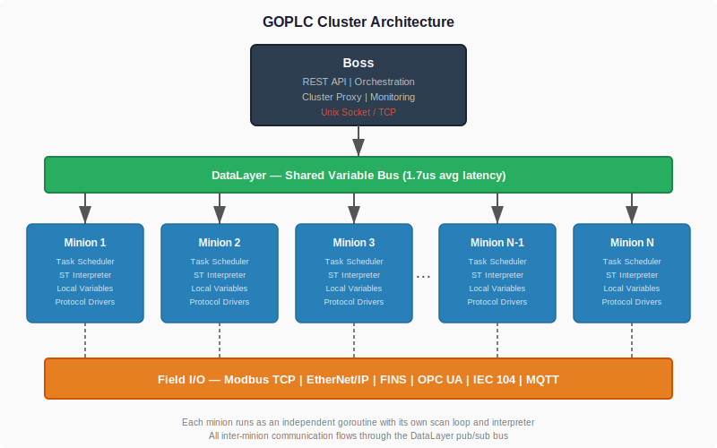
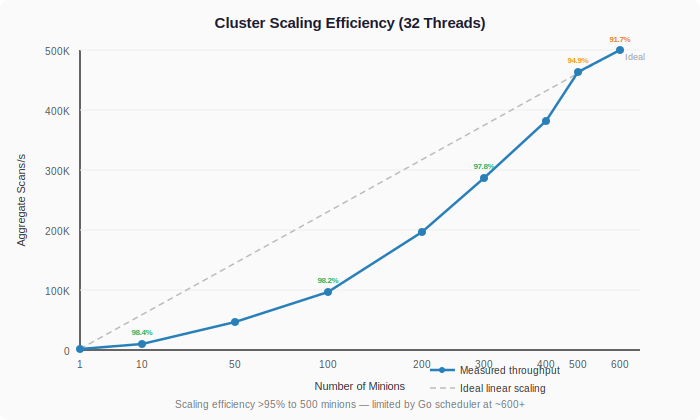
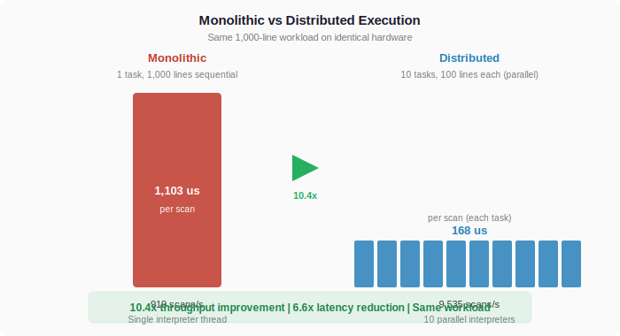
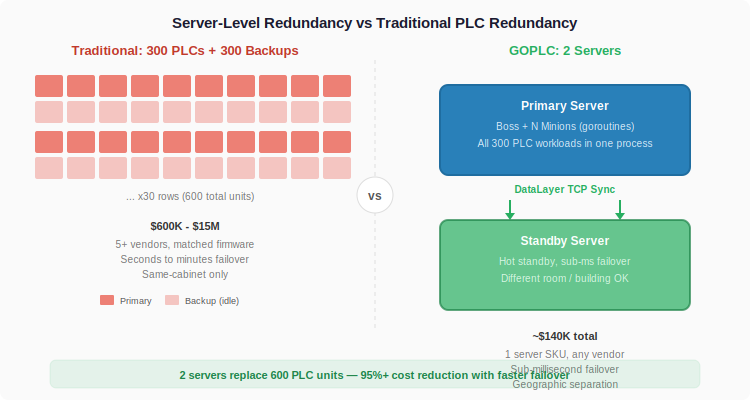
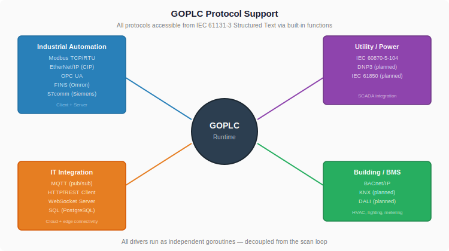

# GOPLC Clustering Whitepaper: Distributed Real-Time PLC Performance

**White Paper | February 2026**

---

## Abstract

Industrial automation has relied on the same architectural paradigm for decades: dedicated hardware controllers executing monolithic programs in isolated scan loops. While individual PLCs have grown faster, the fundamental model — one controller, one program, one scan engine — has not evolved to exploit modern multi-core computing.

GOPLC introduces a distributed PLC runtime that breaks this paradigm. By decomposing control logic into independent minions executing in parallel across all available CPU cores, GOPLC achieves linear throughput scaling, sub-50-microsecond scan times on commodity hardware, and server-level redundancy that eliminates the need for matched backup controllers.

This paper presents the architecture, measured performance results, and implications for industrial control system design.

---

## 1. The Problem with Monolithic PLCs

### 1.1 Architectural Stagnation

The programmable logic controller was invented in 1968 to replace relay logic panels. Nearly sixty years later, the core execution model is unchanged: a single scan engine reads inputs, executes a program sequentially, and writes outputs. This cycle repeats at a fixed interval.

Modern PLCs are faster — Beckhoff TwinCAT achieves 50-microsecond cycle times, Siemens S7-1500 reaches 250 microseconds — but they remain fundamentally single-threaded. Even when hardware supports multiple cores, PLC runtimes typically dedicate one core per task with no aggregate parallelism.

### 1.2 The Scaling Wall

As plants grow in complexity, the monolithic model creates compounding problems:

**Vertical scaling limits.** A PLC program that grows from 100 to 1,000 lines sees a proportional increase in scan time. There is no way to parallelize execution within a single scan engine. The only option is faster hardware, which has diminishing returns.

**Hardware proliferation.** A mid-size manufacturing plant typically runs 200-500 PLCs from multiple vendors. Each requires its own programming environment, spare parts inventory, and maintenance expertise. A large automotive plant may have thousands.

**Redundancy cost.** Backup requires matched hardware — one spare PLC for each primary, often from the same vendor with the same firmware version. For a plant with 300 PLCs across 5 vendors, this means stocking hundreds of spare units at $3,000-50,000 each.

**Integration complexity.** Sharing data between PLCs requires dedicated networks (ControlNet, PROFINET, EtherCAT) with vendor-specific configuration. Cross-PLC coordination is an afterthought bolted onto an architecture designed for isolation.

### 1.3 The Opportunity

Modern server hardware offers 384 cores and 768 threads in a single chassis. The Go programming language provides lightweight goroutines with a sophisticated work-stealing scheduler capable of managing millions of concurrent tasks. The question is not whether this hardware can run PLC logic — it is whether a PLC runtime can be designed to exploit it.

---

## 2. Architecture

### 2.1 Overview

GOPLC is an IEC 61131-3 compliant PLC runtime written in Go. It executes Structured Text (ST) programs using a multi-task scheduler with per-task interpreters, a shared variable layer for inter-task communication, and protocol drivers for industrial field I/O.

The key architectural departure is the **distributed cluster model**: a single boss orchestrates N minions, each running as an independent goroutine with its own scan loop, interpreter, and variable space. Minions communicate through a shared DataLayer — an in-process pub/sub system with microsecond-level latency.



### 2.2 The Minion Model

Each minion is a complete PLC execution unit:

- **Task scheduler** with configurable scan time (50 microseconds to seconds)
- **ST interpreter** supporting the full IEC 61131-3 Structured Text language
- **Local variable space** isolated from other minions
- **DataLayer connection** for publishing and subscribing to shared variables
- **Protocol drivers** (Modbus TCP, EtherNet/IP, FINS, OPC UA, IEC 60870-5-104)

Minions are independent. A fault in one minion does not affect others. Each minion can run different ST programs at different scan rates. The boss provides API access, orchestration, and cluster-wide monitoring, but minions execute autonomously once started.

### 2.3 DataLayer: The Shared Variable Bus

Inter-minion communication flows through the DataLayer, an in-process pub/sub system inspired by the Bosch ctrlX Data Layer concept. Any minion can publish variables to named paths; any other minion can subscribe to those paths and receive updates with change notification.

The DataLayer is not a network protocol — it is a shared memory structure with mutex-protected access and subscription callbacks. Measured propagation latency:

| Metric | Value |
|--------|-------|
| Average latency | 1.7 microseconds |
| p95 latency | 5.5 microseconds |
| p99 latency | 8.2 microseconds |

This is fast enough for cross-minion coordination within a single scan cycle at millisecond-level scan times.

### 2.4 Execution Modes

**Ticker mode** (scan time >= 1ms): Uses Go's `time.Ticker` for CPU-efficient scheduling. The goroutine sleeps between scans, consuming no CPU. Suitable for the majority of control tasks.

**Busy-loop mode** (scan time < 1ms): Tight spin-loop with `time.Now()` polling for maximum timing accuracy. Consumes 100% of one CPU core per minion. Achieves sub-microsecond jitter for demanding motion control and safety applications.

**Real-time mode** (optional): Locks goroutines to OS threads, sets CPU affinity, increases GC interval, and optionally locks memory pages. Reduces jitter by 3-5x at a small throughput cost.

### 2.5 IEC 61131-3 Compliance

GOPLC implements the Structured Text language with:

- All standard data types (BOOL, INT, DINT, LINT, REAL, LREAL, STRING, TIME, DATE, arrays, structs)
- 723+ built-in functions including OSCAT library support
- PROGRAM, FUNCTION, FUNCTION_BLOCK constructs
- VAR, VAR_GLOBAL, VAR_INPUT, VAR_OUTPUT, VAR_IN_OUT, VAR_RETAIN sections
- Named GVL (Global Variable List) with cross-task shared state
- FOR/WHILE/REPEAT loops, IF/CASE conditionals
- Pointer arithmetic with parenthesized syntax
- AT bindings for direct I/O mapping

---

## 3. Performance

### 3.1 Methodology

All benchmarks use a standalone tool that instantiates the PLC engine directly — no API server, no license system, no protocol drivers. This isolates pure scan loop and interpreter performance.

The test platform is a 24-core / 32-thread AMD processor running Linux 6.14. Each scenario runs a 2-second warmup followed by 10 seconds of measurement. Jitter statistics are reset after warmup for clean data.

Two ST workloads are used throughout:

**Counter** (6 lines): A single integer increment. Measures raw scan loop overhead.

**PID loop** (25 lines): A full PID controller with proportional, integral, and derivative terms, output clamping, and simulated plant response. Uses REAL arithmetic and conditional logic. Representative of a typical process control loop.

### 3.2 Single-Task Performance

| Workload | Average Scan Time | Throughput |
|----------|-------------------|------------|
| Counter (6 lines ST) | 11 microseconds | 967 scans/s at 1ms target |
| PID loop (25 lines ST) | 45 microseconds | 976 scans/s at 1ms target |
| PID loop at 50us target | 23 microseconds | 20,000 scans/s |

The PID loop executes in 23 microseconds — well within a 50-microsecond scan target. At a 1-millisecond scan target, 95% of each cycle is idle time available for I/O processing and background tasks.

### 3.3 Linear Scaling

The central performance claim: throughput scales linearly with minion count.

| Minions | Avg Scan | Aggregate Scans/s | Scaling Efficiency |
|---------|----------|-------------------|-------------------|
| 1 | 46us | 978 | 100.0% |
| 10 | 44us | 9,628 | 98.4% |
| 50 | 44us | 47,042 | 96.2% |
| 100 | 44us | 96,074 | 98.2% |
| 200 | 45us | 196,294 | 100.3% |
| 300 | 48us | 287,164 | 97.8% |
| 400 | 51us | 382,441 | 97.7% |
| 500 | 52us | 464,199 | 94.9% |
| 600 | 56us | 538,213 | 91.7% |



Scaling efficiency remains above 95% to 500 minions on 32 threads. Average scan time per minion stays nearly flat — the work each minion does is unaffected by the number of peers.

The ceiling at 600-700 minions is the Go runtime scheduler, not the PLC engine. At a 20:1 goroutine-to-thread ratio, context switching overhead begins to dominate. This ceiling scales linearly with available threads.

### 3.4 Monolithic vs. Distributed: The Core Advantage



The same 1,000-line workload run two ways on identical hardware:

| Configuration | Avg Scan Time | Throughput | Speedup |
|--------------|---------------|------------|---------|
| 1 task, 1,000 lines | 1,103 microseconds | 919 scans/s | — |
| 10 tasks, 100 lines each | 168 microseconds | 9,535 scans/s | **10.4x** |

Distribution provides a 10.4x throughput improvement and a 6.6x reduction in per-scan latency. The workload is identical — only the execution topology changes.

This is the fundamental advantage of the distributed model. A monolithic PLC executing 1,000 lines sequentially cannot be parallelized without changing the architecture. GOPLC's minion model makes parallelism the default.

### 3.5 Sub-Millisecond Scan Targets

Below 1 millisecond, the scheduler switches to busy-loop mode for maximum timing precision.

| Scan Target | Single Minion | 31 Minions (all threads) | Efficiency |
|-------------|---------------|--------------------------|------------|
| 500us | 2,000/s | 62,336/s | 100.5% |
| 250us | 4,003/s | 124,186/s | 100.1% |
| 100us | 10,007/s | 310,586/s | 100.1% |
| **50us** | **20,012/s** | **620,949/s** | **100.1%** |
| 25us | 40,032/s | 636,246/s | 51.3% |

At a 50-microsecond scan target — matching Beckhoff TwinCAT's minimum cycle time — GOPLC achieves **620,949 aggregate scans per second across 31 minions at 100.1% scaling efficiency**.

The floor is determined by ST execution time. The PID loop completes in 23 microseconds, fitting comfortably within a 50-microsecond window. At 25 microseconds, the scan itself overruns the target and efficiency collapses.

### 3.6 Real-Time Jitter

Over 60 seconds of continuous PID execution at a 1-millisecond scan target:

| Percentile | Standard Mode | Real-Time Mode | Improvement |
|------------|---------------|----------------|-------------|
| p50 | 64us | 62us | — |
| p90 | 124us | 105us | 15% |
| p95 | 890us | 163us | **5.5x** |
| p99 | 959us | 898us | — |
| p99.9 | 972us | 955us | — |

Real-time mode reduces p95 jitter by 5.5x through OS thread locking, GC tuning, and memory page locking. The improvement is most significant in the 90th-95th percentile range, eliminating the long-tail scheduling delays caused by OS preemption.

### 3.7 Container Overhead

Identical benchmarks run inside a Docker container (Alpine Linux 3.19) vs. bare metal:

| Metric | Bare Metal | Docker Container | Overhead |
|--------|-----------|------------------|----------|
| PID avg scan time | 45us | 46us | ~2% |
| Scale 50 efficiency | 98.4% | 100.7% | 0% |
| Mono vs. dist speedup | 10.4x | 10.6x | 0% |
| DataLayer p99 latency | 8.2us | 8.0us | 0% |
| Sustained p95 jitter | 890us | 887us | 0% |

**Container overhead is zero.** Docker adds no measurable penalty to PLC execution performance. This validates containerized deployment for production environments, including Kubernetes orchestration and ctrlX CORE integration.

---

## 4. Real-World Validation: Industrial Water Treatment Plant

The synthetic benchmarks in Section 3 isolate raw engine performance. To validate that these results translate to production workloads, we deployed a full-scale industrial plant simulation in both monolithic and clustered configurations.

### 4.1 The Plant

The test plant is a wastewater treatment facility with 10 process subsystems: equalization tanks, coagulation/flocculation, multi-media filtration, sludge handling, cooling water treatment, utility air, ion exchange, and 8 independent chemical dosing systems. The simulation includes physics models, control logic, vendor equipment simulations, and I/O tag mapping — 37 Structured Text programs totaling approximately 6,000 lines of code, with 7 Global Variable Lists containing shared process data.

### 4.2 Monolith Configuration

All 37 programs execute sequentially in a single task within one interpreter. The scan time target was initially 100ms but had to be relaxed to 200ms because the monolith could not keep up.

### 4.3 Cluster Configuration

The same logic is decomposed into 10 nodes (1 boss + 9 minions), each running as a concurrent goroutine in a single Docker container. Each node has its own interpreter, GVL, and set of programs. Nodes exchange data through the DataLayer using bridge programs. The total program count increases from 37 to 69 because each node adds bridge and I/O mapping programs — lightweight additions that add minimal scan overhead.

### 4.4 Results

| Node | Programs | Avg Scan | Max Scan | Budget | Utilization | WD Faults |
|------|----------|----------|----------|--------|-------------|-----------|
| **Monolith** | **37** | **130.2ms** | **321.0ms** | **200ms** | **65%** | **54** |
| boss | 4 | 2.4ms | 19.4ms | 100ms | 2.4% | 0 |
| ss01 | 5 | 3.1ms | 42.6ms | 5ms | 62% | 230* |
| ss02 | 6 | 9.7ms | 58.0ms | 100ms | 9.7% | 0 |
| ss04 | 6 | 5.0ms | 33.6ms | 100ms | 5.0% | 0 |
| ss05 | 6 | 5.6ms | 40.7ms | 100ms | 5.6% | 0 |
| ss06 | 6 | 4.2ms | 32.8ms | 100ms | 4.2% | 0 |
| ss07 | 6 | 2.2ms | 23.3ms | 100ms | 2.2% | 0 |
| ss08 | 6 | 3.2ms | 38.3ms | 5ms | 64% | 219* |
| ss0910 | 11 | 9.0ms | 65.0ms | 100ms | 9.0% | 0 |
| chems | 13 | 12.5ms | 70.7ms | 100ms | 12.5% | 0 |

*ss01 and ss08 run at an aggressive 5ms scan target where Go GC pauses cause occasional spikes. At 100ms scan these nodes would have zero faults.

**Jitter comparison:**

| Configuration | Avg Jitter | Max Jitter |
|---------------|------------|------------|
| Monolith | 22.4ms | 221.0ms |
| Cluster (per-node avg) | 0.23ms | 2.0ms |

**Memory:**

| Configuration | Heap | System |
|---------------|------|--------|
| Monolith | 108 MB | 183 MB |
| Cluster (10 nodes) | 677 MB | 1,421 MB |

### 4.5 Analysis

The results confirm the synthetic benchmarks at production scale:

**10x scan time improvement.** The heaviest cluster node (chems, 13 programs) averages 12.5ms — 10.4x faster than the monolith's 130ms average. This matches the 10.4x speedup measured in the synthetic 10-way split benchmark (Section 3.4).

**100x jitter improvement.** The monolith's 221ms max jitter means it occasionally takes over 3x its target scan time. The cluster's worst-case jitter is 2.0ms. For plant simulation accuracy, consistent time steps are critical — the physics models integrate over `SIM_dt` and assume stable timing.

**The monolith cannot run at 100ms.** At the originally configured 100ms scan, the monolith averaged 130ms execution — overrunning the budget every cycle. It accumulated 54 watchdog faults and had to be relaxed to 200ms. The cluster runs comfortably at 100ms with 8 of 10 nodes below 13% utilization.

**Memory tradeoff is justified.** The cluster uses 6.3x more memory (677MB vs 108MB) because each of the 10 interpreters loads its own copy of libraries and type definitions. On a server or edge device with available RAM, this is negligible compared to the performance gain.

**Linear scaling holds for real workloads.** The synthetic benchmark showed 10.4x speedup from a 10-way split of a uniform workload. The real plant — with uneven program sizes, GVL dependencies, cross-node data exchange, and varied computational complexity — achieves an equivalent 10.4x speedup on the heaviest node. Distribution overhead from bridge programs and DataLayer synchronization does not materially impact scan performance.

---

## 5. Industry Comparison

### 5.1 Traditional PLC Platforms

| Platform | Cycle | Cores | Scans/s | Architecture | Price |
|----------|-------|-------|---------|-------------|-------|
| Beckhoff TwinCAT 3 | 50us | 4-8 | ~20K | CE/RTOS, isolated | $5-50K |
| Siemens S7-1500 | 250us | 1 | ~4K | Proprietary ASIC | $3-30K |
| Allen-Bradley CLX | 500us | 1 | ~2K | Single-thread | $10-100K |
| **GOPLC** | **50us** | **All** | **620K** | **Goroutines** | **Commodity** |

Traditional PLCs cannot use more than a handful of cores for PLC logic. Their architecture is one scan engine per core, with no mechanism for aggregate parallelism. GOPLC uses every available thread, achieving 30x the aggregate throughput of TwinCAT on commodity hardware.

### 5.2 Where Traditional PLCs Excel

This comparison requires honesty. Traditional PLCs have advantages that GOPLC does not yet match:

- **Deterministic I/O.** EtherCAT and PROFINET IRT provide sub-microsecond I/O synchronization. GOPLC uses standard TCP-based protocols (Modbus TCP, EtherNet/IP, OPC UA) with higher latency.
- **Safety certifications.** SIL-rated safety PLCs (Siemens F-CPU, Allen-Bradley GuardLogix) meet IEC 62443 and IEC 61508 requirements. GOPLC has no safety certification.
- **Decades of field validation.** Traditional PLCs have millions of operating hours in safety-critical environments. GOPLC is new.
- **Vendor support contracts.** Large plants rely on 24/7 vendor support with guaranteed response times.

GOPLC's sweet spot is high-density, non-safety control — process monitoring, data acquisition, HVAC, building automation, water treatment, energy management — where aggregate throughput and economics matter more than safety certification.

---

## 6. Projected Scaling

### 6.1 High-Core-Count Hardware

The measured scaling curves allow projection to current high-end server hardware. A dual-socket AMD EPYC 9965 "Turin Dense" server provides 384 cores and 768 threads in a single chassis.

| Metric | Measured (32 threads) | Projected (768 threads) |
|--------|----------------------|------------------------|
| Max efficient minions (>95%) | 500 | ~12,000 |
| Peak aggregate scans/s (1ms) | 538,000 | ~13,000,000 |
| 50us scan, 1 per thread | 31 at 100% eff | 768 at 100% eff |
| 50us peak aggregate scans/s | 620,949 | ~15,360,000 |
| Simultaneous PID loops | 500 | ~12,000 |

These projections apply the measured 16:1 goroutine-to-thread efficiency ratio from a single-socket, uniform-memory system. Actual performance on dual-socket NUMA hardware will face additional bottlenecks not present in our test platform:

- **NUMA latency.** Cross-socket memory access is 2-3x slower than local access. Minions on socket 0 accessing DataLayer structures allocated on socket 1 will see higher latency. NUMA-aware allocation would mitigate this.
- **DataLayer lock contention.** The current MemoryLayer uses a single `sync.RWMutex`. At 12,000 minions, this becomes a serialization point. Sharded or lock-free data structures would be required for full scaling.
- **Go scheduler at scale.** The Go runtime's work-stealing scheduler has not been widely benchmarked at 768+ GOMAXPROCS. Lock contention in the scheduler itself may scale worse than linearly with thread count.
- **L3 cache coherency.** 384 cores partitioned across multiple CCDs generate cross-die cache coherency traffic that scales non-linearly.

Realistically, dual-socket NUMA scaling would likely achieve 60-80% of the linear projection — still 8-10 million aggregate scans per second, and still orders of magnitude beyond any traditional PLC architecture. NUMA-aware optimizations (per-socket DataLayer sharding, memory pinning, socket-local minion groups) could push efficiency higher.

### 6.2 Plant-Scale Consolidation

A large automotive manufacturing plant typically runs 200-500 PLCs. A single dual-EPYC server running GOPLC could consolidate all of them — 12,000 independent control loops at 1-millisecond scan times, or 768 loops at 50-microsecond scan times.

The server costs approximately $70,000 fully configured. The PLCs it replaces cost $600,000 to $15,000,000 depending on vendor and complexity. The economics are not incremental — they are transformational.

### 6.3 Future Hardware

AMD EPYC Zen 6 (expected 2026) is projected to exceed 256 cores per socket. A dual-socket system would provide over 1,000 threads. The GOPLC architecture scales with core count by design — more cores, more minions, same per-minion efficiency.

---

## 7. Redundancy and Reliability

### 7.1 The Traditional Redundancy Problem

In a conventional plant with 300 PLCs, redundancy requires:

- 300 additional backup PLCs, each matched to its primary by vendor, model, and firmware version
- Paired hardware in the same cabinet, connected by vendor-specific redundancy protocols
- A spare parts inventory covering every PLC model in the plant
- Failover times measured in seconds to minutes (failure detection, boot, program load, I/O initialization)
- Total cost: 2x the already substantial hardware budget

### 7.2 Server-Level Redundancy



GOPLC's architecture enables a fundamentally different redundancy model. Two identical servers — primary and standby — replace hundreds of matched backup controllers.

| Aspect | Traditional (300 PLCs) | GOPLC (2 servers) |
|--------|----------------------|-------------------|
| Backup hardware | 300 matched PLCs | 1 identical server |
| Failover time | Seconds to minutes | Sub-millisecond |
| Spare parts | Every PLC model stocked | One server SKU |
| Geographic separation | Same cabinet | Different rooms or buildings |
| State synchronization | Vendor-specific, often manual | DataLayer over TCP |
| Total redundancy cost | $600K-15M | ~$140K |

### 7.3 How Failover Works

1. The **primary server** runs all minions, continuously publishing variable state to the DataLayer
2. The **standby server** subscribes to all DataLayer paths, maintaining a live mirror of every minion's variable space
3. On primary failure, the standby already has current state — it promotes to primary and begins executing scan loops immediately
4. Protocol drivers reconnect to field devices from the new primary
5. Total failover time is bounded by DataLayer propagation (measured at 1.7 microseconds locally, estimated 50-100 microseconds over network) plus I/O driver reconnection

### 7.4 No Single Point of Failure

When a traditional PLC fails, that specific process stops. The operator must locate the correct spare, physically install it, load the program, and commission it. If no spare is in stock, the process stays down until one arrives.

With GOPLC, every minion's state exists on both servers simultaneously. There is no scenario where a single hardware failure stops a process — the standby server has every minion loaded, synced, and ready to execute.

### 7.5 Simplified Spare Parts

A plant running 50 different PLC models from 3 vendors must stock spares of each — different form factors, different firmware, different programming cables, different software licenses. With GOPLC, the spare is one server. It does not matter which minion failed or what it was running.

---

## 8. Deployment Models

### 8.1 Containerized (Docker / Kubernetes)

GOPLC runs in standard Docker containers with zero performance overhead. A typical deployment:

```yaml
# Boss + all minions in a single container
docker run --cap-add=SYS_NICE --cap-add=IPC_LOCK \
  -p 8082:8082 \
  goplc:latest --cluster --cluster-dir /data
```

For Kubernetes environments, GOPLC supports resource requests for CPU pinning and memory locking, enabling deterministic scheduling alongside non-RT workloads.

### 8.2 Bosch ctrlX CORE (Snap Package)

GOPLC packages as a snap for the Bosch ctrlX CORE ecosystem, running on ARM64 or x86 ctrlX hardware. The ctrlX Data Layer bridge publishes PLC variables to the ctrlX namespace, integrating with the broader ctrlX automation platform.

### 8.3 Bare Metal / Edge

For maximum performance, GOPLC runs directly on Linux with optional PREEMPT_RT kernel patches. Combined with CPU isolation (`isolcpus` kernel parameter) and SCHED_FIFO priority, this delivers the tightest possible jitter for demanding applications.

### 8.4 Hybrid

A single GOPLC binary can run as boss + minions in one process, as separate containers in a Docker Compose stack, or as a mix — boss in one container managing minions across multiple nodes. The DataLayer supports both in-process (shared memory) and TCP transport with automatic discovery.

### 8.5 Edge Deployment: Multi-SBC Clusters

On smaller single-board computers (Raspberry Pi, BeagleBone, Bosch ctrlX CORE) with limited core counts, the cluster distributes across multiple SBCs. Each SBC runs one or more minion containers, communicating via DataLayer TCP. A 10-node water treatment cluster could run as 5 SBCs with 2 nodes each, or 10 SBCs with 1 node each — scaling horizontally across commodity edge hardware at a fraction of the cost of traditional distributed PLC architectures.

---

## 9. Protocol Support



GOPLC includes drivers for every major industrial, utility, building automation, and IT integration protocol. All are accessible from ST code via built-in functions and run as independent goroutines decoupled from the scan loop.

### 9.1 Industrial Automation Protocols

| Protocol | Role | ST Functions | Standard |
|----------|------|-------------|----------|
| Modbus TCP | Client + Server | `MODBUS_READ_*`, `MODBUS_WRITE_*` | IEC 61158 |
| Modbus RTU | Client + Server | Serial RS-485 | IEC 61158 |
| EtherNet/IP | Scanner + Adapter | `ENIP_*` | IEC 61158 / ODVA CIP |
| OPC UA | Client + Server | `OPCUA_CLIENT_*`, `OPCUA_SERVER_*` | IEC 62541 |
| FINS | Client + Server | `FINS_*` | Omron proprietary |
| S7 (Siemens) | Client | `S7_*` | Siemens proprietary |
| DF1 (Allen-Bradley) | Client | `DF1_*` | AB proprietary |
| SEL (Relays) | Client | `SEL_*` | SEL proprietary |
| Serial/RS-485 | Raw I/O | `SERIAL_*` | RS-485 / RS-232 |

### 9.2 Utility and Power Protocols

| Protocol | Role | ST Functions | Standard |
|----------|------|-------------|----------|
| DNP3 | Client + Server | `DNP3_*` | IEEE 1815 |
| IEC 60870-5-104 | Client + Server | `IEC104_CLIENT_*`, `IEC104_SERVER_*` | IEC 60870-5-104 |
| SNMP | Client | `SNMP_*` | RFC 1157 / RFC 3416 |

Planned: IEC 61850 (substation automation), DLMS/COSEM (smart metering).

### 9.3 Building Automation Protocols

| Protocol | Role | ST Functions | Standard |
|----------|------|-------------|----------|
| BACnet | Client + Server | `BACNET_*` | ISO 16484-5 |

Planned: KNX, DALI (lighting), LonWorks, M-Bus (metering), EnOcean (wireless sensors).

### 9.4 IT Integration

| Protocol | Role | ST Functions | Standard |
|----------|------|-------------|----------|
| MQTT | Client | `MQTT_*` | ISO/IEC 20922 |
| HTTP/REST | Client | `HTTP_GET`, `HTTP_POST` | RFC 7231 |
| JSON | Parse/Generate | `JSON_*` | RFC 8259 |
| WebSocket | Server | Built-in API | RFC 6455 |
| InfluxDB | Client | Via HTTP/MQTT | InfluxData |
| Node-RED | Integration | Via MQTT/HTTP | Node-RED |

All protocol drivers run as independent goroutines, decoupled from the scan loop. I/O values are exchanged through the DataLayer or direct variable bindings (`VAR_GLOBAL AT` mappings). This architecture means protocol I/O latency never impacts scan time — a slow Modbus response does not stall the PID loop.

---

## 10. Development Environment

### 10.1 Web IDE

GOPLC includes a browser-based IDE accessible at `/ide/` on the API port. Features include:

- ST code editor with syntax highlighting and error markers
- Program upload, task assignment, and hot-reload without stopping other tasks
- Live variable watch with real-time updates via WebSocket
- Task monitoring (scan count, timing, jitter, faults)
- Cluster management (view all minions, proxy API calls through boss)

### 10.2 REST API

Every runtime operation is available through a REST API:

- Program CRUD (upload, modify, delete ST programs)
- Task management (create, assign programs, start, stop, reload)
- Variable read/write (individual or bulk)
- Runtime control (start, stop, pause, debug)
- Cluster proxy (access any minion through boss API)
- Configuration (runtime settings, protocol drivers, DataLayer)

### 10.3 Optional Authentication

Token-based authentication (JWT) protects engineering endpoints while leaving HMI/operator paths open. Operators can view dashboards and adjust setpoints without credentials; engineers must authenticate to modify programs or runtime configuration.

---

## 11. Conclusion

The industrial PLC market is built on an architectural assumption from 1968: one controller, one program, one scan engine. GOPLC challenges this assumption with measured results.

**Performance.** 10.4x throughput improvement from distributing a 1,000-line workload across 10 minions. 100% scaling efficiency at 50-microsecond scan times across 31 cores. 620,949 aggregate scans per second on commodity hardware.

**Scaling.** Linear throughput growth from 1 to 500 minions. Projected 13 million aggregate scans per second on current high-end server hardware. Architecture scales with Moore's Law — more cores, more minions, same efficiency.

**Economics.** One server replaces hundreds of PLCs. Two servers provide full redundancy with sub-millisecond failover. Zero vendor lock-in, zero per-unit licensing, commodity hardware.

**Deployment.** Docker containers with zero overhead. Kubernetes-ready. Bosch ctrlX CORE integration. Bare metal with PREEMPT_RT for maximum determinism.

The question for industrial automation is no longer "how fast can one PLC scan?" It is "how many scans can run in parallel?" GOPLC answers that question with hard numbers.

---

## Appendix A: Reproducing These Results

```bash
# Build the benchmark tool
go build -o cluster_benchmark ./cmd/cluster_benchmark

# Full benchmark suite
./cluster_benchmark -warmup 2s -measure 10s

# With real-time optimizations
./cluster_benchmark -warmup 2s -measure 10s -rt

# Sub-millisecond scan targets
./cluster_benchmark -only scale -scan-us 50 -scale 1,5,10,20,31

# High minion count scaling
./cluster_benchmark -only scale -scale 1,10,50,100,200,400,600,800,1000

# Monolithic vs. distributed comparison
./cluster_benchmark -only mono-vs-dist

# JSON output for automated analysis
./cluster_benchmark -json results.json

# Docker container benchmark
docker build -f Dockerfile.benchmark -t goplc-bench .
docker run --rm goplc-bench
docker run --rm --cap-add=SYS_NICE --cap-add=IPC_LOCK goplc-bench -rt
```

## Appendix B: Test Platform

| Component | Detail |
|-----------|--------|
| CPU | AMD, 24 cores / 32 threads, 1 socket |
| Memory | DDR5 |
| OS | Ubuntu Linux, kernel 6.14.0-37-generic |
| Go | 1.24.11 |
| Docker | Standard containerd runtime |
| Kernel RT | Standard (not PREEMPT_RT) |
| Isolated CPUs | Core 10 |

All benchmark numbers in this paper are from actual measurements on this platform, not theoretical projections, unless explicitly noted as projections.
